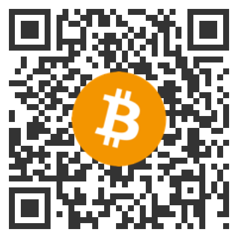
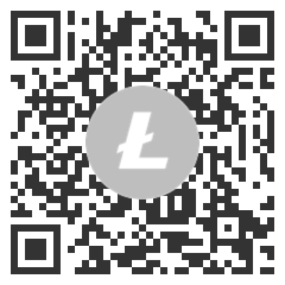

# Cryptocurrency Icons
**The official cryptocurrency icon pack for all your favourite cryptocurrencies.**

This repository contains all the cryptocurrency icons available on [coinmarketcap.com](https://cryptocurrencyliveprices.com/)

## Donations
**This is all voluntary work**, so if you want to support my efforts [please donate](https://erikthiart.com/donate-or-buy-me-coffee.php). 

Donation addresses are found below (if you don't see your coin, let me know and I'll send the address afterwards) alternatively you can use paypal too [paypal.me/erikthiart](https://paypal.me/erikthiart)

Bitcoin Address QR Code            |  Ethereum Address QR Code         |  Litecoin Address QR Code
:-------------------------:|:-------------------------:|:-------------------------:
  |   | 

**BTC**: 1GeXS8t5KtYvyMAf5hhwtdxM9Ba9EWQqMz

**ETH**: 0x023f29596Bf80c521C906f80ee305fADc3B1Be3C

**LTC**: LcNa8XKqimLjXDGck7dPnxEjENPm9t6r3H

## Screenshot


## Cryptocurrency API
I also maintain the [Coindata](https://cryptocurrencyliveprices.com/) website and decided to make it's API available to the public. 
### ToDo
You can pull the current pricing of all coins in existence by hitting this endpoint: ```https://cryptocurrencyliveprices.com/api/```

## List of all the coin icons

* [bitcoin.png](https://cryptocurrencyliveprices.com/coin.php?id=bitcoin "Bitcoin (BTC)") ")
* [ethereum.png](https://cryptocurrencyliveprices.com/coin.php?id=ethereum "Ethereum (ETH)") ")
* [tether.png](https://cryptocurrencyliveprices.com/coin.php?id=tether "Tether (USDT)") ")
* [polkadot-new.png](https://cryptocurrencyliveprices.com/coin.php?id=polkadot-new "Polkadot (DOT)") ")
* [xrp.png](https://cryptocurrencyliveprices.com/coin.php?id=xrp "XRP (XRP)") ")
* [cardano.png](https://cryptocurrencyliveprices.com/coin.php?id=cardano "Cardano (ADA)") ")
* [litecoin.png](https://cryptocurrencyliveprices.com/coin.php?id=litecoin "Litecoin (LTC)") ")
* [bitcoin-cash.png](https://cryptocurrencyliveprices.com/coin.php?id=bitcoin-cash "Bitcoin Cash (BCH)") ")
* [chainlink.png](https://cryptocurrencyliveprices.com/coin.php?id=chainlink "Chainlink (LINK)") ")
* [stellar.png](https://cryptocurrencyliveprices.com/coin.php?id=stellar "Stellar (XLM)") ")
* [binance-coin.png](https://cryptocurrencyliveprices.com/coin.php?id=binance-coin "Binance Coin (BNB)") ")
* [usd-coin.png](https://cryptocurrencyliveprices.com/coin.php?id=usd-coin "USD Coin (USDC)") ")
* [wrapped-bitcoin.png](https://cryptocurrencyliveprices.com/coin.php?id=wrapped-bitcoin "Wrapped Bitcoin (WBTC)") ")
* [bitcoin-sv.png](https://cryptocurrencyliveprices.com/coin.php?id=bitcoin-sv "Bitcoin SV (BSV)") ")
* [monero.png](https://cryptocurrencyliveprices.com/coin.php?id=monero "Monero (XMR)") ")
* [eos.png](https://cryptocurrencyliveprices.com/coin.php?id=eos "EOS (EOS)") ")
* [uniswap.png](https://cryptocurrencyliveprices.com/coin.php?id=uniswap "Uniswap (UNI)") ")
* [aave.png](https://cryptocurrencyliveprices.com/coin.php?id=aave "Aave (AAVE)") ")
* [tron.png](https://cryptocurrencyliveprices.com/coin.php?id=tron "TRON (TRX)") ")
* [tezos.png](https://cryptocurrencyliveprices.com/coin.php?id=tezos "Tezos (XTZ)") ")
* [nem.png](https://cryptocurrencyliveprices.com/coin.php?id=nem "NEM (XEM)") ")
* [theta.png](https://cryptocurrencyliveprices.com/coin.php?id=theta "THETA (THETA)") ")
* [cosmos.png](https://cryptocurrencyliveprices.com/coin.php?id=cosmos "Cosmos (ATOM)") ")
* [internet-computer.png](https://cryptocurrencyliveprices.com/coin.php?id=internet-computer "Internet Computer (ICP)") ")
* [vechain.png](https://cryptocurrencyliveprices.com/coin.php?id=vechain "VeChain (VET)") ")
* [crypto-com-coin.png](https://cryptocurrencyliveprices.com/coin.php?id=crypto-com-coin "Crypto.com Coin (CRO)") ")
* [neo.png](https://cryptocurrencyliveprices.com/coin.php?id=neo "Neo (NEO)") ")
* [synthetix-network-token.png](https://cryptocurrencyliveprices.com/coin.php?id=synthetix-network-token "Synthetix (SNX)") ")
* [maker.png](https://cryptocurrencyliveprices.com/coin.php?id=maker "Maker (MKR)") ")
* [multi-collateral-dai.png](https://cryptocurrencyliveprices.com/coin.php?id=multi-collateral-dai "Dai (DAI)") ")
* [unus-sed-leo.png](https://cryptocurrencyliveprices.com/coin.php?id=unus-sed-leo "UNUS SED LEO (LEO)") ")
* [dash.png](https://cryptocurrencyliveprices.com/coin.php?id=dash "Dash (DASH)") ")
* [iota.png](https://cryptocurrencyliveprices.com/coin.php?id=iota "IOTA (MIOTA)") ")
* [dogecoin.png](https://cryptocurrencyliveprices.com/coin.php?id=dogecoin "Dogecoin (DOGE)") ")
* [huobi-token.png](https://cryptocurrencyliveprices.com/coin.php?id=huobi-token "Huobi Token (HT)") ")
* [binance-usd.png](https://cryptocurrencyliveprices.com/coin.php?id=binance-usd "Binance USD (BUSD)") ")
* [celsius.png](https://cryptocurrencyliveprices.com/coin.php?id=celsius "Celsius (CEL)") ")
* [zcash.png](https://cryptocurrencyliveprices.com/coin.php?id=zcash "Zcash (ZEC)") ")
* [yearn-finance.png](https://cryptocurrencyliveprices.com/coin.php?id=yearn-finance "yearn.finance (YFI)") ")
* [filecoin.png](https://cryptocurrencyliveprices.com/coin.php?id=filecoin "Filecoin (FIL)") ")
* [ftx-token.png](https://cryptocurrencyliveprices.com/coin.php?id=ftx-token "FTX Token (FTT)") ")
* [compound.png](https://cryptocurrencyliveprices.com/coin.php?id=compound "Compound (COMP)") ")
* [solana.png](https://cryptocurrencyliveprices.com/coin.php?id=solana "Solana (SOL)") ")
* [avalanche.png](https://cryptocurrencyliveprices.com/coin.php?id=avalanche "Avalanche (AVAX)") ")
* [revain.png](https://cryptocurrencyliveprices.com/coin.php?id=revain "Revain (REV)") ")
* [ethereum-classic.png](https://cryptocurrencyliveprices.com/coin.php?id=ethereum-classic "Ethereum Classic (ETC)") ")
* [sushiswap.png](https://cryptocurrencyliveprices.com/coin.php?id=sushiswap "SushiSwap (SUSHI)") ")
* [kusama.png](https://cryptocurrencyliveprices.com/coin.php?id=kusama "Kusama (KSM)") ")
* [zilliqa.png](https://cryptocurrencyliveprices.com/coin.php?id=zilliqa "Zilliqa (ZIL)") ")
* [waves.png](https://cryptocurrencyliveprices.com/coin.php?id=waves "Waves (WAVES)") ")
* [uma.png](https://cryptocurrencyliveprices.com/coin.php?id=uma "UMA (UMA)") ")
* [decred.png](https://cryptocurrencyliveprices.com/coin.php?id=decred "Decred (DCR)") ")
* [algorand.png](https://cryptocurrencyliveprices.com/coin.php?id=algorand "Algorand (ALGO)") ")
* [the-graph.png](https://cryptocurrencyliveprices.com/coin.php?id=the-graph "The Graph (GRT)") ")
* [elrond-egld.png](https://cryptocurrencyliveprices.com/coin.php?id=elrond-egld "Elrond (EGLD)") ")
* [hedgetrade.png](https://cryptocurrencyliveprices.com/coin.php?id=hedgetrade "HedgeTrade (HEDG)") ")
* [omg.png](https://cryptocurrencyliveprices.com/coin.php?id=omg "OMG Network (OMG)") ")
* [ontology.png](https://cryptocurrencyliveprices.com/coin.php?id=ontology "Ontology (ONT)") ")
* [loopring.png](https://cryptocurrencyliveprices.com/coin.php?id=loopring "Loopring (LRC)") ")
* [ren.png](https://cryptocurrencyliveprices.com/coin.php?id=ren "Ren (REN)") ")
* [renbtc.png](https://cryptocurrencyliveprices.com/coin.php?id=renbtc "renBTC (RENBTC)") ")
* [nano.png](https://cryptocurrencyliveprices.com/coin.php?id=nano "Nano (NANO)") ")
* [near-protocol.png](https://cryptocurrencyliveprices.com/coin.php?id=near-protocol "NEAR Protocol (NEAR)") ")
* [terra-luna.png](https://cryptocurrencyliveprices.com/coin.php?id=terra-luna "Terra (LUNA)") ")
* [icon.png](https://cryptocurrencyliveprices.com/coin.php?id=icon "ICON (ICX)") ")
* [reserve-rights.png](https://cryptocurrencyliveprices.com/coin.php?id=reserve-rights "Reserve Rights (RSR)") ")
* [0x.png](https://cryptocurrencyliveprices.com/coin.php?id=0x "0x (ZRX)") ")
* [hedera-hashgraph.png](https://cryptocurrencyliveprices.com/coin.php?id=hedera-hashgraph "Hedera Hashgraph (HBAR)") ")
* [basic-attention-token.png](https://cryptocurrencyliveprices.com/coin.php?id=basic-attention-token "Basic Attention Token (BAT)") ")
* [trueusd.png](https://cryptocurrencyliveprices.com/coin.php?id=trueusd "TrueUSD (TUSD)") ")
* [digibyte.png](https://cryptocurrencyliveprices.com/coin.php?id=digibyte "DigiByte (DGB)") ")
* [okb.png](https://cryptocurrencyliveprices.com/coin.php?id=okb "OKB (OKB)") ")
* [bittorrent.png](https://cryptocurrencyliveprices.com/coin.php?id=bittorrent "BitTorrent (BTT)") ")
* [nexo.png](https://cryptocurrencyliveprices.com/coin.php?id=nexo "Nexo (NEXO)") ")
* [blockstack.png](https://cryptocurrencyliveprices.com/coin.php?id=blockstack "Blockstack (STX)") ")
* [thorchain.png](https://cryptocurrencyliveprices.com/coin.php?id=thorchain "THORChain (RUNE)") ")
* [qtum.png](https://cryptocurrencyliveprices.com/coin.php?id=qtum "Qtum (QTUM)") ")
* [mdex.png](https://cryptocurrencyliveprices.com/coin.php?id=mdex "Mdex (MDX)") ")
* [iostoken.png](https://cryptocurrencyliveprices.com/coin.php?id=iostoken "IOST (IOST)") ")
* [horizen.png](https://cryptocurrencyliveprices.com/coin.php?id=horizen "Horizen (ZEN)") ")
* [energy-web-token.png](https://cryptocurrencyliveprices.com/coin.php?id=energy-web-token "Energy Web Token (EWT)") ")
* [husd.png](https://cryptocurrencyliveprices.com/coin.php?id=husd "HUSD (HUSD)") ")
* [curve-dao-token.png](https://cryptocurrencyliveprices.com/coin.php?id=curve-dao-token "Curve DAO Token (CRV)") ")
* [swissborg.png](https://cryptocurrencyliveprices.com/coin.php?id=swissborg "SwissBorg (CHSB)") ")
* [celo.png](https://cryptocurrencyliveprices.com/coin.php?id=celo "Celo (CELO)") ")
* [kyber-network.png](https://cryptocurrencyliveprices.com/coin.php?id=kyber-network "Kyber Network (KNC)") ")
* [bitcoin-bep2.png](https://cryptocurrencyliveprices.com/coin.php?id=bitcoin-bep2 "Bitcoin BEP2 (BTCB)") ")
* [voyager-token.png](https://cryptocurrencyliveprices.com/coin.php?id=voyager-token "Voyager Token (VGX)") ")
* [paxos-standard.png](https://cryptocurrencyliveprices.com/coin.php?id=paxos-standard "Paxos Standard (PAX)") ")
* [enjin-coin.png](https://cryptocurrencyliveprices.com/coin.php?id=enjin-coin "Enjin Coin (ENJ)") ")
* [quant.png](https://cryptocurrencyliveprices.com/coin.php?id=quant "Quant (QNT)") ")
* [ampleforth.png](https://cryptocurrencyliveprices.com/coin.php?id=ampleforth "Ampleforth (AMPL)") ")
* [ocean-protocol.png](https://cryptocurrencyliveprices.com/coin.php?id=ocean-protocol "Ocean Protocol (OCEAN)") ")
* [siacoin.png](https://cryptocurrencyliveprices.com/coin.php?id=siacoin "Siacoin (SC)") ")
* [bitcoin-gold.png](https://cryptocurrencyliveprices.com/coin.php?id=bitcoin-gold "Bitcoin Gold (BTG)") ")
* [augur.png](https://cryptocurrencyliveprices.com/coin.php?id=augur "Augur (REP)") ")
* [verge.png](https://cryptocurrencyliveprices.com/coin.php?id=verge "Verge (XVG)") ")
* [band-protocol.png](https://cryptocurrencyliveprices.com/coin.php?id=band-protocol "Band Protocol (BAND)") ")
* [nxm.png](https://cryptocurrencyliveprices.com/coin.php?id=nxm "NXM (NXM)") ")
* [status.png](https://cryptocurrencyliveprices.com/coin.php?id=status "Status (SNT)") ")
* [terrausd.png](https://cryptocurrencyliveprices.com/coin.php?id=terrausd "TerraUSD (UST)") ")
* [abbc-coin.png](https://cryptocurrencyliveprices.com/coin.php?id=abbc-coin "ABBC Coin (ABBC)") ")
* [bancor.png](https://cryptocurrencyliveprices.com/coin.php?id=bancor "Bancor (BNT)") ")
* [gnosis-gno.png](https://cryptocurrencyliveprices.com/coin.php?id=gnosis-gno "Gnosis (GNO)") ")
* [decentraland.png](https://cryptocurrencyliveprices.com/coin.php?id=decentraland "Decentraland (MANA)") ")
* [lisk.png](https://cryptocurrencyliveprices.com/coin.php?id=lisk "Lisk (LSK)") ")
* [matic-network.png](https://cryptocurrencyliveprices.com/coin.php?id=matic-network "Matic Network (MATIC)") ")
* [balancer.png](https://cryptocurrencyliveprices.com/coin.php?id=balancer "Balancer (BAL)") ")
* [aragon.png](https://cryptocurrencyliveprices.com/coin.php?id=aragon "Aragon (ANT)") ")
* [arweave.png](https://cryptocurrencyliveprices.com/coin.php?id=arweave "Arweave (AR)") ")
* [ravencoin.png](https://cryptocurrencyliveprices.com/coin.php?id=ravencoin "Ravencoin (RVN)") ")
* [1inch.png](https://cryptocurrencyliveprices.com/coin.php?id=1inch "1inch (1INCH)") ")
* [flow.png](https://cryptocurrencyliveprices.com/coin.php?id=flow "Flow (FLOW)") ")
* [theta-fuel.png](https://cryptocurrencyliveprices.com/coin.php?id=theta-fuel "Theta Fuel (TFUEL)") ")
* [bitcoin-diamond.png](https://cryptocurrencyliveprices.com/coin.php?id=bitcoin-diamond "Bitcoin Diamond (BCD)") ")
* [injective-protocol.png](https://cryptocurrencyliveprices.com/coin.php?id=injective-protocol "Injective Protocol (INJ)") ")
* [zb-token.png](https://cryptocurrencyliveprices.com/coin.php?id=zb-token "ZB Token (ZB)") ")
* [maidsafecoin.png](https://cryptocurrencyliveprices.com/coin.php?id=maidsafecoin "MaidSafeCoin (MAID)") ")
* [rsk-infrastructure-framework.png](https://cryptocurrencyliveprices.com/coin.php?id=rsk-infrastructure-framework "RSK Infrastructure Framework (RIF)") ")
* [numeraire.png](https://cryptocurrencyliveprices.com/coin.php?id=numeraire "Numeraire (NMR)") ")
* [funfair.png](https://cryptocurrencyliveprices.com/coin.php?id=funfair "FunFair (FUN)") ")
* [holo.png](https://cryptocurrencyliveprices.com/coin.php?id=holo "Holo (HOT)") ")
* [nervos-network.png](https://cryptocurrencyliveprices.com/coin.php?id=nervos-network "Nervos Network (CKB)") ")
* [helium.png](https://cryptocurrencyliveprices.com/coin.php?id=helium "Helium (HNT)") ")
* [orchid.png](https://cryptocurrencyliveprices.com/coin.php?id=orchid "Orchid (OXT)") ")
* [chiliz.png](https://cryptocurrencyliveprices.com/coin.php?id=chiliz "Chiliz (CHZ)") ")
* [monacoin.png](https://cryptocurrencyliveprices.com/coin.php?id=monacoin "MonaCoin (MONA)") ")
* [civic.png](https://cryptocurrencyliveprices.com/coin.php?id=civic "Civic (CVC)") ")
* [mina.png](https://cryptocurrencyliveprices.com/coin.php?id=mina "Mina (MINA)") ")
* [alpha-finance-lab.png](https://cryptocurrencyliveprices.com/coin.php?id=alpha-finance-lab "Alpha Finance Lab (ALPHA)") ")
* [cybervein.png](https://cryptocurrencyliveprices.com/coin.php?id=cybervein "CyberVein (CVT)") ")
* [tomochain.png](https://cryptocurrencyliveprices.com/coin.php?id=tomochain "TomoChain (TOMO)") ")
* [utrust.png](https://cryptocurrencyliveprices.com/coin.php?id=utrust "Utrust (UTK)") ")
* [unibright.png](https://cryptocurrencyliveprices.com/coin.php?id=unibright "Unibright (UBT)") ")
* [pax-gold.png](https://cryptocurrencyliveprices.com/coin.php?id=pax-gold "PAX Gold (PAXG)") ")
* [bytom.png](https://cryptocurrencyliveprices.com/coin.php?id=bytom "Bytom (BTM)") ")
* [kava.png](https://cryptocurrencyliveprices.com/coin.php?id=kava "Kava.io (KAVA)") ")
* [rlc.png](https://cryptocurrencyliveprices.com/coin.php?id=rlc "iExec RLC (RLC)") ")
* [serum.png](https://cryptocurrencyliveprices.com/coin.php?id=serum "Serum (SRM)") ")
* [kucoin-token.png](https://cryptocurrencyliveprices.com/coin.php?id=kucoin-token "KuCoin Token (KCS)") ")
* [oasis-network.png](https://cryptocurrencyliveprices.com/coin.php?id=oasis-network "Oasis Network (ROSE)") ")
* [storj.png](https://cryptocurrencyliveprices.com/coin.php?id=storj "Storj (STORJ)") ")
* [swipe.png](https://cryptocurrencyliveprices.com/coin.php?id=swipe "Swipe (SXP)") ")
* [pundi-x.png](https://cryptocurrencyliveprices.com/coin.php?id=pundi-x "Pundi X (NPXS)") ")
* [iotex.png](https://cryptocurrencyliveprices.com/coin.php?id=iotex "IoTeX (IOTX)") ")
* [secret.png](https://cryptocurrencyliveprices.com/coin.php?id=secret "Secret (SCRT)") ")
* [ardor.png](https://cryptocurrencyliveprices.com/coin.php?id=ardor "Ardor (ARDR)") ")
* [aelf.png](https://cryptocurrencyliveprices.com/coin.php?id=aelf "aelf (ELF)") ")
* [yearn-finance-ii.png](https://cryptocurrencyliveprices.com/coin.php?id=yearn-finance-ii "DFI.Money (YFII)") ")
* [kleros.png](https://cryptocurrencyliveprices.com/coin.php?id=kleros "Kleros (PNK)") ")
* [golem-network-tokens.png](https://cryptocurrencyliveprices.com/coin.php?id=golem-network-tokens "Golem (GLM)") ")
* [steem.png](https://cryptocurrencyliveprices.com/coin.php?id=steem "Steem (STEEM)") ")
* [bitshares.png](https://cryptocurrencyliveprices.com/coin.php?id=bitshares "BitShares (BTS)") ")
* [komodo.png](https://cryptocurrencyliveprices.com/coin.php?id=komodo "Komodo (KMD)") ")
* [xdai.png](https://cryptocurrencyliveprices.com/coin.php?id=xdai "xDai (STAKE)") ")
* [velas.png](https://cryptocurrencyliveprices.com/coin.php?id=velas "Velas (VLX)") ")
* [fantom.png](https://cryptocurrencyliveprices.com/coin.php?id=fantom "Fantom (FTM)") ")
* [btc-standard-hashrate-token.png](https://cryptocurrencyliveprices.com/coin.php?id=btc-standard-hashrate-token "Bitcoin Standard Hashrate Token (BTCST)") ")
* [keep3rv1.png](https://cryptocurrencyliveprices.com/coin.php?id=keep3rv1 "Keep3rV1 (KP3R)") ")
* [lto-network.png](https://cryptocurrencyliveprices.com/coin.php?id=lto-network "LTO Network (LTO)") ")
* [dxchain-token.png](https://cryptocurrencyliveprices.com/coin.php?id=dxchain-token "DxChain Token (DX)") ")
* [district0x.png](https://cryptocurrencyliveprices.com/coin.php?id=district0x "district0x (DNT)") ")
* [syntropy.png](https://cryptocurrencyliveprices.com/coin.php?id=syntropy "Syntropy (NOIA)") ")
* [library-credit.png](https://cryptocurrencyliveprices.com/coin.php?id=library-credit "LBRY Credits (LBC)") ")
* [travala.png](https://cryptocurrencyliveprices.com/coin.php?id=travala "Travala.com (AVA)") ")
* [fetch.png](https://cryptocurrencyliveprices.com/coin.php?id=fetch "Fetch.ai (FET)") ")
* [wanchain.png](https://cryptocurrencyliveprices.com/coin.php?id=wanchain "Wanchain (WAN)") ")
* [just.png](https://cryptocurrencyliveprices.com/coin.php?id=just "JUST (JST)") ")
* [harmony.png](https://cryptocurrencyliveprices.com/coin.php?id=harmony "Harmony (ONE)") ")
* [firo.png](https://cryptocurrencyliveprices.com/coin.php?id=firo "Firo (FIRO)") ")
* [singularitynet.png](https://cryptocurrencyliveprices.com/coin.php?id=singularitynet "SingularityNET (AGI)") ")
* [kin.png](https://cryptocurrencyliveprices.com/coin.php?id=kin "Kin (KIN)") ")
* [wax.png](https://cryptocurrencyliveprices.com/coin.php?id=wax "WAX (WAXP)") ")
* [melon.png](https://cryptocurrencyliveprices.com/coin.php?id=melon "Melon (MLN)") ")
* [origintrail.png](https://cryptocurrencyliveprices.com/coin.php?id=origintrail "OriginTrail (TRAC)") ")
* [ankr.png](https://cryptocurrencyliveprices.com/coin.php?id=ankr "Ankr (ANKR)") ")
* [electroneum.png](https://cryptocurrencyliveprices.com/coin.php?id=electroneum "Electroneum (ETN)") ")
* [irisnet.png](https://cryptocurrencyliveprices.com/coin.php?id=irisnet "IRISnet (IRIS)") ")
* [loom-network.png](https://cryptocurrencyliveprices.com/coin.php?id=loom-network "Loom Network (LOOM)") ")
* [stratis.png](https://cryptocurrencyliveprices.com/coin.php?id=stratis "Stratis (STRAX)") ")
* [energi.png](https://cryptocurrencyliveprices.com/coin.php?id=energi "Energi (NRG)") ")
* [polymath-network.png](https://cryptocurrencyliveprices.com/coin.php?id=polymath-network "Polymath (POLY)") ")
* [aidos-kuneen.png](https://cryptocurrencyliveprices.com/coin.php?id=aidos-kuneen "Aidos Kuneen (ADK)") ")
* [hive-blockchain.png](https://cryptocurrencyliveprices.com/coin.php?id=hive-blockchain "Hive (HIVE)") ")
* [trustswap.png](https://cryptocurrencyliveprices.com/coin.php?id=trustswap "TrustSwap (SWAP)") ")
* [waykichain.png](https://cryptocurrencyliveprices.com/coin.php?id=waykichain "WaykiChain (WICC)") ")
* [casper.png](https://cryptocurrencyliveprices.com/coin.php?id=casper "Casper (CSPR)") ")
* [ark.png](https://cryptocurrencyliveprices.com/coin.php?id=ark "Ark (ARK)") ")
* [divi.png](https://cryptocurrencyliveprices.com/coin.php?id=divi "Divi (DIVI)") ")
* [syscoin.png](https://cryptocurrencyliveprices.com/coin.php?id=syscoin "Syscoin (SYS)") ")
* [tellor.png](https://cryptocurrencyliveprices.com/coin.php?id=tellor "Tellor (TRB)") ")
* [handshake.png](https://cryptocurrencyliveprices.com/coin.php?id=handshake "Handshake (HNS)") ")
* [uquid-coin.png](https://cryptocurrencyliveprices.com/coin.php?id=uquid-coin "Uquid Coin (UQC)") ")
* [vethor-token.png](https://cryptocurrencyliveprices.com/coin.php?id=vethor-token "VeThor Token (VTHO)") ")
* [power-ledger.png](https://cryptocurrencyliveprices.com/coin.php?id=power-ledger "Power Ledger (POWR)") ")
* [populous.png](https://cryptocurrencyliveprices.com/coin.php?id=populous "Populous (PPT)") ")
* [strike.png](https://cryptocurrencyliveprices.com/coin.php?id=strike "Strike (STRK)") ")
* [mainframe.png](https://cryptocurrencyliveprices.com/coin.php?id=mainframe "Mainframe (MFT)") ")
* [dia.png](https://cryptocurrencyliveprices.com/coin.php?id=dia "DIA (DIA)") ")
* [telcoin.png](https://cryptocurrencyliveprices.com/coin.php?id=telcoin "Telcoin (TEL)") ")
* [adx-net.png](https://cryptocurrencyliveprices.com/coin.php?id=adx-net "AdEx Network (ADX)") ")
* [aion.png](https://cryptocurrencyliveprices.com/coin.php?id=aion "Aion (AION)") ")
* [elastos.png](https://cryptocurrencyliveprices.com/coin.php?id=elastos "Elastos (ELA)") ")
* [crypto-com.png](https://cryptocurrencyliveprices.com/coin.php?id=crypto-com "MCO (MCO)") ")
* [nimiq.png](https://cryptocurrencyliveprices.com/coin.php?id=nimiq "Nimiq (NIM)") ")
* [bzx-protocol.png](https://cryptocurrencyliveprices.com/coin.php?id=bzx-protocol "bZx Protocol (BZRX)") ")
* [akropolis.png](https://cryptocurrencyliveprices.com/coin.php?id=akropolis "Akropolis (AKRO)") ")
* [hex.png](https://cryptocurrencyliveprices.com/coin.php?id=hex "HEX (HEX)") ")
* [counos-x.png](https://cryptocurrencyliveprices.com/coin.php?id=counos-x "Counos X (CCXX)") ")
* [ino-coin.png](https://cryptocurrencyliveprices.com/coin.php?id=ino-coin "INO COIN (INO)") ")
* [fei-protocol.png](https://cryptocurrencyliveprices.com/coin.php?id=fei-protocol "Fei Protocol (FEI)") ")
* [ize.png](https://cryptocurrencyliveprices.com/coin.php?id=ize "IZE (IZE)") ")
* [defichain.png](https://cryptocurrencyliveprices.com/coin.php?id=defichain "DeFiChain (DFI)") ")
* [safemoon.png](https://cryptocurrencyliveprices.com/coin.php?id=safemoon "SafeMoon (SAFEMOON)") ")
* [thorecoin.png](https://cryptocurrencyliveprices.com/coin.php?id=thorecoin "ThoreCoin (THR)") ")
* [insight-chain.png](https://cryptocurrencyliveprices.com/coin.php?id=insight-chain "Insight Chain (INB)") ")
* [creditcoin.png](https://cryptocurrencyliveprices.com/coin.php?id=creditcoin "Creditcoin (CTC)") ")
* [basid-coin.png](https://cryptocurrencyliveprices.com/coin.php?id=basid-coin "Basid Coin (BASID)") ")
* [botxcoin.png](https://cryptocurrencyliveprices.com/coin.php?id=botxcoin "botXcoin (BOTX)") ")
* [bitcoin-cash-abc-2.png](https://cryptocurrencyliveprices.com/coin.php?id=bitcoin-cash-abc-2 "Bitcoin Cash ABC (BCHA)") ")
* [zelwin.png](https://cryptocurrencyliveprices.com/coin.php?id=zelwin "Zelwin (ZLW)") ")
* [cipher-core-token.png](https://cryptocurrencyliveprices.com/coin.php?id=cipher-core-token "Cipher Core Token (CIPHC)") ")
* [liquity-usd.png](https://cryptocurrencyliveprices.com/coin.php?id=liquity-usd "Liquity USD (LUSD)") ")
* [stpay.png](https://cryptocurrencyliveprices.com/coin.php?id=stpay "STPAY (STP)") ")
* [symbol.png](https://cryptocurrencyliveprices.com/coin.php?id=symbol "Symbol (XYM)") ")
* [cryptonex.png](https://cryptocurrencyliveprices.com/coin.php?id=cryptonex "Cryptonex (CNX)") ")
* [empty-set-dollar.png](https://cryptocurrencyliveprices.com/coin.php?id=empty-set-dollar "Empty Set Dollar (ESD)") ")
* [helper-search-token.png](https://cryptocurrencyliveprices.com/coin.php?id=helper-search-token "Helper Search Token (HSN)") ")
* [huobi-btc.png](https://cryptocurrencyliveprices.com/coin.php?id=huobi-btc "Huobi BTC (HBTC)") ")
* [largo-coin.png](https://cryptocurrencyliveprices.com/coin.php?id=largo-coin "Largo Coin (LRG)") ")
* [sologenic.png](https://cryptocurrencyliveprices.com/coin.php?id=sologenic "Sologenic (SOLO)") ")
* [elitium.png](https://cryptocurrencyliveprices.com/coin.php?id=elitium "Elitium (EUM)") ")
* [chimpion.png](https://cryptocurrencyliveprices.com/coin.php?id=chimpion "Chimpion (BNANA)") ")
* [yusra.png](https://cryptocurrencyliveprices.com/coin.php?id=yusra "YUSRA (YUSRA)") ")
* [metacoin.png](https://cryptocurrencyliveprices.com/coin.php?id=metacoin "Metacoin (MTC)") ")
* [doctors-coin.png](https://cryptocurrencyliveprices.com/coin.php?id=doctors-coin "Doctors Coin (DRS)") ")
* [ecomi.png](https://cryptocurrencyliveprices.com/coin.php?id=ecomi "ECOMI (OMI)") ")
* [vitae.png](https://cryptocurrencyliveprices.com/coin.php?id=vitae "Vitae (VITAE)") ")
* [parsiq.png](https://cryptocurrencyliveprices.com/coin.php?id=parsiq "PARSIQ (PRQ)") ")
* [bridge-oracle.png](https://cryptocurrencyliveprices.com/coin.php?id=bridge-oracle "Bridge Oracle (BRG)") ")
* [keep-network.png](https://cryptocurrencyliveprices.com/coin.php?id=keep-network "Keep Network (KEEP)") ")
* [persistence.png](https://cryptocurrencyliveprices.com/coin.php?id=persistence "Persistence (XPRT)") ")
* [susd.png](https://cryptocurrencyliveprices.com/coin.php?id=susd "sUSD (SUSD)") ")
* [newyork-exchange.png](https://cryptocurrencyliveprices.com/coin.php?id=newyork-exchange "NewYork Exchange (NYE)") ")
* [bitpanda-ecosystem-token.png](https://cryptocurrencyliveprices.com/coin.php?id=bitpanda-ecosystem-token "Bitpanda Ecosystem Token (BEST)") ")
* [mobilian-coin.png](https://cryptocurrencyliveprices.com/coin.php?id=mobilian-coin "Mobilian Coin (MBN)") ")
* [anchor-protocol.png](https://cryptocurrencyliveprices.com/coin.php?id=anchor-protocol "Anchor Protocol (ANC)") ")
* [pundix-new.png](https://cryptocurrencyliveprices.com/coin.php?id=pundix-new "Pundi X[new] (PUNDIX)") ![Pundi X[new]](https://raw.githubusercontent.com/ErikThiart/cryptocurrency-icons/master/16/pundix-new.png "Pundi X[new] (PUNDIX)")
* [tratin.png](https://cryptocurrencyliveprices.com/coin.php?id=tratin "Tratin (TRAT)") ")
* [idea-chain-coin.png](https://cryptocurrencyliveprices.com/coin.php?id=idea-chain-coin "Idea Chain Coin (ICH)") ")
* [cryptobucks.png](https://cryptocurrencyliveprices.com/coin.php?id=cryptobucks "CRYPTOBUCKS (CBUCKS)") ")
* [darma-cash.png](https://cryptocurrencyliveprices.com/coin.php?id=darma-cash "Darma Cash (DMCH)") ")
* [raydium.png](https://cryptocurrencyliveprices.com/coin.php?id=raydium "Raydium (RAY)") ")
* [bloomzed-token.png](https://cryptocurrencyliveprices.com/coin.php?id=bloomzed-token "Bloomzed Loyalty Club Ticket (BLCT)") ")
* [neutrino-usd.png](https://cryptocurrencyliveprices.com/coin.php?id=neutrino-usd "Neutrino USD (USDN)") ")
* [tribe.png](https://cryptocurrencyliveprices.com/coin.php?id=tribe "Tribe (TRIBE)") ")
* [tnc-coin.png](https://cryptocurrencyliveprices.com/coin.php?id=tnc-coin "TNC Coin (TNC)") ")
* [joule.png](https://cryptocurrencyliveprices.com/coin.php?id=joule "Joule (JUL)") ")
* [tokocrypto.png](https://cryptocurrencyliveprices.com/coin.php?id=tokocrypto "Toko Token (TKO)") ")
* [hegic.png](https://cryptocurrencyliveprices.com/coin.php?id=hegic "Hegic (HEGIC)") ")
* [perpetual-protocol.png](https://cryptocurrencyliveprices.com/coin.php?id=perpetual-protocol "Perpetual Protocol (PERP)") ")
* [mimblewimblecoin.png](https://cryptocurrencyliveprices.com/coin.php?id=mimblewimblecoin "MimbleWimbleCoin (MWC)") ")
* [whitecoin.png](https://cryptocurrencyliveprices.com/coin.php?id=whitecoin "WhiteCoin (XWC)") ")
* [yamv1.png](https://cryptocurrencyliveprices.com/coin.php?id=yamv1 "YAM v1 (YAM)") ")
* [mixin.png](https://cryptocurrencyliveprices.com/coin.php?id=mixin "Mixin (XIN)") ")
* [greenpower.png](https://cryptocurrencyliveprices.com/coin.php?id=greenpower "GreenPower (GRN)") ")
* [xenioscoin.png](https://cryptocurrencyliveprices.com/coin.php?id=xenioscoin "XeniosCoin (XNC)") ")
* [sun-token.png](https://cryptocurrencyliveprices.com/coin.php?id=sun-token "Sun (New) (SUN)")  (SUN)")
* [wbnb.png](https://cryptocurrencyliveprices.com/coin.php?id=wbnb "Wrapped BNB (WBNB)") ")
* [helleniccoin.png](https://cryptocurrencyliveprices.com/coin.php?id=helleniccoin "Hellenic Coin (HNC)") ")
* [dimension-chain.png](https://cryptocurrencyliveprices.com/coin.php?id=dimension-chain "Dimension Chain (EON)") ")
* [xinfin-network.png](https://cryptocurrencyliveprices.com/coin.php?id=xinfin-network "XinFin Network (XDC)") ")
* [nucypher.png](https://cryptocurrencyliveprices.com/coin.php?id=nucypher "NuCypher (NU)") ")
* [skale-network.png](https://cryptocurrencyliveprices.com/coin.php?id=skale-network "SKALE Network (SKL)") ")
* [polkastarter.png](https://cryptocurrencyliveprices.com/coin.php?id=polkastarter "Polkastarter (POLS)") ")
* [rakon.png](https://cryptocurrencyliveprices.com/coin.php?id=rakon "Rakon (RKN)") ")
* [amp.png](https://cryptocurrencyliveprices.com/coin.php?id=amp "Amp (AMP)") ")
* [edgeware.png](https://cryptocurrencyliveprices.com/coin.php?id=edgeware "Edgeware (EDG)") ")
* [beldex.png](https://cryptocurrencyliveprices.com/coin.php?id=beldex "Beldex (BDX)") ")
* [stakenet.png](https://cryptocurrencyliveprices.com/coin.php?id=stakenet "Stakenet (XSN)") ")
* [axel.png](https://cryptocurrencyliveprices.com/coin.php?id=axel "AXEL (AXEL)") ")
* [pancakeswap.png](https://cryptocurrencyliveprices.com/coin.php?id=pancakeswap "PancakeSwap (CAKE)") ")
* [mindol.png](https://cryptocurrencyliveprices.com/coin.php?id=mindol "MINDOL (MIN)") ")
* [qcash.png](https://cryptocurrencyliveprices.com/coin.php?id=qcash "Qcash (QC)") ")
* [strong.png](https://cryptocurrencyliveprices.com/coin.php?id=strong "Strong (STRONG)") ")
* [gny.png](https://cryptocurrencyliveprices.com/coin.php?id=gny "GNY (GNY)") ")
* [baer-chain.png](https://cryptocurrencyliveprices.com/coin.php?id=baer-chain "Baer Chain (BRC)") ")
* [incent.png](https://cryptocurrencyliveprices.com/coin.php?id=incent "Incent (INCNT)") ")
* [math.png](https://cryptocurrencyliveprices.com/coin.php?id=math "MATH (MATH)") ")
* [coinmetro-token.png](https://cryptocurrencyliveprices.com/coin.php?id=coinmetro-token "CoinMetro Token (XCM)") ")
* [bonorum.png](https://cryptocurrencyliveprices.com/coin.php?id=bonorum "Bonorum (BONO)") ")
* [c20.png](https://cryptocurrencyliveprices.com/coin.php?id=c20 "CRYPTO20 (C20)") ")
* [eauric.png](https://cryptocurrencyliveprices.com/coin.php?id=eauric "Eauric (EAURIC)") ")
* [homeros.png](https://cryptocurrencyliveprices.com/coin.php?id=homeros "Homeros (HMR)") ")
* [terra-krw.png](https://cryptocurrencyliveprices.com/coin.php?id=terra-krw "TerraKRW (KRT)") ")
* [nest-protocol.png](https://cryptocurrencyliveprices.com/coin.php?id=nest-protocol "NEST Protocol (NEST)") ")
* [attila.png](https://cryptocurrencyliveprices.com/coin.php?id=attila "Attila (ATT)") ")
* [oxygen.png](https://cryptocurrencyliveprices.com/coin.php?id=oxygen "Oxygen (OXY)") ")
* [alchemix.png](https://cryptocurrencyliveprices.com/coin.php?id=alchemix "Alchemix (ALCX)") ")
* [api3.png](https://cryptocurrencyliveprices.com/coin.php?id=api3 "API3 (API3)") ")
* [sora.png](https://cryptocurrencyliveprices.com/coin.php?id=sora "Sora (XOR)") ")
* [bitball-treasure.png](https://cryptocurrencyliveprices.com/coin.php?id=bitball-treasure "Bitball Treasure (BTRS)") ")
* [advanced-internet-blocks.png](https://cryptocurrencyliveprices.com/coin.php?id=advanced-internet-blocks "Advanced Internet Blocks (AIB)") ")
* [cryptaldash.png](https://cryptocurrencyliveprices.com/coin.php?id=cryptaldash "CryptalDash (CRD)") ")
* [wrapped-nxm.png](https://cryptocurrencyliveprices.com/coin.php?id=wrapped-nxm "Wrapped NXM (WNXM)") ")
* [frax-share.png](https://cryptocurrencyliveprices.com/coin.php?id=frax-share "Frax Share (FXS)") ")
* [automata-network.png](https://cryptocurrencyliveprices.com/coin.php?id=automata-network "Automata Network (ATA)") ")
* [gitcoin.png](https://cryptocurrencyliveprices.com/coin.php?id=gitcoin "Gitcoin (GTC)") ")
* [rewardiqa.png](https://cryptocurrencyliveprices.com/coin.php?id=rewardiqa "Rewardiqa (REW)") ")
* [orion-protocol.png](https://cryptocurrencyliveprices.com/coin.php?id=orion-protocol "Orion Protocol (ORN)") ")
* [harvest-finance.png](https://cryptocurrencyliveprices.com/coin.php?id=harvest-finance "Harvest Finance (FARM)") ")
* [waves-enterprise.png](https://cryptocurrencyliveprices.com/coin.php?id=waves-enterprise "Waves Enterprise (WEST)") ")
* [bithao.png](https://cryptocurrencyliveprices.com/coin.php?id=bithao "Bithao (BHAO)") ")
* [the-transfer-token.png](https://cryptocurrencyliveprices.com/coin.php?id=the-transfer-token "The Transfer Token (TTT)") ")
* [poseidon-network.png](https://cryptocurrencyliveprices.com/coin.php?id=poseidon-network "Poseidon Network (QQQ)") ")
* [veritaseum.png](https://cryptocurrencyliveprices.com/coin.php?id=veritaseum "Veritaseum (VERI)") ")
* [sport-and-leisure.png](https://cryptocurrencyliveprices.com/coin.php?id=sport-and-leisure "Sport and Leisure (SNL)") ")
* [kardiachain.png](https://cryptocurrencyliveprices.com/coin.php?id=kardiachain "KardiaChain (KAI)") ")
* [efforce.png](https://cryptocurrencyliveprices.com/coin.php?id=efforce "EFFORCE (WOZX)") ")
* [chainx.png](https://cryptocurrencyliveprices.com/coin.php?id=chainx "ChainX (PCX)") ")
* [bitmax-token.png](https://cryptocurrencyliveprices.com/coin.php?id=bitmax-token "BitMax Token (BTMX)") ")
* [ampleforth-governance-token.png](https://cryptocurrencyliveprices.com/coin.php?id=ampleforth-governance-token "Ampleforth Governance Token (FORTH)") ")
* [reef.png](https://cryptocurrencyliveprices.com/coin.php?id=reef "Reef (REEF)") ")
* [phala-network.png](https://cryptocurrencyliveprices.com/coin.php?id=phala-network "Phala.Network (PHA)") ")
* [truefi-token.png](https://cryptocurrencyliveprices.com/coin.php?id=truefi-token "TrueFi (TRU)") ")
* [cvault-finance.png](https://cryptocurrencyliveprices.com/coin.php?id=cvault-finance "cVault.finance (CORE)") ")
* [saffron-finance.png](https://cryptocurrencyliveprices.com/coin.php?id=saffron-finance "saffron.finance (SFI)") ")
* [dao-maker.png](https://cryptocurrencyliveprices.com/coin.php?id=dao-maker "DAO Maker (DAO)") ")
* [ferrum-network.png](https://cryptocurrencyliveprices.com/coin.php?id=ferrum-network "Ferrum Network (FRM)") ")
* [quarkchain.png](https://cryptocurrencyliveprices.com/coin.php?id=quarkchain "QuarkChain (QKC)") ")
* [haven-protocol.png](https://cryptocurrencyliveprices.com/coin.php?id=haven-protocol "Haven Protocol (XHV)") ")
* [orbit-chain.png](https://cryptocurrencyliveprices.com/coin.php?id=orbit-chain "Orbit Chain (ORC)") ")
* [akash-network.png](https://cryptocurrencyliveprices.com/coin.php?id=akash-network "Akash Network (AKT)") ")
* [everipedia.png](https://cryptocurrencyliveprices.com/coin.php?id=everipedia "Everipedia (IQ)") ")
* [centrality.png](https://cryptocurrencyliveprices.com/coin.php?id=centrality "Centrality (CENNZ)") ")
* [sapphire.png](https://cryptocurrencyliveprices.com/coin.php?id=sapphire "Sapphire (SAPP)") ")
* [sun.png](https://cryptocurrencyliveprices.com/coin.php?id=sun "SUN (SUN)") ")
* [yflink.png](https://cryptocurrencyliveprices.com/coin.php?id=yflink "YF Link (YFL)") ")
* [celer-network.png](https://cryptocurrencyliveprices.com/coin.php?id=celer-network "Celer Network (CELR)") ")
* [safepal.png](https://cryptocurrencyliveprices.com/coin.php?id=safepal "SafePal (SFP)") ")
* [mxc.png](https://cryptocurrencyliveprices.com/coin.php?id=mxc "MXC (MXC)") ")
* [coti.png](https://cryptocurrencyliveprices.com/coin.php?id=coti "COTI (COTI)") ")
* [rocket-pool.png](https://cryptocurrencyliveprices.com/coin.php?id=rocket-pool "Rocket Pool (RPL)") ")
* [solve.png](https://cryptocurrencyliveprices.com/coin.php?id=solve "SOLVE (SOLVE)") ")
* [mirror-protocol.png](https://cryptocurrencyliveprices.com/coin.php?id=mirror-protocol "Mirror Protocol (MIR)") ")
* [wixlar.png](https://cryptocurrencyliveprices.com/coin.php?id=wixlar "Wixlar (WIX)") ")
* [quickswap.png](https://cryptocurrencyliveprices.com/coin.php?id=quickswap "QuickSwap (QUICK)") ")
* [gatetoken.png](https://cryptocurrencyliveprices.com/coin.php?id=gatetoken "GateToken (GT)") ")
* [sharetoken.png](https://cryptocurrencyliveprices.com/coin.php?id=sharetoken "ShareToken (SHR)") ")
* [stasis-euro.png](https://cryptocurrencyliveprices.com/coin.php?id=stasis-euro "STASIS EURO (EURS)") ")
* [troy.png](https://cryptocurrencyliveprices.com/coin.php?id=troy "TROY (TROY)") ")
* [ultra.png](https://cryptocurrencyliveprices.com/coin.php?id=ultra "Ultra (UOS)") ")
* [meta.png](https://cryptocurrencyliveprices.com/coin.php?id=meta "Meta (MTA)") ")
* [bankera.png](https://cryptocurrencyliveprices.com/coin.php?id=bankera "Bankera (BNK)") ")
* [alien-worlds.png](https://cryptocurrencyliveprices.com/coin.php?id=alien-worlds "Alien Worlds (TLM)") ")
* [streamr.png](https://cryptocurrencyliveprices.com/coin.php?id=streamr "Streamr (DATA)") ")
* [myneighboralice.png](https://cryptocurrencyliveprices.com/coin.php?id=myneighboralice "MyNeighborAlice (ALICE)") ")
* [steth.png](https://cryptocurrencyliveprices.com/coin.php?id=steth "stETH (Lido) (STETH)")  (STETH)")
* [ethernity-chain.png](https://cryptocurrencyliveprices.com/coin.php?id=ethernity-chain "Ethernity Chain (ERN)") ")
* [orbs.png](https://cryptocurrencyliveprices.com/coin.php?id=orbs "Orbs (ORBS)") ")
* [trust-wallet-token.png](https://cryptocurrencyliveprices.com/coin.php?id=trust-wallet-token "Trust Wallet Token (TWT)") ")
* [venus.png](https://cryptocurrencyliveprices.com/coin.php?id=venus "Venus (XVS)") ")
* [livepeer.png](https://cryptocurrencyliveprices.com/coin.php?id=livepeer "Livepeer (LPT)") ")
* [axie-infinity.png](https://cryptocurrencyliveprices.com/coin.php?id=axie-infinity "Axie Infinity (AXS)") ")
* [titanswap.png](https://cryptocurrencyliveprices.com/coin.php?id=titanswap "TitanSwap (TITAN)") ")
* [the-midas-touch-gold.png](https://cryptocurrencyliveprices.com/coin.php?id=the-midas-touch-gold "The Midas Touch Gold (TMTG)") ")
* [darwinia-network.png](https://cryptocurrencyliveprices.com/coin.php?id=darwinia-network "Darwinia Network (RING)") ")
* [origin-protocol.png](https://cryptocurrencyliveprices.com/coin.php?id=origin-protocol "Origin Protocol (OGN)") ")
* [ankreth.png](https://cryptocurrencyliveprices.com/coin.php?id=ankreth "ankrETH (aEth)") ")
* [hxro.png](https://cryptocurrencyliveprices.com/coin.php?id=hxro "Hxro (HXRO)") ")
* [btu-protocol.png](https://cryptocurrencyliveprices.com/coin.php?id=btu-protocol "BTU Protocol (BTU)") ")
* [redd.png](https://cryptocurrencyliveprices.com/coin.php?id=redd "ReddCoin (RDD)") ")
* [repo.png](https://cryptocurrencyliveprices.com/coin.php?id=repo "REPO (REPO)") ")
* [stem-cell-coin.png](https://cryptocurrencyliveprices.com/coin.php?id=stem-cell-coin "STEM CELL COIN (SCC)") ")
* [bhex-token.png](https://cryptocurrencyliveprices.com/coin.php?id=bhex-token "BHEX Token (BHT)") ")
* [v-systems.png](https://cryptocurrencyliveprices.com/coin.php?id=v-systems "v.systems (VSYS)") ")
* [1irstcoin.png](https://cryptocurrencyliveprices.com/coin.php?id=1irstcoin "1irstcoin (FST)") ")
* [morpheus-network.png](https://cryptocurrencyliveprices.com/coin.php?id=morpheus-network "Morpheus.Network (MRPH)") ")
* [salt.png](https://cryptocurrencyliveprices.com/coin.php?id=salt "SALT (SALT)") ")
* [mstable-usd.png](https://cryptocurrencyliveprices.com/coin.php?id=mstable-usd "mStable USD (MUSD)") ")
* [hypercash.png](https://cryptocurrencyliveprices.com/coin.php?id=hypercash "HyperCash (HC)") ")
* [extstock-token.png](https://cryptocurrencyliveprices.com/coin.php?id=extstock-token "ExtStock Token (XT)") ")
* [request.png](https://cryptocurrencyliveprices.com/coin.php?id=request "Request (REQ)") ")
* [digixdao.png](https://cryptocurrencyliveprices.com/coin.php?id=digixdao "DigixDAO (DGD)") ")
* [neutrino-system-base-token.png](https://cryptocurrencyliveprices.com/coin.php?id=neutrino-system-base-token "Neutrino Token (NSBT)") ")
* [the-sandbox.png](https://cryptocurrencyliveprices.com/coin.php?id=the-sandbox "The Sandbox (SAND)") ")
* [hoge-finance.png](https://cryptocurrencyliveprices.com/coin.php?id=hoge-finance "Hoge Finance (HOGE)") ")
* [bytecoin-bcn.png](https://cryptocurrencyliveprices.com/coin.php?id=bytecoin-bcn "Bytecoin (BCN)") ")
* [ramp.png](https://cryptocurrencyliveprices.com/coin.php?id=ramp "RAMP (RAMP)") ")
* [etherisc.png](https://cryptocurrencyliveprices.com/coin.php?id=etherisc "Etherisc DIP Token (DIP)") ")
* [robonomics-network.png](https://cryptocurrencyliveprices.com/coin.php?id=robonomics-network "Robonomics.network (XRT)") ")
* [vidt-datalink.png](https://cryptocurrencyliveprices.com/coin.php?id=vidt-datalink "VIDT Datalink (VIDT)") ")
* [oxen.png](https://cryptocurrencyliveprices.com/coin.php?id=oxen "Oxen (LOKI)") ")
* [ignis.png](https://cryptocurrencyliveprices.com/coin.php?id=ignis "Ignis (IGNIS)") ")
* [super-zero-protocol.png](https://cryptocurrencyliveprices.com/coin.php?id=super-zero-protocol "Super Zero Protocol (SERO)") ")
* [cryptoindex-com-100.png](https://cryptocurrencyliveprices.com/coin.php?id=cryptoindex-com-100 "Cryptoindex.com 100 (CIX100)") ")
* [cumrocket.png](https://cryptocurrencyliveprices.com/coin.php?id=cumrocket "CUMROCKET (CUMMIES)") ")
* [hard-protocol.png](https://cryptocurrencyliveprices.com/coin.php?id=hard-protocol "HARD Protocol (HARD)") ")
* [0chain.png](https://cryptocurrencyliveprices.com/coin.php?id=0chain "0Chain (ZCN)") ")
* [belt.png](https://cryptocurrencyliveprices.com/coin.php?id=belt "Belt Finance (BELT)") ")
* [huobi-pool-token.png](https://cryptocurrencyliveprices.com/coin.php?id=huobi-pool-token "Huobi Pool Token (HPT)") ")
* [insure.png](https://cryptocurrencyliveprices.com/coin.php?id=insure "inSure (SURE)") ")
* [nuls.png](https://cryptocurrencyliveprices.com/coin.php?id=nuls "NULS (NULS)") ")
* [cortex.png](https://cryptocurrencyliveprices.com/coin.php?id=cortex "Cortex (CTXC)") ")
* [litentry.png](https://cryptocurrencyliveprices.com/coin.php?id=litentry "Litentry (LIT)") ")
* [thunder-token.png](https://cryptocurrencyliveprices.com/coin.php?id=thunder-token "Thunder Token (TT)") ")
* [groestlcoin.png](https://cryptocurrencyliveprices.com/coin.php?id=groestlcoin "Groestlcoin (GRS)") ")
* [glitzkoin.png](https://cryptocurrencyliveprices.com/coin.php?id=glitzkoin "GlitzKoin (GTN)") ")
* [pivx.png](https://cryptocurrencyliveprices.com/coin.php?id=pivx "PIVX (PIVX)") ")
* [cream-finance.png](https://cryptocurrencyliveprices.com/coin.php?id=cream-finance "Cream Finance (CREAM)") ")
* [aeternity.png](https://cryptocurrencyliveprices.com/coin.php?id=aeternity "Aeternity (AE)") ")
* [beam.png](https://cryptocurrencyliveprices.com/coin.php?id=beam "Beam (BEAM)") ")
* [mvl.png](https://cryptocurrencyliveprices.com/coin.php?id=mvl "MVL (MVL)") ")
* [reflect-finance.png](https://cryptocurrencyliveprices.com/coin.php?id=reflect-finance "reflect.finance (RFI)") ")
* [flamingo.png](https://cryptocurrencyliveprices.com/coin.php?id=flamingo "Flamingo (FLM)") ")
* [apenft.png](https://cryptocurrencyliveprices.com/coin.php?id=apenft "APENFT (NFT)") ")
* [barnbridge.png](https://cryptocurrencyliveprices.com/coin.php?id=barnbridge "BarnBridge (BOND)") ")
* [certik.png](https://cryptocurrencyliveprices.com/coin.php?id=certik "CertiK (CTK)") ")
* [cocos-bcx.png](https://cryptocurrencyliveprices.com/coin.php?id=cocos-bcx "Cocos-BCX (COCOS)") ")
* [wink.png](https://cryptocurrencyliveprices.com/coin.php?id=wink "WINk (WIN)") ")
* [metal.png](https://cryptocurrencyliveprices.com/coin.php?id=metal "Metal (MTL)") ")
* [usdx-kava.png](https://cryptocurrencyliveprices.com/coin.php?id=usdx-kava "USDX [Kava] (USDX)") ![USDX [Kava]](https://raw.githubusercontent.com/ErikThiart/cryptocurrency-icons/master/16/usdx-kava.png "USDX [Kava] (USDX)")
* [octofi.png](https://cryptocurrencyliveprices.com/coin.php?id=octofi "OctoFi (OCTO)") ")
* [lynx.png](https://cryptocurrencyliveprices.com/coin.php?id=lynx "Lynx (LYNX)") ")
* [dmm-governance.png](https://cryptocurrencyliveprices.com/coin.php?id=dmm-governance "DMM: Governance (DMG)") ")
* [bora.png](https://cryptocurrencyliveprices.com/coin.php?id=bora "BORA (BORA)") ")
* [usdk.png](https://cryptocurrencyliveprices.com/coin.php?id=usdk "USDK (USDK)") ")
* [breezecoin.png](https://cryptocurrencyliveprices.com/coin.php?id=breezecoin "Breezecoin (BRZE)") ")
* [switcheo.png](https://cryptocurrencyliveprices.com/coin.php?id=switcheo "Switcheo (SWTH)") ")
* [bluzelle.png](https://cryptocurrencyliveprices.com/coin.php?id=bluzelle "Bluzelle (BLZ)") ")
* [hermez-network.png](https://cryptocurrencyliveprices.com/coin.php?id=hermez-network "Hermez Network (HEZ)") ")
* [celo-dollar.png](https://cryptocurrencyliveprices.com/coin.php?id=celo-dollar "Celo Dollar (CUSD)") ")
* [dent.png](https://cryptocurrencyliveprices.com/coin.php?id=dent "Dent (DENT)") ")
* [wirex-token.png](https://cryptocurrencyliveprices.com/coin.php?id=wirex-token "Wirex Token (WXT)") ")
* [mask-network.png](https://cryptocurrencyliveprices.com/coin.php?id=mask-network "Mask Network (MASK)") ")
* [safex-token.png](https://cryptocurrencyliveprices.com/coin.php?id=safex-token "Safex Token (SFT)") ")
* [zap.png](https://cryptocurrencyliveprices.com/coin.php?id=zap "Zap (ZAP)") ")
* [massnet.png](https://cryptocurrencyliveprices.com/coin.php?id=massnet "Massnet (MASS)") ")
* [gxchain.png](https://cryptocurrencyliveprices.com/coin.php?id=gxchain "GXChain (GXC)") ")
* [yep-coin.png](https://cryptocurrencyliveprices.com/coin.php?id=yep-coin "YEP COIN (YEP)") ")
* [frax.png](https://cryptocurrencyliveprices.com/coin.php?id=frax "Frax (FRAX)") ")
* [waltonchain.png](https://cryptocurrencyliveprices.com/coin.php?id=waltonchain "Waltonchain (WTC)") ")
* [mx-token.png](https://cryptocurrencyliveprices.com/coin.php?id=mx-token "MX Token (MX)") ")
* [bitbook-gambling.png](https://cryptocurrencyliveprices.com/coin.php?id=bitbook-gambling "Bitbook Gambling (BXK)") ")
* [metaverse-dualchain-network-architecture.png](https://cryptocurrencyliveprices.com/coin.php?id=metaverse-dualchain-network-architecture "Metaverse Dualchain Network Architecture (DNA)") ")
* [suku.png](https://cryptocurrencyliveprices.com/coin.php?id=suku "SUKU (SUKU)") ")
* [ducato-protocol-token.png](https://cryptocurrencyliveprices.com/coin.php?id=ducato-protocol-token "Ducato Protocol Token (DUCATO)") ")
* [ellipsis.png](https://cryptocurrencyliveprices.com/coin.php?id=ellipsis "Ellipsis (EPS)") ")
* [ripio-credit-network.png](https://cryptocurrencyliveprices.com/coin.php?id=ripio-credit-network "Ripio Credit Network (RCN)") ")
* [ultiledger.png](https://cryptocurrencyliveprices.com/coin.php?id=ultiledger "Ultiledger (ULT)") ")
* [audius.png](https://cryptocurrencyliveprices.com/coin.php?id=audius "Audius (AUDIO)") ")
* [metronome.png](https://cryptocurrencyliveprices.com/coin.php?id=metronome "Metronome (MET)") ")
* [contentos.png](https://cryptocurrencyliveprices.com/coin.php?id=contentos "Contentos (COS)") ")
* [dynamic-trading-rights.png](https://cryptocurrencyliveprices.com/coin.php?id=dynamic-trading-rights "Dynamic Trading Rights (DTR)") ")
* [wazirx.png](https://cryptocurrencyliveprices.com/coin.php?id=wazirx "WazirX (WRX)") ")
* [auto.png](https://cryptocurrencyliveprices.com/coin.php?id=auto "Auto (AUTO)") ")
* [stormx.png](https://cryptocurrencyliveprices.com/coin.php?id=stormx "StormX (STMX)") ")
* [arpa-chain.png](https://cryptocurrencyliveprices.com/coin.php?id=arpa-chain "ARPA Chain (ARPA)") ")
* [bosagora.png](https://cryptocurrencyliveprices.com/coin.php?id=bosagora "BOSAGORA (BOA)") ")
* [duckdaodime.png](https://cryptocurrencyliveprices.com/coin.php?id=duckdaodime "DuckDaoDime (DDIM)") ")
* [nexus.png](https://cryptocurrencyliveprices.com/coin.php?id=nexus "Nexus (NXS)") ")
* [vai.png](https://cryptocurrencyliveprices.com/coin.php?id=vai "Vai (VAI)") ")
* [lotto.png](https://cryptocurrencyliveprices.com/coin.php?id=lotto "Lotto (LOTTO)") ")
* [grin.png](https://cryptocurrencyliveprices.com/coin.php?id=grin "Grin (GRIN)") ")
* [basic.png](https://cryptocurrencyliveprices.com/coin.php?id=basic "BASIC (BASIC)") ")
* [asta.png](https://cryptocurrencyliveprices.com/coin.php?id=asta "ASTA (ASTA)") ")
* [native-utility-token.png](https://cryptocurrencyliveprices.com/coin.php?id=native-utility-token "Native Utility Token (NUT)") ")
* [liquity.png](https://cryptocurrencyliveprices.com/coin.php?id=liquity "Liquity (LQTY)") ")
* [lambda.png](https://cryptocurrencyliveprices.com/coin.php?id=lambda "Lambda (LAMB)") ")
* [nash-exchange.png](https://cryptocurrencyliveprices.com/coin.php?id=nash-exchange "Nash Exchange (NEX)") ")
* [nexalt.png](https://cryptocurrencyliveprices.com/coin.php?id=nexalt "Nexalt (XLT)") ")
* [sparkpoint.png](https://cryptocurrencyliveprices.com/coin.php?id=sparkpoint "SparkPoint (SRK)") ")
* [ecoreal-estate.png](https://cryptocurrencyliveprices.com/coin.php?id=ecoreal-estate "Ecoreal Estate (ECOREAL)") ")
* [leverj-gluon.png](https://cryptocurrencyliveprices.com/coin.php?id=leverj-gluon "Leverj Gluon (L2)") ")
* [oraichain-token.png](https://cryptocurrencyliveprices.com/coin.php?id=oraichain-token "Oraichain Token (ORAI)") ")
* [pirate-chain.png](https://cryptocurrencyliveprices.com/coin.php?id=pirate-chain "Pirate Chain (ARRR)") ")
* [ergo.png](https://cryptocurrencyliveprices.com/coin.php?id=ergo "Ergo (ERG)") ")
* [maximine-coin.png](https://cryptocurrencyliveprices.com/coin.php?id=maximine-coin "Maximine Coin (MXM)") ")
* [einsteinium.png](https://cryptocurrencyliveprices.com/coin.php?id=einsteinium "Einsteinium (EMC2)") ")
* [boringdao.png](https://cryptocurrencyliveprices.com/coin.php?id=boringdao "BoringDAO (BOR)") ")
* [refereum.png](https://cryptocurrencyliveprices.com/coin.php?id=refereum "Refereum (RFR)") ")
* [quantstamp.png](https://cryptocurrencyliveprices.com/coin.php?id=quantstamp "Quantstamp (QSP)") ")
* [unifi-protocol-dao.png](https://cryptocurrencyliveprices.com/coin.php?id=unifi-protocol-dao "Unifi Protocol DAO (UNFI)") ")
* [idex.png](https://cryptocurrencyliveprices.com/coin.php?id=idex "IDEX (IDEX)") ")
* [rsk-smart-bitcoin.png](https://cryptocurrencyliveprices.com/coin.php?id=rsk-smart-bitcoin "RSK Smart Bitcoin (RBTC)") ")
* [peakdefi.png](https://cryptocurrencyliveprices.com/coin.php?id=peakdefi "PEAKDEFI (PEAK)") ")
* [venus-reward-token.png](https://cryptocurrencyliveprices.com/coin.php?id=venus-reward-token "Venus Reward Token (VRT)") ")
* [agavecoin.png](https://cryptocurrencyliveprices.com/coin.php?id=agavecoin "AgaveCoin (AGVC)") ")
* [fc-barcelona-fan-token.png](https://cryptocurrencyliveprices.com/coin.php?id=fc-barcelona-fan-token "FC Barcelona Fan Token (BAR)") ")
* [dforce.png](https://cryptocurrencyliveprices.com/coin.php?id=dforce "dForce (DF)") ")
* [bscpad.png](https://cryptocurrencyliveprices.com/coin.php?id=bscpad "BSCPAD (BSCPAD)") ")
* [counos-coin.png](https://cryptocurrencyliveprices.com/coin.php?id=counos-coin "Counos Coin (CCA)") ")
* [karatgold-coin.png](https://cryptocurrencyliveprices.com/coin.php?id=karatgold-coin "Karatgold Coin (KBC)") ")
* [nectar.png](https://cryptocurrencyliveprices.com/coin.php?id=nectar "Nectar (NEC)") ")
* [ghostprism.png](https://cryptocurrencyliveprices.com/coin.php?id=ghostprism "GHOSTPRISM (GHOST)") ")
* [crpt.png](https://cryptocurrencyliveprices.com/coin.php?id=crpt "Crypterium (CRPT)") ")
* [bella-protocol.png](https://cryptocurrencyliveprices.com/coin.php?id=bella-protocol "Bella Protocol (BEL)") ")
* [12ships.png](https://cryptocurrencyliveprices.com/coin.php?id=12ships "12Ships (TSHP)") ")
* [dad.png](https://cryptocurrencyliveprices.com/coin.php?id=dad "DAD (DAD)") ")
* [rai-finance.png](https://cryptocurrencyliveprices.com/coin.php?id=rai-finance "RAI Finance (RAI)") ")
* [torn.png](https://cryptocurrencyliveprices.com/coin.php?id=torn "Tornado Cash (TORN)") ")
* [galatasaray-fan-token.png](https://cryptocurrencyliveprices.com/coin.php?id=galatasaray-fan-token "Galatasaray Fan Token (GAL)") ")
* [klever.png](https://cryptocurrencyliveprices.com/coin.php?id=klever "Klever (KLV)") ")
* [decentralized-vulnerability-platform.png](https://cryptocurrencyliveprices.com/coin.php?id=decentralized-vulnerability-platform "Decentralized Vulnerability Platform (DVP)") ")
* [steem-dollars.png](https://cryptocurrencyliveprices.com/coin.php?id=steem-dollars "Steem Dollars (SBD)") ")
* [gas.png](https://cryptocurrencyliveprices.com/coin.php?id=gas "Gas (GAS)") ")
* [seigniorage-shares.png](https://cryptocurrencyliveprices.com/coin.php?id=seigniorage-shares "Seigniorage Shares (SHARE)") ")
* [cindicator.png](https://cryptocurrencyliveprices.com/coin.php?id=cindicator "Cindicator (CND)") ")
* [dragonchain.png](https://cryptocurrencyliveprices.com/coin.php?id=dragonchain "Dragonchain (DRGN)") ")
* [dusk-network.png](https://cryptocurrencyliveprices.com/coin.php?id=dusk-network "Dusk Network (DUSK)") ")
* [nebulas-token.png](https://cryptocurrencyliveprices.com/coin.php?id=nebulas-token "Nebulas (NAS)") ")
* [airswap.png](https://cryptocurrencyliveprices.com/coin.php?id=airswap "AirSwap (AST)") ")
* [88mph.png](https://cryptocurrencyliveprices.com/coin.php?id=88mph "88mph (MPH)") ")
* [superfarm.png](https://cryptocurrencyliveprices.com/coin.php?id=superfarm "SuperFarm (SUPER)") ")
* [tokenlon-network-token.png](https://cryptocurrencyliveprices.com/coin.php?id=tokenlon-network-token "Tokenlon Network Token (LON)") ")
* [revv.png](https://cryptocurrencyliveprices.com/coin.php?id=revv "REVV (REVV)") ")
* [standard-tokenization-protocol.png](https://cryptocurrencyliveprices.com/coin.php?id=standard-tokenization-protocol "Standard Tokenization Protocol (STPT)") ")
* [quantum-resistant-ledger.png](https://cryptocurrencyliveprices.com/coin.php?id=quantum-resistant-ledger "Quantum Resistant Ledger (QRL)") ")
* [1sg.png](https://cryptocurrencyliveprices.com/coin.php?id=1sg "1SG (1SG)") ")
* [rally.png](https://cryptocurrencyliveprices.com/coin.php?id=rally "Rally (RLY)") ")
* [zenon.png](https://cryptocurrencyliveprices.com/coin.php?id=zenon "Zenon (ZNN)") ")
* [vestchain.png](https://cryptocurrencyliveprices.com/coin.php?id=vestchain "VestChain (VEST)") ")
* [trade-token-x.png](https://cryptocurrencyliveprices.com/coin.php?id=trade-token-x "Trade Token X (TIOX)") ")
* [universa.png](https://cryptocurrencyliveprices.com/coin.php?id=universa "Universa (UTNP)") ")
* [wom-protocol.png](https://cryptocurrencyliveprices.com/coin.php?id=wom-protocol "WOM Protocol (WOM)") ")
* [fio-protocol.png](https://cryptocurrencyliveprices.com/coin.php?id=fio-protocol "FIO Protocol (FIO)") ")
* [invictus-hyperion-fund.png](https://cryptocurrencyliveprices.com/coin.php?id=invictus-hyperion-fund "Invictus Hyperion Fund (IHF)") ")
* [aurora.png](https://cryptocurrencyliveprices.com/coin.php?id=aurora "Aurora (AOA)") ")
* [zynecoin.png](https://cryptocurrencyliveprices.com/coin.php?id=zynecoin "Zynecoin (ZYN)") ")
* [xensor.png](https://cryptocurrencyliveprices.com/coin.php?id=xensor "Xensor (XSR)") ")
* [drep.png](https://cryptocurrencyliveprices.com/coin.php?id=drep "DREP (DREP)") ")
* [marlin.png](https://cryptocurrencyliveprices.com/coin.php?id=marlin "Marlin (POND)") ")
* [spacechain.png](https://cryptocurrencyliveprices.com/coin.php?id=spacechain "SpaceChain (SPC)") ")
* [spartan-protocol.png](https://cryptocurrencyliveprices.com/coin.php?id=spartan-protocol "Spartan Protocol (SPARTA)") ")
* [obyte.png](https://cryptocurrencyliveprices.com/coin.php?id=obyte "Obyte (GBYTE)") ")
* [inflationcoin.png](https://cryptocurrencyliveprices.com/coin.php?id=inflationcoin "InflationCoin (IFLT)") ")
* [veruscoin.png](https://cryptocurrencyliveprices.com/coin.php?id=veruscoin "VerusCoin (VRSC)") ")
* [leverj.png](https://cryptocurrencyliveprices.com/coin.php?id=leverj "Leverj (LEV)") ")
* [newscrypto.png](https://cryptocurrencyliveprices.com/coin.php?id=newscrypto "Newscrypto (NWC)") ")
* [youcash.png](https://cryptocurrencyliveprices.com/coin.php?id=youcash "yOUcash (YOUC)") ")
* [olyseum.png](https://cryptocurrencyliveprices.com/coin.php?id=olyseum "Olyseum (OLY)") ")
* [aladdin.png](https://cryptocurrencyliveprices.com/coin.php?id=aladdin "Aladdin (ADN)") ")
* [gemini-dollar.png](https://cryptocurrencyliveprices.com/coin.php?id=gemini-dollar "Gemini Dollar (GUSD)") ")
* [bonfida.png](https://cryptocurrencyliveprices.com/coin.php?id=bonfida "Bonfida (FIDA)") ")
* [function-x.png](https://cryptocurrencyliveprices.com/coin.php?id=function-x "Function X (FX)") ")
* [gifto.png](https://cryptocurrencyliveprices.com/coin.php?id=gifto "Gifto (GTO)") ")
* [aleph-im.png](https://cryptocurrencyliveprices.com/coin.php?id=aleph-im "Aleph.im (ALEPH)") ")
* [perlin.png](https://cryptocurrencyliveprices.com/coin.php?id=perlin "Perlin (PERL)") ")
* [global-digital-content.png](https://cryptocurrencyliveprices.com/coin.php?id=global-digital-content "Global Digital Content (GDC)") ")
* [covalent.png](https://cryptocurrencyliveprices.com/coin.php?id=covalent "Covalent (CQT)") ")
* [agoras-tokens.png](https://cryptocurrencyliveprices.com/coin.php?id=agoras-tokens "Agoras Tokens (AGRS)") ")
* [bigone-token.png](https://cryptocurrencyliveprices.com/coin.php?id=bigone-token "BigONE Token (ONE)") ")
* [nervenetwork.png](https://cryptocurrencyliveprices.com/coin.php?id=nervenetwork "NerveNetwork (NVT)") ")
* [vesper.png](https://cryptocurrencyliveprices.com/coin.php?id=vesper "Vesper (VSP)") ")
* [latoken.png](https://cryptocurrencyliveprices.com/coin.php?id=latoken "LATOKEN (LA)") ")
* [erc20.png](https://cryptocurrencyliveprices.com/coin.php?id=erc20 "ERC20 (ERC20)") ")
* [monolith.png](https://cryptocurrencyliveprices.com/coin.php?id=monolith "Monolith (TKN)") ")
* [manchester-city-fan-token.png](https://cryptocurrencyliveprices.com/coin.php?id=manchester-city-fan-token "Manchester City Fan Token (CITY)") ")
* [bitcoin2.png](https://cryptocurrencyliveprices.com/coin.php?id=bitcoin2 "Bitcoin 2 (BTC2)") ")
* [dock.png](https://cryptocurrencyliveprices.com/coin.php?id=dock "Dock (DOCK)") ")
* [frontier.png](https://cryptocurrencyliveprices.com/coin.php?id=frontier "Frontier (FRONT)") ")
* [measurable-data-token.png](https://cryptocurrencyliveprices.com/coin.php?id=measurable-data-token "Measurable Data Token (MDT)") ")
* [bridge-mutual.png](https://cryptocurrencyliveprices.com/coin.php?id=bridge-mutual "Bridge Mutual (BMI)") ")
* [arcblock.png](https://cryptocurrencyliveprices.com/coin.php?id=arcblock "Arcblock (ABT)") ")
* [prometeus.png](https://cryptocurrencyliveprices.com/coin.php?id=prometeus "Prometeus (PROM)") ")
* [neblio.png](https://cryptocurrencyliveprices.com/coin.php?id=neblio "Neblio (NEBL)") ")
* [spendcoin.png](https://cryptocurrencyliveprices.com/coin.php?id=spendcoin "Spendcoin (SPND)") ")
* [usdj.png](https://cryptocurrencyliveprices.com/coin.php?id=usdj "USDJ (USDJ)") ")
* [bounce-token.png](https://cryptocurrencyliveprices.com/coin.php?id=bounce-token "Bounce Token (AUCTION)") ")
* [bitforex-token.png](https://cryptocurrencyliveprices.com/coin.php?id=bitforex-token "BitForex Token (BF)") ")
* [project-pai.png](https://cryptocurrencyliveprices.com/coin.php?id=project-pai "Project Pai (PAI)") ")
* [platincoin.png](https://cryptocurrencyliveprices.com/coin.php?id=platincoin "PLATINCOIN (PLC)") ")
* [mushroom.png](https://cryptocurrencyliveprices.com/coin.php?id=mushroom "Mushroom (MUSH)") ")
* [props.png](https://cryptocurrencyliveprices.com/coin.php?id=props "Props Token (PROPS)") ")
* [egoras.png](https://cryptocurrencyliveprices.com/coin.php?id=egoras "Egoras (EGR)") ")
* [xsgd.png](https://cryptocurrencyliveprices.com/coin.php?id=xsgd "XSGD (XSGD)") ")
* [bitcoinhd.png](https://cryptocurrencyliveprices.com/coin.php?id=bitcoinhd "BitcoinHD (BHD)") ")
* [apollo-currency.png](https://cryptocurrencyliveprices.com/coin.php?id=apollo-currency "Apollo Currency (APL)") ")
* [powerpool.png](https://cryptocurrencyliveprices.com/coin.php?id=powerpool "PowerPool (CVP)") ")
* [cashaa.png](https://cryptocurrencyliveprices.com/coin.php?id=cashaa "Cashaa (CAS)") ")
* [carry.png](https://cryptocurrencyliveprices.com/coin.php?id=carry "Carry (CRE)") ")
* [vulcan-forged-pyr.png](https://cryptocurrencyliveprices.com/coin.php?id=vulcan-forged-pyr "Vulcan Forged PYR (PYR)") ")
* [dogelon.png](https://cryptocurrencyliveprices.com/coin.php?id=dogelon "Dogelon Mars (ELON)") ")
* [next.png](https://cryptocurrencyliveprices.com/coin.php?id=next "NEXT (NET)") ")
* [lcx.png](https://cryptocurrencyliveprices.com/coin.php?id=lcx "LCX (LCX)") ")
* [nerve-finance.png](https://cryptocurrencyliveprices.com/coin.php?id=nerve-finance "Nerve Finance (NRV)") ")
* [degenerator-meme.png](https://cryptocurrencyliveprices.com/coin.php?id=degenerator-meme "Meme (MEME)") ")
* [endor-protocol.png](https://cryptocurrencyliveprices.com/coin.php?id=endor-protocol "Endor Protocol (EDR)") ")
* [bounce-token.png](https://cryptocurrencyliveprices.com/coin.php?id=bounce-token "Bounce Token (BOT)") ")
* [bitkan.png](https://cryptocurrencyliveprices.com/coin.php?id=bitkan "BitKan (KAN)") ")
* [truechain.png](https://cryptocurrencyliveprices.com/coin.php?id=truechain "TrueChain (TRUE)") ")
* [general-attention-currency.png](https://cryptocurrencyliveprices.com/coin.php?id=general-attention-currency "General Attention Currency (XAC)") ")
* [nkn.png](https://cryptocurrencyliveprices.com/coin.php?id=nkn "NKN (NKN)") ")
* [aga.png](https://cryptocurrencyliveprices.com/coin.php?id=aga "AGA Token (AGA)") ")
* [dinastycoin.png](https://cryptocurrencyliveprices.com/coin.php?id=dinastycoin "Dinastycoin (DCY)") ")
* [nav-coin.png](https://cryptocurrencyliveprices.com/coin.php?id=nav-coin "NavCoin (NAV)") ")
* [king-dag.png](https://cryptocurrencyliveprices.com/coin.php?id=king-dag "King DAG (KDAG)") ")
* [wing.png](https://cryptocurrencyliveprices.com/coin.php?id=wing "Wing (WING)") ")
* [factom.png](https://cryptocurrencyliveprices.com/coin.php?id=factom "Factom (FCT)") ")
* [qash.png](https://cryptocurrencyliveprices.com/coin.php?id=qash "QASH (QASH)") ")
* [everest.png](https://cryptocurrencyliveprices.com/coin.php?id=everest "Everest (ID)") ")
* [aergo.png](https://cryptocurrencyliveprices.com/coin.php?id=aergo "Aergo (AERGO)") ")
* [atomic-wallet-coin.png](https://cryptocurrencyliveprices.com/coin.php?id=atomic-wallet-coin "Atomic Wallet Coin (AWC)") ")
* [deeper-network.png](https://cryptocurrencyliveprices.com/coin.php?id=deeper-network "Deeper Network (DPR)") ")
* [bhp-coin.png](https://cryptocurrencyliveprices.com/coin.php?id=bhp-coin "BHPCoin (BHP)") ")
* [medibloc.png](https://cryptocurrencyliveprices.com/coin.php?id=medibloc "MediBloc (MED)") ")
* [gem-exchange-and-trading.png](https://cryptocurrencyliveprices.com/coin.php?id=gem-exchange-and-trading "Gem Exchange And Trading (GXT)") ")
* [statera.png](https://cryptocurrencyliveprices.com/coin.php?id=statera "STATERA (STA)") ")
* [polkadex.png](https://cryptocurrencyliveprices.com/coin.php?id=polkadex "Polkadex (PDEX)") ")
* [molecular-future.png](https://cryptocurrencyliveprices.com/coin.php?id=molecular-future "Molecular Future (MOF)") ")
* [salus.png](https://cryptocurrencyliveprices.com/coin.php?id=salus "SaluS (SLS)") ")
* [polybius.png](https://cryptocurrencyliveprices.com/coin.php?id=polybius "Polybius (PLBT)") ")
* [beowulf.png](https://cryptocurrencyliveprices.com/coin.php?id=beowulf "Beowulf (BWF)") ")
* [doggy.png](https://cryptocurrencyliveprices.com/coin.php?id=doggy "DOGGY (DOGGY)") ")
* [microbitcoin.png](https://cryptocurrencyliveprices.com/coin.php?id=microbitcoin "MicroBitcoin (MBC)") ")
* [pangolin.png](https://cryptocurrencyliveprices.com/coin.php?id=pangolin "Pangolin (PNG)") ")
* [juventus-fan-token.png](https://cryptocurrencyliveprices.com/coin.php?id=juventus-fan-token "Juventus Fan Token (JUV)") ")
* [prizm.png](https://cryptocurrencyliveprices.com/coin.php?id=prizm "PRIZM (PZM)") ")
* [emirex-token.png](https://cryptocurrencyliveprices.com/coin.php?id=emirex-token "Emirex Token (EMRX)") ")
* [chromia.png](https://cryptocurrencyliveprices.com/coin.php?id=chromia "Chromia (CHR)") ")
* [paris-saint-germain-fan-token.png](https://cryptocurrencyliveprices.com/coin.php?id=paris-saint-germain-fan-token "Paris Saint-Germain Fan Token (PSG)") ")
* [iqeon.png](https://cryptocurrencyliveprices.com/coin.php?id=iqeon "IQeon (IQN)") ")
* [keeperdao.png](https://cryptocurrencyliveprices.com/coin.php?id=keeperdao "KeeperDAO (ROOK)") ")
* [sentinel-protocol.png](https://cryptocurrencyliveprices.com/coin.php?id=sentinel-protocol "Sentinel Protocol (UPP)") ")
* [nxt.png](https://cryptocurrencyliveprices.com/coin.php?id=nxt "Nxt (NXT)") ")
* [unobtanium.png](https://cryptocurrencyliveprices.com/coin.php?id=unobtanium "Unobtanium (UNO)") ")
* [dextools.png](https://cryptocurrencyliveprices.com/coin.php?id=dextools "DEXTools (DEXT)") ")
* [sirin-labs-token.png](https://cryptocurrencyliveprices.com/coin.php?id=sirin-labs-token "SIRIN LABS Token (SRN)") ")
* [milk-alliance.png](https://cryptocurrencyliveprices.com/coin.php?id=milk-alliance "MiL.k (MLK)") ")
* [dex.png](https://cryptocurrencyliveprices.com/coin.php?id=dex "DEX (DEX)") ")
* [peercoin.png](https://cryptocurrencyliveprices.com/coin.php?id=peercoin "Peercoin (PPC)") ")
* [revolution-populi.png](https://cryptocurrencyliveprices.com/coin.php?id=revolution-populi "Revolution Populi (RVP)") ")
* [vertcoin.png](https://cryptocurrencyliveprices.com/coin.php?id=vertcoin "Vertcoin (VTC)") ")
* [zbg-token.png](https://cryptocurrencyliveprices.com/coin.php?id=zbg-token "ZBG Token (ZT)") ")
* [levolution.png](https://cryptocurrencyliveprices.com/coin.php?id=levolution "Levolution (LEVL)") ")
* [maps.png](https://cryptocurrencyliveprices.com/coin.php?id=maps "MAPS (MAPS)") ")
* [dmarket.png](https://cryptocurrencyliveprices.com/coin.php?id=dmarket "DMarket (DMT)") ")
* [davinci-coin.png](https://cryptocurrencyliveprices.com/coin.php?id=davinci-coin "Davinci Coin (DAC)") ")
* [finxflo.png](https://cryptocurrencyliveprices.com/coin.php?id=finxflo "Finxflo (FXF)") ")
* [dkargo.png](https://cryptocurrencyliveprices.com/coin.php?id=dkargo "dKargo (DKA)") ")
* [blocknet.png](https://cryptocurrencyliveprices.com/coin.php?id=blocknet "Blocknet (BLOCK)") ")
* [firstblood.png](https://cryptocurrencyliveprices.com/coin.php?id=firstblood "FirstBlood (1ST)") ")
* [illuvium.png](https://cryptocurrencyliveprices.com/coin.php?id=illuvium "Illuvium (ILV)") ")
* [cartesi.png](https://cryptocurrencyliveprices.com/coin.php?id=cartesi "Cartesi (CTSI)") ")
* [raiden-network-token.png](https://cryptocurrencyliveprices.com/coin.php?id=raiden-network-token "Raiden Network Token (RDN)") ")
* [anchor-neural-world.png](https://cryptocurrencyliveprices.com/coin.php?id=anchor-neural-world "Anchor Neural World (ANW)") ")
* [convergence.png](https://cryptocurrencyliveprices.com/coin.php?id=convergence "Convergence (CONV)") ")
* [ost.png](https://cryptocurrencyliveprices.com/coin.php?id=ost "OST (OST)") ")
* [moac.png](https://cryptocurrencyliveprices.com/coin.php?id=moac "MOAC (MOAC)") ")
* [radicle.png](https://cryptocurrencyliveprices.com/coin.php?id=radicle "Radicle (RAD)") ")
* [moeda-loyalty-points.png](https://cryptocurrencyliveprices.com/coin.php?id=moeda-loyalty-points "Moeda Loyalty Points (MDA)") ")
* [presearch.png](https://cryptocurrencyliveprices.com/coin.php?id=presearch "Presearch (PRE)") ")
* [genesis-vision.png](https://cryptocurrencyliveprices.com/coin.php?id=genesis-vision "Genesis Vision (GVT)") ")
* [sentivate.png](https://cryptocurrencyliveprices.com/coin.php?id=sentivate "Sentivate (SNTVT)") ")
* [namecoin.png](https://cryptocurrencyliveprices.com/coin.php?id=namecoin "Namecoin (NMC)") ")
* [thorenext.png](https://cryptocurrencyliveprices.com/coin.php?id=thorenext "ThoreNext (THX)") ")
* [digitalbits.png](https://cryptocurrencyliveprices.com/coin.php?id=digitalbits "DigitalBits (XDB)") ")
* [moviebloc.png](https://cryptocurrencyliveprices.com/coin.php?id=moviebloc "MovieBloc (MBL)") ")
* [snowswap.png](https://cryptocurrencyliveprices.com/coin.php?id=snowswap "SnowSwap (SNOW)") ")
* [tachyon-protocol.png](https://cryptocurrencyliveprices.com/coin.php?id=tachyon-protocol "Tachyon Protocol (IPX)") ")
* [dos-network.png](https://cryptocurrencyliveprices.com/coin.php?id=dos-network "DOS Network (DOS)") ")
* [hakka-finance.png](https://cryptocurrencyliveprices.com/coin.php?id=hakka-finance "Hakka.Finance (HAKKA)") ")
* [kylin.png](https://cryptocurrencyliveprices.com/coin.php?id=kylin "Kylin (KYL)") ")
* [sentinel.png](https://cryptocurrencyliveprices.com/coin.php?id=sentinel "Sentinel (SENT)") ")
* [vndc.png](https://cryptocurrencyliveprices.com/coin.php?id=vndc "VNDC (VNDC)") ")
* [metadium.png](https://cryptocurrencyliveprices.com/coin.php?id=metadium "Metadium (META)") ")
* [gocrypto-token.png](https://cryptocurrencyliveprices.com/coin.php?id=gocrypto-token "GoCrypto Token (GOC)") ")
* [gyen.png](https://cryptocurrencyliveprices.com/coin.php?id=gyen "GYEN (GYEN)") ")
* [dexe.png](https://cryptocurrencyliveprices.com/coin.php?id=dexe "DeXe (DEXE)") ")
* [piedao-dough-v2.png](https://cryptocurrencyliveprices.com/coin.php?id=piedao-dough-v2 "PieDAO DOUGH v2 (DOUGH)") ")
* [skycoin.png](https://cryptocurrencyliveprices.com/coin.php?id=skycoin "Skycoin (SKY)") ")
* [playfuel.png](https://cryptocurrencyliveprices.com/coin.php?id=playfuel "PlayFuel (PLF)") ")
* [phoenix-global.png](https://cryptocurrencyliveprices.com/coin.php?id=phoenix-global "Phoenix Global (PHB)") ")
* [conun.png](https://cryptocurrencyliveprices.com/coin.php?id=conun "CONUN (CON)") ")
* [proton.png](https://cryptocurrencyliveprices.com/coin.php?id=proton "Proton (XPR)") ")
* [dodo.png](https://cryptocurrencyliveprices.com/coin.php?id=dodo "DODO (DODO)") ")
* [render-token.png](https://cryptocurrencyliveprices.com/coin.php?id=render-token "Render Token (RNDR)") ")
* [maro.png](https://cryptocurrencyliveprices.com/coin.php?id=maro "Maro (MARO)") ")
* [degate.png](https://cryptocurrencyliveprices.com/coin.php?id=degate "DeGate (DG)") ")
* [hashgard.png](https://cryptocurrencyliveprices.com/coin.php?id=hashgard "Hashgard (GARD)") ")
* [contracoin.png](https://cryptocurrencyliveprices.com/coin.php?id=contracoin "CONTRACOIN (CTCN)") ")
* [bit-z-token.png](https://cryptocurrencyliveprices.com/coin.php?id=bit-z-token "Bit-Z Token (BZ)") ")
* [fusion.png](https://cryptocurrencyliveprices.com/coin.php?id=fusion "Fusion (FSN)") ")
* [smartofgiving.png](https://cryptocurrencyliveprices.com/coin.php?id=smartofgiving "smARTOFGIVING (AOG)") ")
* [yfdai-finance.png](https://cryptocurrencyliveprices.com/coin.php?id=yfdai-finance "YFDAI.FINANCE (YF-DAI)") ")
* [map-protocol.png](https://cryptocurrencyliveprices.com/coin.php?id=map-protocol "MAP Protocol (MAP)") ")
* [anchor.png](https://cryptocurrencyliveprices.com/coin.php?id=anchor "Anchor (ANCT)") ")
* [biki.png](https://cryptocurrencyliveprices.com/coin.php?id=biki "BIKI (BIKI)") ")
* [time-new-bank.png](https://cryptocurrencyliveprices.com/coin.php?id=time-new-bank "Time New Bank (TNB)") ")
* [pac-global.png](https://cryptocurrencyliveprices.com/coin.php?id=pac-global "PAC Global (PAC)") ")
* [animalgo.png](https://cryptocurrencyliveprices.com/coin.php?id=animalgo "AnimalGo (GOM2)") ")
* [mithril.png](https://cryptocurrencyliveprices.com/coin.php?id=mithril "Mithril (MITH)") ")
* [selfkey.png](https://cryptocurrencyliveprices.com/coin.php?id=selfkey "Selfkey (KEY)") ")
* [crypto-village-accelerator.png](https://cryptocurrencyliveprices.com/coin.php?id=crypto-village-accelerator "Crypto Village Accelerator (CVA)") ")
* [powertrade-fuel.png](https://cryptocurrencyliveprices.com/coin.php?id=powertrade-fuel "PowerTrade Fuel (PTF)") ")
* [satt.png](https://cryptocurrencyliveprices.com/coin.php?id=satt "SaTT (SATT)") ")
* [oax.png](https://cryptocurrencyliveprices.com/coin.php?id=oax "OAX (OAX)") ")
* [cybermiles.png](https://cryptocurrencyliveprices.com/coin.php?id=cybermiles "CyberMiles (CMT)") ")
* [coinex-token.png](https://cryptocurrencyliveprices.com/coin.php?id=coinex-token "CoinEx Token (CET)") ")
* [firmachain.png](https://cryptocurrencyliveprices.com/coin.php?id=firmachain "FirmaChain (FCT)") ")
* [metaverse.png](https://cryptocurrencyliveprices.com/coin.php?id=metaverse "Metaverse ETP (ETP)") ")
* [kcash.png](https://cryptocurrencyliveprices.com/coin.php?id=kcash "Kcash (KCASH)") ")
* [platoncoin.png](https://cryptocurrencyliveprices.com/coin.php?id=platoncoin "PlatonCoin (PLTC)") ")
* [ruff.png](https://cryptocurrencyliveprices.com/coin.php?id=ruff "Ruff (RUFF)") ")
* [jd-coin.png](https://cryptocurrencyliveprices.com/coin.php?id=jd-coin "JD Coin (JDC)") ")
* [pnetwork.png](https://cryptocurrencyliveprices.com/coin.php?id=pnetwork "pNetwork (PNT)") ")
* [likecoin.png](https://cryptocurrencyliveprices.com/coin.php?id=likecoin "LikeCoin (LIKE)") ")
* [gochain.png](https://cryptocurrencyliveprices.com/coin.php?id=gochain "GoChain (GO)") ")
* [telos.png](https://cryptocurrencyliveprices.com/coin.php?id=telos "Telos (TLOS)") ")
* [wowbit.png](https://cryptocurrencyliveprices.com/coin.php?id=wowbit "Wowbit (WWB)") ")
* [eccoin.png](https://cryptocurrencyliveprices.com/coin.php?id=eccoin "ECC (ECC)") ")
* [egoras-dollar.png](https://cryptocurrencyliveprices.com/coin.php?id=egoras-dollar "Egoras Dollar (EUSD)") ")
* [moss-coin.png](https://cryptocurrencyliveprices.com/coin.php?id=moss-coin "Moss Coin (MOC)") ")
* [beefy-finance.png](https://cryptocurrencyliveprices.com/coin.php?id=beefy-finance "Beefy.Finance (BIFI)") ")
* [dynamic.png](https://cryptocurrencyliveprices.com/coin.php?id=dynamic "Dynamic (DYN)") ")
* [vidy.png](https://cryptocurrencyliveprices.com/coin.php?id=vidy "VIDY (VIDY)") ")
* [fnb-protocol.png](https://cryptocurrencyliveprices.com/coin.php?id=fnb-protocol "FNB Protocol (FNB)") ")
* [hunt.png](https://cryptocurrencyliveprices.com/coin.php?id=hunt "HUNT (HUNT)") ")
* [viacoin.png](https://cryptocurrencyliveprices.com/coin.php?id=viacoin "Viacoin (VIA)") ")
* [tap.png](https://cryptocurrencyliveprices.com/coin.php?id=tap "Tap (XTP)") ")
* [s4fe.png](https://cryptocurrencyliveprices.com/coin.php?id=s4fe "S4FE (S4F)") ")
* [aioz-network.png](https://cryptocurrencyliveprices.com/coin.php?id=aioz-network "AIOZ Network (AIOZ)") ")
* [rchain.png](https://cryptocurrencyliveprices.com/coin.php?id=rchain "RChain (REV)") ")
* [aavegotchi.png](https://cryptocurrencyliveprices.com/coin.php?id=aavegotchi "Aavegotchi (GHST)") ")
* [linkeye.png](https://cryptocurrencyliveprices.com/coin.php?id=linkeye "LinkEye (LET)") ")
* [observer.png](https://cryptocurrencyliveprices.com/coin.php?id=observer "Observer (OBSR)") ")
* [fibos.png](https://cryptocurrencyliveprices.com/coin.php?id=fibos "FIBOS (FO)") ")
* [appcoins.png](https://cryptocurrencyliveprices.com/coin.php?id=appcoins "AppCoins (APPC)") ")
* [crust.png](https://cryptocurrencyliveprices.com/coin.php?id=crust "Crust (CRU)") ")
* [cwv-chain.png](https://cryptocurrencyliveprices.com/coin.php?id=cwv-chain "CWV Chain (CWV)") ")
* [everus.png](https://cryptocurrencyliveprices.com/coin.php?id=everus "Everus (EVR)") ")
* [polis.png](https://cryptocurrencyliveprices.com/coin.php?id=polis "Polis (POLIS)") ")
* [wabi.png](https://cryptocurrencyliveprices.com/coin.php?id=wabi "Wabi (WABI)") ")
* [amber.png](https://cryptocurrencyliveprices.com/coin.php?id=amber "Ambrosus (AMB)") ")
* [atari-token.png](https://cryptocurrencyliveprices.com/coin.php?id=atari-token "Atari Token (ATRI)") ")
* [digital-asset-guarantee-token.png](https://cryptocurrencyliveprices.com/coin.php?id=digital-asset-guarantee-token "Digital Asset Guarantee Token (DAGT)") ")
* [foam.png](https://cryptocurrencyliveprices.com/coin.php?id=foam "FOAM (FOAM)") ")
* [lockchain.png](https://cryptocurrencyliveprices.com/coin.php?id=lockchain "LockTrip (LOC)") ")
* [kryll.png](https://cryptocurrencyliveprices.com/coin.php?id=kryll "Kryll (KRL)") ")
* [constellation.png](https://cryptocurrencyliveprices.com/coin.php?id=constellation "Constellation (DAG)") ")
* [ubiq.png](https://cryptocurrencyliveprices.com/coin.php?id=ubiq "Ubiq (UBQ)") ")
* [olive.png](https://cryptocurrencyliveprices.com/coin.php?id=olive "Olive (OLE)") ")
* [high-performance-blockchain.png](https://cryptocurrencyliveprices.com/coin.php?id=high-performance-blockchain "High Performance Blockchain (HPB)") ")
* [content-value-network.png](https://cryptocurrencyliveprices.com/coin.php?id=content-value-network "Content Value Network (CVNT)") ")
* [playchip.png](https://cryptocurrencyliveprices.com/coin.php?id=playchip "PlayChip (PLA)") ")
* [amo-coin.png](https://cryptocurrencyliveprices.com/coin.php?id=amo-coin "AMO Coin (AMO)") ")
* [gulden.png](https://cryptocurrencyliveprices.com/coin.php?id=gulden "Gulden (NLG)") ")
* [kadena.png](https://cryptocurrencyliveprices.com/coin.php?id=kadena "Kadena (KDA)") ")
* [boson-protocol.png](https://cryptocurrencyliveprices.com/coin.php?id=boson-protocol "Boson Protocol (BOSON)") ")
* [eminer.png](https://cryptocurrencyliveprices.com/coin.php?id=eminer "Eminer (EM)") ")
* [tranche-finance.png](https://cryptocurrencyliveprices.com/coin.php?id=tranche-finance "Tranche Finance (SLICE)") ")
* [symverse.png](https://cryptocurrencyliveprices.com/coin.php?id=symverse "SymVerse (SYM)") ")
* [metahash.png](https://cryptocurrencyliveprices.com/coin.php?id=metahash "#MetaHash (MHC)") ")
* [wagerr.png](https://cryptocurrencyliveprices.com/coin.php?id=wagerr "Wagerr (WGR)") ")
* [pixel.png](https://cryptocurrencyliveprices.com/coin.php?id=pixel "PIXEL (PXL)") ")
* [aen-smart-token.png](https://cryptocurrencyliveprices.com/coin.php?id=aen-smart-token "AEN Smart Token (AENS)") ")
* [xio.png](https://cryptocurrencyliveprices.com/coin.php?id=xio "XIO (XIO)") ")
* [the-force-protocol.png](https://cryptocurrencyliveprices.com/coin.php?id=the-force-protocol "ForTube (FOR)") ")
* [vnx-exchange.png](https://cryptocurrencyliveprices.com/coin.php?id=vnx-exchange "VNX Exchange (VNXLU)") ")
* [gala.png](https://cryptocurrencyliveprices.com/coin.php?id=gala "Gala (GALA)") ")
* [videocoin.png](https://cryptocurrencyliveprices.com/coin.php?id=videocoin "VideoCoin (VID)") ")
* [morpheus-labs.png](https://cryptocurrencyliveprices.com/coin.php?id=morpheus-labs "Morpheus Labs (MITX)") ")
* [vite.png](https://cryptocurrencyliveprices.com/coin.php?id=vite "VITE (VITE)") ")
* [jewel.png](https://cryptocurrencyliveprices.com/coin.php?id=jewel "Jewel (JWL)") ")
* [tenx.png](https://cryptocurrencyliveprices.com/coin.php?id=tenx "TenX (PAY)") ")
* [cobak-token.png](https://cryptocurrencyliveprices.com/coin.php?id=cobak-token "Cobak Token (CBK)") ")
* [ahatoken.png](https://cryptocurrencyliveprices.com/coin.php?id=ahatoken "AhaToken (AHT)") ")
* [quickx-protocol.png](https://cryptocurrencyliveprices.com/coin.php?id=quickx-protocol "QuickX Protocol (QCX)") ")
* [swerve.png](https://cryptocurrencyliveprices.com/coin.php?id=swerve "Swerve (SWRV)") ")
* [bitcoinpos.png](https://cryptocurrencyliveprices.com/coin.php?id=bitcoinpos "BitcoinPoS (BPS)") ")
* [mixmarvel.png](https://cryptocurrencyliveprices.com/coin.php?id=mixmarvel "MixMarvel (MIX)") ")
* [seele.png](https://cryptocurrencyliveprices.com/coin.php?id=seele "Seele-N (SEELE)") ")
* [everex.png](https://cryptocurrencyliveprices.com/coin.php?id=everex "Everex (EVX)") ")
* [dsla-protocol.png](https://cryptocurrencyliveprices.com/coin.php?id=dsla-protocol "DSLA Protocol (DSLA)") ")
* [gleec.png](https://cryptocurrencyliveprices.com/coin.php?id=gleec "Gleec (GLEEC)") ")
* [quiztok.png](https://cryptocurrencyliveprices.com/coin.php?id=quiztok "Quiztok (QTCON)") ")
* [trustverse.png](https://cryptocurrencyliveprices.com/coin.php?id=trustverse "TrustVerse (TRV)") ")
* [drep-new.png](https://cryptocurrencyliveprices.com/coin.php?id=drep-new "Drep [new] (DREP)") ![Drep [new]](https://raw.githubusercontent.com/ErikThiart/cryptocurrency-icons/master/16/drep-new.png "Drep [new] (DREP)")
* [nucleus-vision.png](https://cryptocurrencyliveprices.com/coin.php?id=nucleus-vision "Nucleus Vision (NCASH)") ")
* [aryacoin.png](https://cryptocurrencyliveprices.com/coin.php?id=aryacoin "Aryacoin (AYA)") ")
* [prcy-coin.png](https://cryptocurrencyliveprices.com/coin.php?id=prcy-coin "PRCY Coin (PRCY)") ")
* [darwinia-commitment-token.png](https://cryptocurrencyliveprices.com/coin.php?id=darwinia-commitment-token "Darwinia Commitment Token (KTON)") ")
* [dawn-protocol.png](https://cryptocurrencyliveprices.com/coin.php?id=dawn-protocol "Dawn Protocol (DAWN)") ")
* [burger-swap.png](https://cryptocurrencyliveprices.com/coin.php?id=burger-swap "Burger Swap (BURGER)") ")
* [valobit.png](https://cryptocurrencyliveprices.com/coin.php?id=valobit "Valobit (VBIT)") ")
* [humanscape.png](https://cryptocurrencyliveprices.com/coin.php?id=humanscape "Humanscape (HUM)") ")
* [unicly-cryptopunks-collection.png](https://cryptocurrencyliveprices.com/coin.php?id=unicly-cryptopunks-collection "Unicly CryptoPunks Collection (UPUNK)") ")
* [tokamak-network.png](https://cryptocurrencyliveprices.com/coin.php?id=tokamak-network "Tokamak Network (TON)") ")
* [wepower.png](https://cryptocurrencyliveprices.com/coin.php?id=wepower "WePower (WPR)") ")
* [cryptocean.png](https://cryptocurrencyliveprices.com/coin.php?id=cryptocean "Cryptocean (CRON)") ")
* [origin-dollar.png](https://cryptocurrencyliveprices.com/coin.php?id=origin-dollar "Origin Dollar (OUSD)") ")
* [dero.png](https://cryptocurrencyliveprices.com/coin.php?id=dero "Dero (DERO)") ")
* [lgo-token.png](https://cryptocurrencyliveprices.com/coin.php?id=lgo-token "LGO Token (LGO)") ")
* [level01.png](https://cryptocurrencyliveprices.com/coin.php?id=level01 "Level01 (LVX)") ")
* [modefi.png](https://cryptocurrencyliveprices.com/coin.php?id=modefi "Modefi (MOD)") ")
* [tokenclub.png](https://cryptocurrencyliveprices.com/coin.php?id=tokenclub "TokenClub (TCT)") ")
* [apix.png](https://cryptocurrencyliveprices.com/coin.php?id=apix "APIX (APIX)") ")
* [pchain.png](https://cryptocurrencyliveprices.com/coin.php?id=pchain "PCHAIN (PI)") ")
* [grid.png](https://cryptocurrencyliveprices.com/coin.php?id=grid "Grid+ (GRID)") ")
* [inlock.png](https://cryptocurrencyliveprices.com/coin.php?id=inlock "INLOCK (ILK)") ")
* [achain.png](https://cryptocurrencyliveprices.com/coin.php?id=achain "Achain (ACT)") ")
* [bread.png](https://cryptocurrencyliveprices.com/coin.php?id=bread "Bread (BRD)") ")
* [apy-finance.png](https://cryptocurrencyliveprices.com/coin.php?id=apy-finance "APY.Finance (APY)") ")
* [gamecredits.png](https://cryptocurrencyliveprices.com/coin.php?id=gamecredits "GameCredits (GAME)") ")
* [phantasma.png](https://cryptocurrencyliveprices.com/coin.php?id=phantasma "Phantasma (SOUL)") ")
* [buysell.png](https://cryptocurrencyliveprices.com/coin.php?id=buysell "BuySell (BULL)") ")
* [orient-walt.png](https://cryptocurrencyliveprices.com/coin.php?id=orient-walt "Orient Walt (HTDF)") ")
* [ilcoin.png](https://cryptocurrencyliveprices.com/coin.php?id=ilcoin "ILCOIN (ILC)") ")
* [penta.png](https://cryptocurrencyliveprices.com/coin.php?id=penta "Penta (PNT)") ")
* [proximax.png](https://cryptocurrencyliveprices.com/coin.php?id=proximax "ProximaX (XPX)") ")
* [metrix-coin.png](https://cryptocurrencyliveprices.com/coin.php?id=metrix-coin "Metrix Coin (MRX)") ")
* [suncontract.png](https://cryptocurrencyliveprices.com/coin.php?id=suncontract "SunContract (SNC)") ")
* [aitra.png](https://cryptocurrencyliveprices.com/coin.php?id=aitra "Aitra (AITRA)") ")
* [insurace.png](https://cryptocurrencyliveprices.com/coin.php?id=insurace "InsurAce (INSUR)") ")
* [nexty.png](https://cryptocurrencyliveprices.com/coin.php?id=nexty "Nexty (NTY)") ")
* [particl.png](https://cryptocurrencyliveprices.com/coin.php?id=particl "Particl (PART)") ")
* [blank-wallet.png](https://cryptocurrencyliveprices.com/coin.php?id=blank-wallet "Blank Wallet (BLANK)") ")
* [karma-eos.png](https://cryptocurrencyliveprices.com/coin.php?id=karma-eos "KARMA (KARMA)") ")
* [poa.png](https://cryptocurrencyliveprices.com/coin.php?id=poa "POA (POA)") ")
* [realio-network.png](https://cryptocurrencyliveprices.com/coin.php?id=realio-network "Realio Network (RIO)") ")
* [tronclassic.png](https://cryptocurrencyliveprices.com/coin.php?id=tronclassic "TRONCLASSIC (TRXC)") ")
* [lcms.png](https://cryptocurrencyliveprices.com/coin.php?id=lcms "LCMS (LCMS)") ")
* [lightning-bitcoin.png](https://cryptocurrencyliveprices.com/coin.php?id=lightning-bitcoin "Lightning Bitcoin (LBTC)") ")
* [atletico-de-madrid-fan-token.png](https://cryptocurrencyliveprices.com/coin.php?id=atletico-de-madrid-fan-token "Atletico De Madrid Fan Token (ATM)") ")
* [pendle.png](https://cryptocurrencyliveprices.com/coin.php?id=pendle "Pendle (PENDLE)") ")
* [refinable.png](https://cryptocurrencyliveprices.com/coin.php?id=refinable "Refinable (FINE)") ")
* [nestree.png](https://cryptocurrencyliveprices.com/coin.php?id=nestree "Nestree (EGG)") ")
* [dragonvein.png](https://cryptocurrencyliveprices.com/coin.php?id=dragonvein "DragonVein (DVC)") ")
* [ac-milan-fan-token.png](https://cryptocurrencyliveprices.com/coin.php?id=ac-milan-fan-token "AC Milan Fan Token (ACM)") ")
* [rubycoin.png](https://cryptocurrencyliveprices.com/coin.php?id=rubycoin "Rubycoin (RBY)") ")
* [propy.png](https://cryptocurrencyliveprices.com/coin.php?id=propy "Propy (PRO)") ")
* [newton.png](https://cryptocurrencyliveprices.com/coin.php?id=newton "Newton (NEW)") ")
* [elamachain.png](https://cryptocurrencyliveprices.com/coin.php?id=elamachain "Elamachain (ELAMA)") ")
* [bizzcoin.png](https://cryptocurrencyliveprices.com/coin.php?id=bizzcoin "BIZZCOIN (BIZZ)") ")
* [smartcash.png](https://cryptocurrencyliveprices.com/coin.php?id=smartcash "SmartCash (SMART)") ")
* [triumphx.png](https://cryptocurrencyliveprices.com/coin.php?id=triumphx "TriumphX (TRIX)") ")
* [yield-app.png](https://cryptocurrencyliveprices.com/coin.php?id=yield-app "YIELD App (YLD)") ")
* [voisecom.png](https://cryptocurrencyliveprices.com/coin.php?id=voisecom "Voise (VOISE)") ")
* [liquid-apps.png](https://cryptocurrencyliveprices.com/coin.php?id=liquid-apps "LiquidApps (DAPP)") ")
* [elysia.png](https://cryptocurrencyliveprices.com/coin.php?id=elysia "ELYSIA (EL)") ")
* [jibrel-network.png](https://cryptocurrencyliveprices.com/coin.php?id=jibrel-network "Jibrel Network (JNT)") ")
* [blocery.png](https://cryptocurrencyliveprices.com/coin.php?id=blocery "Blocery (BLY)") ")
* [monero-classic.png](https://cryptocurrencyliveprices.com/coin.php?id=monero-classic "Monero Classic (XMC)") ")
* [minter-network.png](https://cryptocurrencyliveprices.com/coin.php?id=minter-network "Minter Network (BIP)") ")
* [matrix-ai-network.png](https://cryptocurrencyliveprices.com/coin.php?id=matrix-ai-network "Matrix AI Network (MAN)") ")
* [wootrade.png](https://cryptocurrencyliveprices.com/coin.php?id=wootrade "Wootrade (WOO)") ")
* [cyberfm.png](https://cryptocurrencyliveprices.com/coin.php?id=cyberfm "CyberFM (CYFM)") ")
* [litecoin-cash.png](https://cryptocurrencyliveprices.com/coin.php?id=litecoin-cash "Litecoin Cash (LCC)") ")
* [indexed-finance.png](https://cryptocurrencyliveprices.com/coin.php?id=indexed-finance "Indexed Finance (NDX)") ")
* [blockv.png](https://cryptocurrencyliveprices.com/coin.php?id=blockv "BLOCKv (VEE)") ")
* [42-coin.png](https://cryptocurrencyliveprices.com/coin.php?id=42-coin "42-coin (42)") ")
* [cryptopay.png](https://cryptocurrencyliveprices.com/coin.php?id=cryptopay "Cryptopay (CPAY)") ")
* [tokenomy.png](https://cryptocurrencyliveprices.com/coin.php?id=tokenomy "Tokenomy (TEN)") ")
* [cryptoping.png](https://cryptocurrencyliveprices.com/coin.php?id=cryptoping "CryptoPing (PING)") ")
* [bibox-token.png](https://cryptocurrencyliveprices.com/coin.php?id=bibox-token "Bibox Token (BIX)") ")
* [daostack.png](https://cryptocurrencyliveprices.com/coin.php?id=daostack "DAOstack (GEN)") ")
* [carboncoin.png](https://cryptocurrencyliveprices.com/coin.php?id=carboncoin "Carboncoin (CARBON)") ")
* [solanium.png](https://cryptocurrencyliveprices.com/coin.php?id=solanium "Solanium (SLIM)") ")
* [top.png](https://cryptocurrencyliveprices.com/coin.php?id=top "TOP (TOP)") ")
* [veriblock.png](https://cryptocurrencyliveprices.com/coin.php?id=veriblock "VeriBlock (VBK)") ")
* [diamond.png](https://cryptocurrencyliveprices.com/coin.php?id=diamond "Diamond (DMD)") ")
* [mobius.png](https://cryptocurrencyliveprices.com/coin.php?id=mobius "Mobius (MOBI)") ")
* [yoyow.png](https://cryptocurrencyliveprices.com/coin.php?id=yoyow "YOYOW (YOYOW)") ")
* [lukso.png](https://cryptocurrencyliveprices.com/coin.php?id=lukso "LUKSO (LYXe)") ")
* [hedget.png](https://cryptocurrencyliveprices.com/coin.php?id=hedget "Hedget (HGET)") ")
* [noku.png](https://cryptocurrencyliveprices.com/coin.php?id=noku "Noku (NOKU)") ")
* [infinity-esaham.png](https://cryptocurrencyliveprices.com/coin.php?id=infinity-esaham "Infinity Esaham (INFS)") ")
* [zimbocash.png](https://cryptocurrencyliveprices.com/coin.php?id=zimbocash "ZIMBOCASH (ZASH)") ")
* [burst.png](https://cryptocurrencyliveprices.com/coin.php?id=burst "Burst (BURST)") ")
* [aragon-court.png](https://cryptocurrencyliveprices.com/coin.php?id=aragon-court "Aragon Court (ANJ)") ")
* [cutcoin.png](https://cryptocurrencyliveprices.com/coin.php?id=cutcoin "CUTcoin (CUT)") ")
* [uttoken.png](https://cryptocurrencyliveprices.com/coin.php?id=uttoken "United Traders Token (UTT)") ")
* [digitex-city.png](https://cryptocurrencyliveprices.com/coin.php?id=digitex-city "Digitex Token (DGTX)") ")
* [roobee.png](https://cryptocurrencyliveprices.com/coin.php?id=roobee "ROOBEE (ROOBEE)") ")
* [free-tool-box-coin.png](https://cryptocurrencyliveprices.com/coin.php?id=free-tool-box-coin "Free Tool Box Coin (FTB)") ")
* [bitmart-token.png](https://cryptocurrencyliveprices.com/coin.php?id=bitmart-token "BitMart Token (BMX)") ")
* [unitrade.png](https://cryptocurrencyliveprices.com/coin.php?id=unitrade "Unitrade (TRADE)") ")
* [hapi-one.png](https://cryptocurrencyliveprices.com/coin.php?id=hapi-one "HAPI (HAPI)") ")
* [covesting.png](https://cryptocurrencyliveprices.com/coin.php?id=covesting "Covesting (COV)") ")
* [defi-yield-protocol.png](https://cryptocurrencyliveprices.com/coin.php?id=defi-yield-protocol "DeFi Yield Protocol (DYP)") ")
* [geeq.png](https://cryptocurrencyliveprices.com/coin.php?id=geeq "Geeq (GEEQ)") ")
* [btse.png](https://cryptocurrencyliveprices.com/coin.php?id=btse "BTSE (BTSE)") ")
* [precium.png](https://cryptocurrencyliveprices.com/coin.php?id=precium "Precium (PCM)") ")
* [mirrored-apple.png](https://cryptocurrencyliveprices.com/coin.php?id=mirrored-apple "Mirrored Apple (mAAPL)") ")
* [safe-haven.png](https://cryptocurrencyliveprices.com/coin.php?id=safe-haven "Safe Haven (SHA)") ")
* [uca-coin.png](https://cryptocurrencyliveprices.com/coin.php?id=uca-coin "UCA Coin (UCA)") ")
* [naga.png](https://cryptocurrencyliveprices.com/coin.php?id=naga "NAGA (NGC)") ")
* [mirrored-tesla.png](https://cryptocurrencyliveprices.com/coin.php?id=mirrored-tesla "Mirrored Tesla (mTSLA)") ")
* [alpha-quark-token.png](https://cryptocurrencyliveprices.com/coin.php?id=alpha-quark-token "Alpha Quark Token (AQT)") ")
* [clams.png](https://cryptocurrencyliveprices.com/coin.php?id=clams "Clams (CLAM)") ")
* [esportbits.png](https://cryptocurrencyliveprices.com/coin.php?id=esportbits "Esportbits (HLT)") ")
* [polyswarm.png](https://cryptocurrencyliveprices.com/coin.php?id=polyswarm "PolySwarm (NCT)") ")
* [blox.png](https://cryptocurrencyliveprices.com/coin.php?id=blox "Blox (CDT)") ")
* [vibe.png](https://cryptocurrencyliveprices.com/coin.php?id=vibe "VIBE (VIBE)") ")
* [shift.png](https://cryptocurrencyliveprices.com/coin.php?id=shift "Shift (SHIFT)") ")
* [backpacker-coin.png](https://cryptocurrencyliveprices.com/coin.php?id=backpacker-coin "BackPacker Coin (BPC)") ")
* [as-roma-fan-token.png](https://cryptocurrencyliveprices.com/coin.php?id=as-roma-fan-token "AS Roma Fan Token (ASR)") ")
* [temco.png](https://cryptocurrencyliveprices.com/coin.php?id=temco "TEMCO (TEMCO)") ")
* [hold.png](https://cryptocurrencyliveprices.com/coin.php?id=hold "HOLD (HOLD)") ")
* [decentrahub-coin.png](https://cryptocurrencyliveprices.com/coin.php?id=decentrahub-coin "Decentrahub Coin (DCNTR)") ")
* [pillar.png](https://cryptocurrencyliveprices.com/coin.php?id=pillar "Pillar (PLR)") ")
* [weshow-token.png](https://cryptocurrencyliveprices.com/coin.php?id=weshow-token "WeShow Token (WET)") ")
* [fleta.png](https://cryptocurrencyliveprices.com/coin.php?id=fleta "FLETA (FLETA)") ")
* [idavoll-network.png](https://cryptocurrencyliveprices.com/coin.php?id=idavoll-network "Idavoll Network (IDV)") ")
* [pumapay.png](https://cryptocurrencyliveprices.com/coin.php?id=pumapay "PumaPay (PMA)") ")
* [og-fan-token.png](https://cryptocurrencyliveprices.com/coin.php?id=og-fan-token "OG Fan Token (OG)") ")
* [dollars.png](https://cryptocurrencyliveprices.com/coin.php?id=dollars "Dollars (USDX)") ")
* [stakecubecoin.png](https://cryptocurrencyliveprices.com/coin.php?id=stakecubecoin "StakeCubeCoin (SCC)") ")
* [casinocoin.png](https://cryptocurrencyliveprices.com/coin.php?id=casinocoin "CasinoCoin (CSC)") ")
* [loser-coin.png](https://cryptocurrencyliveprices.com/coin.php?id=loser-coin "Loser Coin (LOWB)") ")
* [justliquidity.png](https://cryptocurrencyliveprices.com/coin.php?id=justliquidity "JustLiquidity (JUL)") ")
* [zeon.png](https://cryptocurrencyliveprices.com/coin.php?id=zeon "ZEON (ZEON)") ")
* [cardstack.png](https://cryptocurrencyliveprices.com/coin.php?id=cardstack "Cardstack (CARD)") ")
* [lympo-market-token.png](https://cryptocurrencyliveprices.com/coin.php?id=lympo-market-token "Lympo Market Token (LMT)") ")
* [otocash.png](https://cryptocurrencyliveprices.com/coin.php?id=otocash "OTOCASH (OTO)") ")
* [t-os.png](https://cryptocurrencyliveprices.com/coin.php?id=t-os "T.OS (TOSC)") ")
* [get-protocol.png](https://cryptocurrencyliveprices.com/coin.php?id=get-protocol "GET Protocol (GET)") ")
* [fabrk.png](https://cryptocurrencyliveprices.com/coin.php?id=fabrk "FABRK (FAB)") ")
* [fatcoin.png](https://cryptocurrencyliveprices.com/coin.php?id=fatcoin "Fatcoin (FAT)") ")
* [unmarshal-token.png](https://cryptocurrencyliveprices.com/coin.php?id=unmarshal-token "UnMarshal (MARSH)") ")
* [suterusu.png](https://cryptocurrencyliveprices.com/coin.php?id=suterusu "suterusu (SUTER)") ")
* [euno.png](https://cryptocurrencyliveprices.com/coin.php?id=euno "EUNO (EUNO)") ")
* [alchemy-pay.png](https://cryptocurrencyliveprices.com/coin.php?id=alchemy-pay "Alchemy Pay (ACH)") ")
* [agrello-delta.png](https://cryptocurrencyliveprices.com/coin.php?id=agrello-delta "Agrello (DLT)") ")
* [smartlands-network.png](https://cryptocurrencyliveprices.com/coin.php?id=smartlands-network "Smartlands Network (SLT)") ")
* [mysterium.png](https://cryptocurrencyliveprices.com/coin.php?id=mysterium "Mysterium (MYST)") ")
* [zano.png](https://cryptocurrencyliveprices.com/coin.php?id=zano "Zano (ZANO)") ")
* [mettalex.png](https://cryptocurrencyliveprices.com/coin.php?id=mettalex "Mettalex (MTLX)") ")
* [folgory-coin.png](https://cryptocurrencyliveprices.com/coin.php?id=folgory-coin "Folgory Coin (FLG)") ")
* [deapcoin.png](https://cryptocurrencyliveprices.com/coin.php?id=deapcoin "DEAPcoin (DEP)") ")
* [unilend.png](https://cryptocurrencyliveprices.com/coin.php?id=unilend "UniLend (UFT)") ")
* [oxbull-tech.png](https://cryptocurrencyliveprices.com/coin.php?id=oxbull-tech "Oxbull.tech (OXB)") ")
* [iot-chain.png](https://cryptocurrencyliveprices.com/coin.php?id=iot-chain "IoT Chain (ITC)") ")
* [geodb.png](https://cryptocurrencyliveprices.com/coin.php?id=geodb "GeoDB (GEO)") ")
* [diamond-platform-token.png](https://cryptocurrencyliveprices.com/coin.php?id=diamond-platform-token "Diamond Platform Token (DPT)") ")
* [santiment.png](https://cryptocurrencyliveprices.com/coin.php?id=santiment "Santiment Network Token (SAN)") ")
* [flash.png](https://cryptocurrencyliveprices.com/coin.php?id=flash "Flash (FLASH)") ")
* [bnktothefuture.png](https://cryptocurrencyliveprices.com/coin.php?id=bnktothefuture "BnkToTheFuture (BFT)") ")
* [multiplier.png](https://cryptocurrencyliveprices.com/coin.php?id=multiplier "Multiplier (MXX)") ")
* [colossusxt.png](https://cryptocurrencyliveprices.com/coin.php?id=colossusxt "ColossusXT (COLX)") ")
* [idle.png](https://cryptocurrencyliveprices.com/coin.php?id=idle "Idle (IDLE)") ")
* [etheroll.png](https://cryptocurrencyliveprices.com/coin.php?id=etheroll "Etheroll (DICE)") ")
* [data.png](https://cryptocurrencyliveprices.com/coin.php?id=data "DATA (DTA)") ")
* [mir-coin.png](https://cryptocurrencyliveprices.com/coin.php?id=mir-coin "MIR COIN (MIR)") ")
* [apm-coin.png](https://cryptocurrencyliveprices.com/coin.php?id=apm-coin "apM Coin (APM)") ")
* [synlev.png](https://cryptocurrencyliveprices.com/coin.php?id=synlev "SynLev (SYN)") ")
* [trittium.png](https://cryptocurrencyliveprices.com/coin.php?id=trittium "Trittium (TRTT)") ")
* [feathercoin.png](https://cryptocurrencyliveprices.com/coin.php?id=feathercoin "Feathercoin (FTC)") ")
* [gaps.png](https://cryptocurrencyliveprices.com/coin.php?id=gaps "GAPS (GAP)") ")
* [veros.png](https://cryptocurrencyliveprices.com/coin.php?id=veros "Veros (VRS)") ")
* [safe.png](https://cryptocurrencyliveprices.com/coin.php?id=safe "Safe (SAFE)") ")
* [dentacoin.png](https://cryptocurrencyliveprices.com/coin.php?id=dentacoin "Dentacoin (DCN)") ")
* [zigcoin.png](https://cryptocurrencyliveprices.com/coin.php?id=zigcoin "Zigcoin (ZIG)") ")
* [nsure-network.png](https://cryptocurrencyliveprices.com/coin.php?id=nsure-network "Nsure.Network (NSURE)") ")
* [bitcny.png](https://cryptocurrencyliveprices.com/coin.php?id=bitcny "bitCNY (BITCNY)") ")
* [dragon-coins.png](https://cryptocurrencyliveprices.com/coin.php?id=dragon-coins "Dragon Coins (DRG)") ")
* [rapidz.png](https://cryptocurrencyliveprices.com/coin.php?id=rapidz "Rapidz (RPZX)") ")
* [ternio.png](https://cryptocurrencyliveprices.com/coin.php?id=ternio "Ternio (TERN)") ")
* [abyss.png](https://cryptocurrencyliveprices.com/coin.php?id=abyss "Abyss (ABYSS)") ")
* [block-chain-com.png](https://cryptocurrencyliveprices.com/coin.php?id=block-chain-com "Block-Chain.com (BC)") ")
* [opium.png](https://cryptocurrencyliveprices.com/coin.php?id=opium "Opium (OPIUM)") ")
* [prosper.png](https://cryptocurrencyliveprices.com/coin.php?id=prosper "Prosper (PROS)") ")
* [bitgreen.png](https://cryptocurrencyliveprices.com/coin.php?id=bitgreen "BitGreen (BITG)") ")
* [decoin.png](https://cryptocurrencyliveprices.com/coin.php?id=decoin "DECOIN (DTEP)") ")
* [valor-token.png](https://cryptocurrencyliveprices.com/coin.php?id=valor-token "Valor Token (VALOR)") ")
* [corra-finance.png](https://cryptocurrencyliveprices.com/coin.php?id=corra-finance "Corra.Finance (CORA)") ")
* [free-coin.png](https://cryptocurrencyliveprices.com/coin.php?id=free-coin "FREE Coin (FREE)") ")
* [new-year-bull.png](https://cryptocurrencyliveprices.com/coin.php?id=new-year-bull "New Year Bull (NYB)") ")
* [nexxo.png](https://cryptocurrencyliveprices.com/coin.php?id=nexxo "Nexxo (NEXXO)") ")
* [qredit.png](https://cryptocurrencyliveprices.com/coin.php?id=qredit "Qredit (XQR)") ")
* [all-sports.png](https://cryptocurrencyliveprices.com/coin.php?id=all-sports "All Sports (SOC)") ")
* [nubits.png](https://cryptocurrencyliveprices.com/coin.php?id=nubits "NuBits (USNBT)") ")
* [tixl-old.png](https://cryptocurrencyliveprices.com/coin.php?id=tixl-old "Tixl [old] (MTXLT)") ![Tixl [old]](https://raw.githubusercontent.com/ErikThiart/cryptocurrency-icons/master/16/tixl-old.png "Tixl [old] (MTXLT)")
* [growthdefi.png](https://cryptocurrencyliveprices.com/coin.php?id=growthdefi "Growth DeFi (GRO)") ")
* [mb8-coin.png](https://cryptocurrencyliveprices.com/coin.php?id=mb8-coin "MB8 Coin (MB8)") ")
* [counterparty.png](https://cryptocurrencyliveprices.com/coin.php?id=counterparty "Counterparty (XCP)") ")
* [crowns.png](https://cryptocurrencyliveprices.com/coin.php?id=crowns "Crowns (CWS)") ")
* [effect-ai.png](https://cryptocurrencyliveprices.com/coin.php?id=effect-ai "Effect.AI (EFX)") ")
* [global-cryptocurrency.png](https://cryptocurrencyliveprices.com/coin.php?id=global-cryptocurrency "Global Cryptocurrency (GCC)") ")
* [apron-network.png](https://cryptocurrencyliveprices.com/coin.php?id=apron-network "Apron Network (APN)") ")
* [pibble.png](https://cryptocurrencyliveprices.com/coin.php?id=pibble "PIBBLE (PIB)") ")
* [potcoin.png](https://cryptocurrencyliveprices.com/coin.php?id=potcoin "PotCoin (POT)") ")
* [dforce-usdx.png](https://cryptocurrencyliveprices.com/coin.php?id=dforce-usdx "dForce USDx (USDX)") ")
* [jobchain.png](https://cryptocurrencyliveprices.com/coin.php?id=jobchain "Jobchain (JOB)") ")
* [ring-x-platform.png](https://cryptocurrencyliveprices.com/coin.php?id=ring-x-platform "RING X PLATFORM (RINGX)") ")
* [kattana.png](https://cryptocurrencyliveprices.com/coin.php?id=kattana "Kattana (KTN)") ")
* [bitcore.png](https://cryptocurrencyliveprices.com/coin.php?id=bitcore "BitCore (BTX)") ")
* [indahash.png](https://cryptocurrencyliveprices.com/coin.php?id=indahash "indaHash (IDH)") ")
* [te-food.png](https://cryptocurrencyliveprices.com/coin.php?id=te-food "TE-FOOD (TONE)") ")
* [veridocglobal.png](https://cryptocurrencyliveprices.com/coin.php?id=veridocglobal "VeriDocGlobal (VDG)") ")
* [crust-shadow.png](https://cryptocurrencyliveprices.com/coin.php?id=crust-shadow "Crust Shadow (CSM)") ")
* [pluton.png](https://cryptocurrencyliveprices.com/coin.php?id=pluton "Pluton (PLU)") ")
* [digix-gold-token.png](https://cryptocurrencyliveprices.com/coin.php?id=digix-gold-token "Digix Gold Token (DGX)") ")
* [bitcoin-rhodium.png](https://cryptocurrencyliveprices.com/coin.php?id=bitcoin-rhodium "Bitcoin Rhodium (XRC)") ")
* [budbo.png](https://cryptocurrencyliveprices.com/coin.php?id=budbo "Budbo (BUBO)") ")
* [smart-mfg.png](https://cryptocurrencyliveprices.com/coin.php?id=smart-mfg "Smart MFG (MFG)") ")
* [baasid.png](https://cryptocurrencyliveprices.com/coin.php?id=baasid "BaaSid (BAAS)") ")
* [tixl-new.png](https://cryptocurrencyliveprices.com/coin.php?id=tixl-new "Tixl [NEW] (TXL)") ![Tixl [NEW]](https://raw.githubusercontent.com/ErikThiart/cryptocurrency-icons/master/16/tixl-new.png "Tixl [NEW] (TXL)")
* [viberate.png](https://cryptocurrencyliveprices.com/coin.php?id=viberate "Viberate (VIB)") ")
* [qubitica.png](https://cryptocurrencyliveprices.com/coin.php?id=qubitica "Qubitica (QBIT)") ")
* [qlink.png](https://cryptocurrencyliveprices.com/coin.php?id=qlink "QLC Chain (QLC)") ")
* [singulardtv.png](https://cryptocurrencyliveprices.com/coin.php?id=singulardtv "SingularDTV (SNGLS)") ")
* [dora-factory.png](https://cryptocurrencyliveprices.com/coin.php?id=dora-factory "Dora Factory (DORA)") ")
* [insights-network.png](https://cryptocurrencyliveprices.com/coin.php?id=insights-network "Insights Network (INSTAR)") ")
* [quasarcoin.png](https://cryptocurrencyliveprices.com/coin.php?id=quasarcoin "Quasarcoin (QAC)") ")
* [spectre-dividend.png](https://cryptocurrencyliveprices.com/coin.php?id=spectre-dividend "Spectre.ai Dividend Token (SXDT)") ")
* [neumark.png](https://cryptocurrencyliveprices.com/coin.php?id=neumark "Neumark (NEU)") ")
* [gridcoin.png](https://cryptocurrencyliveprices.com/coin.php?id=gridcoin "GridCoin (GRC)") ")
* [senso.png](https://cryptocurrencyliveprices.com/coin.php?id=senso "SENSO (SENSO)") ")
* [blockstamp.png](https://cryptocurrencyliveprices.com/coin.php?id=blockstamp "BlockStamp (BST)") ")
* [mobox.png](https://cryptocurrencyliveprices.com/coin.php?id=mobox "MOBOX (MBOX)") ")
* [six.png](https://cryptocurrencyliveprices.com/coin.php?id=six "SIX (SIX)") ")
* [sonm.png](https://cryptocurrencyliveprices.com/coin.php?id=sonm "SONM (SNM)") ")
* [mirrored-invesco-qqq-trust.png](https://cryptocurrencyliveprices.com/coin.php?id=mirrored-invesco-qqq-trust "Mirrored Invesco QQQ Trust (mQQQ)") ")
* [callisto-network.png](https://cryptocurrencyliveprices.com/coin.php?id=callisto-network "Callisto Network (CLO)") ")
* [trias-token.png](https://cryptocurrencyliveprices.com/coin.php?id=trias-token "Trias Token (new) (TRIAS)")  (TRIAS)")
* [bolt.png](https://cryptocurrencyliveprices.com/coin.php?id=bolt "BOLT (BOLT)") ")
* [emercoin.png](https://cryptocurrencyliveprices.com/coin.php?id=emercoin "Emercoin (EMC)") ")
* [vnt-chain.png](https://cryptocurrencyliveprices.com/coin.php?id=vnt-chain "VNT Chain (VNT)") ")
* [monetha.png](https://cryptocurrencyliveprices.com/coin.php?id=monetha "Monetha (MTH)") ")
* [epns.png](https://cryptocurrencyliveprices.com/coin.php?id=epns "Ethereum Push Notification Service (PUSH)") ")
* [cononchain.png](https://cryptocurrencyliveprices.com/coin.php?id=cononchain "CanonChain (CZR)") ")
* [offshift.png](https://cryptocurrencyliveprices.com/coin.php?id=offshift "Offshift (XFT)") ")
* [graphlinq-protocol.png](https://cryptocurrencyliveprices.com/coin.php?id=graphlinq-protocol "Graphlinq Protocol (GLQ)") ")
* [digitalnote.png](https://cryptocurrencyliveprices.com/coin.php?id=digitalnote "DigitalNote (XDN)") ")
* [hyperion.png](https://cryptocurrencyliveprices.com/coin.php?id=hyperion "Hyperion (HYN)") ")
* [somesing.png](https://cryptocurrencyliveprices.com/coin.php?id=somesing "SOMESING (SSX)") ")
* [swingby.png](https://cryptocurrencyliveprices.com/coin.php?id=swingby "Swingby (SWINGBY)") ")
* [swftcoin.png](https://cryptocurrencyliveprices.com/coin.php?id=swftcoin "SwftCoin (SWFTC)") ")
* [idena.png](https://cryptocurrencyliveprices.com/coin.php?id=idena "Idena (IDNA)") ")
* [carvertical.png](https://cryptocurrencyliveprices.com/coin.php?id=carvertical "carVertical (CV)") ")
* [auctus.png](https://cryptocurrencyliveprices.com/coin.php?id=auctus "Auctus (AUC)") ")
* [fyeth-finance.png](https://cryptocurrencyliveprices.com/coin.php?id=fyeth-finance "fyeth.finance (YETH)") ")
* [polkamon.png](https://cryptocurrencyliveprices.com/coin.php?id=polkamon "Polkamon (PMON)") ")
* [cpchain.png](https://cryptocurrencyliveprices.com/coin.php?id=cpchain "CPChain (CPC)") ")
* [lamden.png](https://cryptocurrencyliveprices.com/coin.php?id=lamden "Lamden (TAU)") ")
* [swace.png](https://cryptocurrencyliveprices.com/coin.php?id=swace "Swace (SWACE)") ")
* [remme.png](https://cryptocurrencyliveprices.com/coin.php?id=remme "Remme (REM)") ")
* [mirrored-microsoft.png](https://cryptocurrencyliveprices.com/coin.php?id=mirrored-microsoft "Mirrored Microsoft (mMSFT)") ")
* [hycon.png](https://cryptocurrencyliveprices.com/coin.php?id=hycon "HYCON (HYC)") ")
* [mirrored-amazon.png](https://cryptocurrencyliveprices.com/coin.php?id=mirrored-amazon "Mirrored Amazon (mAMZN)") ")
* [aeon.png](https://cryptocurrencyliveprices.com/coin.php?id=aeon "Aeon (AEON)") ")
* [odem.png](https://cryptocurrencyliveprices.com/coin.php?id=odem "ODEM (ODE)") ")
* [multi-channel-influencer-creater-cloud-funding-platform.png](https://cryptocurrencyliveprices.com/coin.php?id=multi-channel-influencer-creater-cloud-funding-platform "Multi Channel Influencer Creater Cloud Funding Platform (MCI)") ")
* [medishares.png](https://cryptocurrencyliveprices.com/coin.php?id=medishares "MediShares (MDS)") ")
* [nix.png](https://cryptocurrencyliveprices.com/coin.php?id=nix "NIX (NIX)") ")
* [opendao.png](https://cryptocurrencyliveprices.com/coin.php?id=opendao "OpenDAO (OPEN)") ")
* [lykke.png](https://cryptocurrencyliveprices.com/coin.php?id=lykke "Lykke (LKK)") ")
* [aidus-token.png](https://cryptocurrencyliveprices.com/coin.php?id=aidus-token "AIDUS TOKEN (AIDUS)") ")
* [casino-betting-coin.png](https://cryptocurrencyliveprices.com/coin.php?id=casino-betting-coin "Casino Betting Coin (CBC)") ")
* [mirrored-ishares-gold-trust.png](https://cryptocurrencyliveprices.com/coin.php?id=mirrored-ishares-gold-trust "Mirrored iShares Gold Trust (mIAU)") ")
* [game.png](https://cryptocurrencyliveprices.com/coin.php?id=game "Game.com (GTC)") ")
* [xsuter.png](https://cryptocurrencyliveprices.com/coin.php?id=xsuter "xSuter (XSUTER)") ")
* [bitrue-coin.png](https://cryptocurrencyliveprices.com/coin.php?id=bitrue-coin "Bitrue Coin (BTR)") ")
* [cyclone-protocol.png](https://cryptocurrencyliveprices.com/coin.php?id=cyclone-protocol "Cyclone Protocol (CYC)") ")
* [oneroot-network.png](https://cryptocurrencyliveprices.com/coin.php?id=oneroot-network "OneRoot Network (RNT)") ")
* [spiking.png](https://cryptocurrencyliveprices.com/coin.php?id=spiking "Spiking (SPIKE)") ")
* [smartmesh.png](https://cryptocurrencyliveprices.com/coin.php?id=smartmesh "SmartMesh (SMT)") ")
* [parachute.png](https://cryptocurrencyliveprices.com/coin.php?id=parachute "Parachute (PAR)") ")
* [usdq.png](https://cryptocurrencyliveprices.com/coin.php?id=usdq "USDQ (USDQ)") ")
* [binaryx.png](https://cryptocurrencyliveprices.com/coin.php?id=binaryx "BinaryX (BNX)") ")
* [ugas.png](https://cryptocurrencyliveprices.com/coin.php?id=ugas "UGAS (UGAS)") ")
* [bmultiplier.png](https://cryptocurrencyliveprices.com/coin.php?id=bmultiplier "Multiplier (BMXX)") ")
* [asian-fintech.png](https://cryptocurrencyliveprices.com/coin.php?id=asian-fintech "Asian Fintech (AFIN)") ")
* [iethereum.png](https://cryptocurrencyliveprices.com/coin.php?id=iethereum "iEthereum (IETH)") ")
* [dafi-protocol.png](https://cryptocurrencyliveprices.com/coin.php?id=dafi-protocol "DAFI Protocol (DAFI)") ")
* [atlas-protocol.png](https://cryptocurrencyliveprices.com/coin.php?id=atlas-protocol "Atlas Protocol (ATP)") ")
* [toacoin.png](https://cryptocurrencyliveprices.com/coin.php?id=toacoin "ToaCoin (TOA)") ")
* [everycoin.png](https://cryptocurrencyliveprices.com/coin.php?id=everycoin "EveryCoin (EVY)") ")
* [kira-network.png](https://cryptocurrencyliveprices.com/coin.php?id=kira-network "Kira Network (KEX)") ")
* [marscoin.png](https://cryptocurrencyliveprices.com/coin.php?id=marscoin "Marscoin (MARS)") ")
* [xmax.png](https://cryptocurrencyliveprices.com/coin.php?id=xmax "XMax (XMX)") ")
* [konomi-network.png](https://cryptocurrencyliveprices.com/coin.php?id=konomi-network "Konomi Network (KONO)") ")
* [e-gulden.png](https://cryptocurrencyliveprices.com/coin.php?id=e-gulden "e-Gulden (EFL)") ")
* [k21.png](https://cryptocurrencyliveprices.com/coin.php?id=k21 "K21 (K21)") ")
* [mirrored-united-states-oil-fund.png](https://cryptocurrencyliveprices.com/coin.php?id=mirrored-united-states-oil-fund "Mirrored United States Oil Fund (mUSO)") ")
* [kimchi-finance.png](https://cryptocurrencyliveprices.com/coin.php?id=kimchi-finance "KIMCHI.finance (KIMCHI)") ")
* [deeponion.png](https://cryptocurrencyliveprices.com/coin.php?id=deeponion "DeepOnion (ONION)") ")
* [midas.png](https://cryptocurrencyliveprices.com/coin.php?id=midas "Midas (MIDAS)") ")
* [amon.png](https://cryptocurrencyliveprices.com/coin.php?id=amon "Amon (AMN)") ")
* [sonocoin.png](https://cryptocurrencyliveprices.com/coin.php?id=sonocoin "SonoCoin (SONO)") ")
* [halalchain.png](https://cryptocurrencyliveprices.com/coin.php?id=halalchain "HalalChain (HLC)") ")
* [mirrored-ishares-silver-trust.png](https://cryptocurrencyliveprices.com/coin.php?id=mirrored-ishares-silver-trust "Mirrored iShares Silver Trust (mSLV)") ")
* [traceability-chain.png](https://cryptocurrencyliveprices.com/coin.php?id=traceability-chain "Traceability Chain (TAC)") ")
* [jarvis-network.png](https://cryptocurrencyliveprices.com/coin.php?id=jarvis-network "Jarvis Network (JRT)") ")
* [bux-token.png](https://cryptocurrencyliveprices.com/coin.php?id=bux-token "BUX Token (BUX)") ")
* [yieldwatch.png](https://cryptocurrencyliveprices.com/coin.php?id=yieldwatch "yieldwatch (WATCH)") ")
* [troneuroperewardcoin.png](https://cryptocurrencyliveprices.com/coin.php?id=troneuroperewardcoin "TronEuropeRewardCoin (TERC)") ")
* [mirrored-alibaba.png](https://cryptocurrencyliveprices.com/coin.php?id=mirrored-alibaba "Mirrored Alibaba (mBABA)") ")
* [genaro-network.png](https://cryptocurrencyliveprices.com/coin.php?id=genaro-network "Genaro Network (GNX)") ")
* [tera.png](https://cryptocurrencyliveprices.com/coin.php?id=tera "TERA (TERA)") ")
* [rupiah-token.png](https://cryptocurrencyliveprices.com/coin.php?id=rupiah-token "Rupiah Token (IDRT)") ")
* [formation-fi.png](https://cryptocurrencyliveprices.com/coin.php?id=formation-fi "Formation Fi (FORM)") ")
* [graviocoin.png](https://cryptocurrencyliveprices.com/coin.php?id=graviocoin "Graviocoin (GIO)") ")
* [qitmeer.png](https://cryptocurrencyliveprices.com/coin.php?id=qitmeer "Qitmeer (PMEER)") ")
* [zenfuse.png](https://cryptocurrencyliveprices.com/coin.php?id=zenfuse "Zenfuse (ZEFU)") ")
* [mirrored-netflix.png](https://cryptocurrencyliveprices.com/coin.php?id=mirrored-netflix "Mirrored Netflix (mNFLX)") ")
* [you-coin.png](https://cryptocurrencyliveprices.com/coin.php?id=you-coin "YOU COIN (YOU)") ")
* [sense.png](https://cryptocurrencyliveprices.com/coin.php?id=sense "Sense (SENSE)") ")
* [bezant.png](https://cryptocurrencyliveprices.com/coin.php?id=bezant "Bezant (BZNT)") ")
* [cafeswap-token.png](https://cryptocurrencyliveprices.com/coin.php?id=cafeswap-token "CafeSwap Token (BREW)") ")
* [mooncoin.png](https://cryptocurrencyliveprices.com/coin.php?id=mooncoin "Mooncoin (MOON)") ")
* [hyperdao.png](https://cryptocurrencyliveprices.com/coin.php?id=hyperdao "HyperDAO (HDAO)") ")
* [earneo.png](https://cryptocurrencyliveprices.com/coin.php?id=earneo "Earneo (RNO)") ")
* [truefeedback.png](https://cryptocurrencyliveprices.com/coin.php?id=truefeedback "TrueFeedBack (TFB)") ")
* [goldcoin.png](https://cryptocurrencyliveprices.com/coin.php?id=goldcoin "Goldcoin (GLC)") ")
* [stablexswap.png](https://cryptocurrencyliveprices.com/coin.php?id=stablexswap "StableXSwap (STAX)") ")
* [scprime.png](https://cryptocurrencyliveprices.com/coin.php?id=scprime "ScPrime (SCP)") ")
* [qiibee.png](https://cryptocurrencyliveprices.com/coin.php?id=qiibee "qiibee (QBX)") ")
* [vinchain.png](https://cryptocurrencyliveprices.com/coin.php?id=vinchain "VINchain (VIN)") ")
* [t-bitcoin.png](https://cryptocurrencyliveprices.com/coin.php?id=t-bitcoin "τBitcoin (ΤBTC)") ")
* [dejave.png](https://cryptocurrencyliveprices.com/coin.php?id=dejave "DEJAVE (DJV)") ")
* [credits.png](https://cryptocurrencyliveprices.com/coin.php?id=credits "Credits (CS)") ")
* [hydro-protocol.png](https://cryptocurrencyliveprices.com/coin.php?id=hydro-protocol "Hydro Protocol (HOT)") ")
* [biopassport-token.png](https://cryptocurrencyliveprices.com/coin.php?id=biopassport-token "BioPassport Token (BIOT)") ")
* [html-coin.png](https://cryptocurrencyliveprices.com/coin.php?id=html-coin "HTMLCOIN (HTML)") ")
* [hyprr.png](https://cryptocurrencyliveprices.com/coin.php?id=hyprr "Hyprr (Howdoo) (UDOO)")  (UDOO)")
* [stackos.png](https://cryptocurrencyliveprices.com/coin.php?id=stackos "StackOs (STACK)") ")
* [mirrored-twitter.png](https://cryptocurrencyliveprices.com/coin.php?id=mirrored-twitter "Mirrored Twitter (mTWTR)") ")
* [phore.png](https://cryptocurrencyliveprices.com/coin.php?id=phore "Phore (PHR)") ")
* [airbloc.png](https://cryptocurrencyliveprices.com/coin.php?id=airbloc "Airbloc (ABL)") ")
* [tripio.png](https://cryptocurrencyliveprices.com/coin.php?id=tripio "Tripio (TRIO)") ")
* [nextdao.png](https://cryptocurrencyliveprices.com/coin.php?id=nextdao "NextDAO (NAX)") ")
* [saito.png](https://cryptocurrencyliveprices.com/coin.php?id=saito "Saito (SAITO)") ")
* [coineal-token.png](https://cryptocurrencyliveprices.com/coin.php?id=coineal-token "Coineal Token (NEAL)") ")
* [egretia.png](https://cryptocurrencyliveprices.com/coin.php?id=egretia "Egretia (EGT)") ")
* [cloudbric.png](https://cryptocurrencyliveprices.com/coin.php?id=cloudbric "Cloudbric (CLB)") ")
* [ormeus-cash.png](https://cryptocurrencyliveprices.com/coin.php?id=ormeus-cash "Ormeus Cash (OMC)") ")
* [polyient-games-governance-token.png](https://cryptocurrencyliveprices.com/coin.php?id=polyient-games-governance-token "Polyient Games Governance Token (PGT)") ")
* [chronocoin.png](https://cryptocurrencyliveprices.com/coin.php?id=chronocoin "ChronoCoin (CRN)") ")
* [pantheon-x.png](https://cryptocurrencyliveprices.com/coin.php?id=pantheon-x "PANTHEON X (XPN)") ")
* [verasity.png](https://cryptocurrencyliveprices.com/coin.php?id=verasity "Verasity (VRA)") ")
* [beyond-finance.png](https://cryptocurrencyliveprices.com/coin.php?id=beyond-finance "Beyond Finance (BYN)") ")
* [labs-group.png](https://cryptocurrencyliveprices.com/coin.php?id=labs-group "LABS Group (LABS)") ")
* [peculium.png](https://cryptocurrencyliveprices.com/coin.php?id=peculium "Peculium (PCL)") ")
* [unlimitedip.png](https://cryptocurrencyliveprices.com/coin.php?id=unlimitedip "UnlimitedIP (UIP)") ")
* [validity.png](https://cryptocurrencyliveprices.com/coin.php?id=validity "Validity (VAL)") ")
* [origo.png](https://cryptocurrencyliveprices.com/coin.php?id=origo "Origo (OGO)") ")
* [wings.png](https://cryptocurrencyliveprices.com/coin.php?id=wings "Wings (WINGS)") ")
* [xyo.png](https://cryptocurrencyliveprices.com/coin.php?id=xyo "XYO (XYO)") ")
* [ndex.png](https://cryptocurrencyliveprices.com/coin.php?id=ndex "nDEX (NDX)") ")
* [mirrored-proshares-vix-short-term-futures-etf.png](https://cryptocurrencyliveprices.com/coin.php?id=mirrored-proshares-vix-short-term-futures-etf "Mirrored ProShares VIX (mVIXY)") ")
* [exmo-coin.png](https://cryptocurrencyliveprices.com/coin.php?id=exmo-coin "EXMO Coin (EXM)") ")
* [linker-coin.png](https://cryptocurrencyliveprices.com/coin.php?id=linker-coin "Linker Coin (LNC)") ")
* [myriad.png](https://cryptocurrencyliveprices.com/coin.php?id=myriad "Myriad (XMY)") ")
* [blackcoin.png](https://cryptocurrencyliveprices.com/coin.php?id=blackcoin "BlackCoin (BLK)") ")
* [finnexus.png](https://cryptocurrencyliveprices.com/coin.php?id=finnexus "FinNexus (FNX)") ")
* [minereum.png](https://cryptocurrencyliveprices.com/coin.php?id=minereum "Minereum (MNE)") ")
* [kingdom-game-4.png](https://cryptocurrencyliveprices.com/coin.php?id=kingdom-game-4 "Kingdom Game 4.0 (KDG)") ")
* [rotharium.png](https://cryptocurrencyliveprices.com/coin.php?id=rotharium "Rotharium (RTH)") ")
* [zel.png](https://cryptocurrencyliveprices.com/coin.php?id=zel "Zel (ZEL)") ")
* [nyzo.png](https://cryptocurrencyliveprices.com/coin.php?id=nyzo "Nyzo (NYZO)") ")
* [nuco-cloud.png](https://cryptocurrencyliveprices.com/coin.php?id=nuco-cloud "Nuco.cloud (NCDT)") ")
* [ardcoin.png](https://cryptocurrencyliveprices.com/coin.php?id=ardcoin "ArdCoin (ARDX)") ")
* [airwire.png](https://cryptocurrencyliveprices.com/coin.php?id=airwire "AirWire (WIRE)") ")
* [holyheld.png](https://cryptocurrencyliveprices.com/coin.php?id=holyheld "Holyheld (HOLY)") ")
* [hubii-network.png](https://cryptocurrencyliveprices.com/coin.php?id=hubii-network "Hubii Network (HBT)") ")
* [murall.png](https://cryptocurrencyliveprices.com/coin.php?id=murall "MurAll (PAINT)") ")
* [safe-deal.png](https://cryptocurrencyliveprices.com/coin.php?id=safe-deal "SAFE DEAL (SFD)") ")
* [int-chain.png](https://cryptocurrencyliveprices.com/coin.php?id=int-chain "INT (INT)") ")
* [dune-network.png](https://cryptocurrencyliveprices.com/coin.php?id=dune-network "Dune Network (DUN)") ")
* [smartcredit-token.png](https://cryptocurrencyliveprices.com/coin.php?id=smartcredit-token "SmartCredit Token (SMARTCREDIT)") ")
* [eosdt.png](https://cryptocurrencyliveprices.com/coin.php?id=eosdt "EOSDT (EOSDT)") ")
* [spore.png](https://cryptocurrencyliveprices.com/coin.php?id=spore "Spore (SPORE)") ")
* [okcash.png](https://cryptocurrencyliveprices.com/coin.php?id=okcash "OKCash (OK)") ")
* [blockmason.png](https://cryptocurrencyliveprices.com/coin.php?id=blockmason "Blockmason Credit Protocol (BCPT)") ")
* [x-cash.png](https://cryptocurrencyliveprices.com/coin.php?id=x-cash "X-CASH (XCASH)") ")
* [bartertrade.png](https://cryptocurrencyliveprices.com/coin.php?id=bartertrade "BarterTrade (BART)") ")
* [modern-investment-coin.png](https://cryptocurrencyliveprices.com/coin.php?id=modern-investment-coin "Modern Investment Coin (MODIC)") ")
* [restart-energy-mwat.png](https://cryptocurrencyliveprices.com/coin.php?id=restart-energy-mwat "Restart Energy MWAT (MWAT)") ")
* [exrnchain.png](https://cryptocurrencyliveprices.com/coin.php?id=exrnchain "EXRNchain (EXRN)") ")
* [binance-idr.png](https://cryptocurrencyliveprices.com/coin.php?id=binance-idr "BIDR (BIDR)") ")
* [stealth.png](https://cryptocurrencyliveprices.com/coin.php?id=stealth "Stealth (XST)") ")
* [ormeus-ecosystem.png](https://cryptocurrencyliveprices.com/coin.php?id=ormeus-ecosystem "Ormeus Ecosystem (ECO)") ")
* [maple.png](https://cryptocurrencyliveprices.com/coin.php?id=maple "Maple (MPL)") ")
* [team-heretics-fan-token.png](https://cryptocurrencyliveprices.com/coin.php?id=team-heretics-fan-token "Team Heretics Fan Token (TH)") ")
* [alqo.png](https://cryptocurrencyliveprices.com/coin.php?id=alqo "ALQO (XLQ)") ")
* [doc-com.png](https://cryptocurrencyliveprices.com/coin.php?id=doc-com "DOC.COM (MTC)") ")
* [cache-gold.png](https://cryptocurrencyliveprices.com/coin.php?id=cache-gold "CACHE Gold (CGT)") ")
* [mallcoin.png](https://cryptocurrencyliveprices.com/coin.php?id=mallcoin "Mallcoin (MLC)") ")
* [u-network.png](https://cryptocurrencyliveprices.com/coin.php?id=u-network "U Network (UUU)") ")
* [intellishare.png](https://cryptocurrencyliveprices.com/coin.php?id=intellishare "IntelliShare (INE)") ")
* [blockchain-certified-data-token.png](https://cryptocurrencyliveprices.com/coin.php?id=blockchain-certified-data-token "Blockchain Certified Data Token (BCDT)") ")
* [big-data-protocol.png](https://cryptocurrencyliveprices.com/coin.php?id=big-data-protocol "Big Data Protocol (BDP)") ")
* [enigma.png](https://cryptocurrencyliveprices.com/coin.php?id=enigma "Enigma (ENG)") ")
* [spankchain.png](https://cryptocurrencyliveprices.com/coin.php?id=spankchain "SpankChain (SPANK)") ")
* [lympo.png](https://cryptocurrencyliveprices.com/coin.php?id=lympo "Lympo (LYM)") ")
* [bismuth.png](https://cryptocurrencyliveprices.com/coin.php?id=bismuth "Bismuth (BIS)") ")
* [easyfi.png](https://cryptocurrencyliveprices.com/coin.php?id=easyfi "EasyFi (EASY)") ")
* [polkamarkets.png](https://cryptocurrencyliveprices.com/coin.php?id=polkamarkets "Polkamarkets (POLK)") ")
* [sake-token.png](https://cryptocurrencyliveprices.com/coin.php?id=sake-token "SakeToken (SAKE)") ")
* [halo-platform.png](https://cryptocurrencyliveprices.com/coin.php?id=halo-platform "Halo Platform (HALO)") ")
* [libra-credit.png](https://cryptocurrencyliveprices.com/coin.php?id=libra-credit "Cred (LBA)") ")
* [krios.png](https://cryptocurrencyliveprices.com/coin.php?id=krios "Krios (GIG)") ")
* [quark.png](https://cryptocurrencyliveprices.com/coin.php?id=quark "Quark (QRK)") ")
* [raven-protocol.png](https://cryptocurrencyliveprices.com/coin.php?id=raven-protocol "Raven Protocol (RAVEN)") ")
* [rainicorn.png](https://cryptocurrencyliveprices.com/coin.php?id=rainicorn "Rainicorn (RAINI)") ")
* [newyorkcoin.png](https://cryptocurrencyliveprices.com/coin.php?id=newyorkcoin "NewYorkCoin (NYC)") ")
* [couchain.png](https://cryptocurrencyliveprices.com/coin.php?id=couchain "Couchain (COU)") ")
* [kubocoin.png](https://cryptocurrencyliveprices.com/coin.php?id=kubocoin "KuboCoin (KUBO)") ")
* [definition.png](https://cryptocurrencyliveprices.com/coin.php?id=definition "DeFinition (DZI)") ")
* [base-protocol.png](https://cryptocurrencyliveprices.com/coin.php?id=base-protocol "Base Protocol (BASE)") ")
* [anyswap.png](https://cryptocurrencyliveprices.com/coin.php?id=anyswap "Anyswap (ANY)") ")
* [cryptofranc.png](https://cryptocurrencyliveprices.com/coin.php?id=cryptofranc "CryptoFranc (XCHF)") ")
* [denarius-d.png](https://cryptocurrencyliveprices.com/coin.php?id=denarius-d "Denarius (D)") ")
* [homihelp.png](https://cryptocurrencyliveprices.com/coin.php?id=homihelp "HOMIHELP (HOMI)") ")
* [ulord.png](https://cryptocurrencyliveprices.com/coin.php?id=ulord "Ulord (UT)") ")
* [blackmoon.png](https://cryptocurrencyliveprices.com/coin.php?id=blackmoon "Blackmoon (BMC)") ")
* [hashsbx.png](https://cryptocurrencyliveprices.com/coin.php?id=hashsbx "HashBX (HBX)") ")
* [bit-tube.png](https://cryptocurrencyliveprices.com/coin.php?id=bit-tube "BitTube (TUBE)") ")
* [ig-gold.png](https://cryptocurrencyliveprices.com/coin.php?id=ig-gold "IG Gold (IGG)") ")
* [netbox-coin.png](https://cryptocurrencyliveprices.com/coin.php?id=netbox-coin "Netbox Coin (NBX)") ")
* [ezoow.png](https://cryptocurrencyliveprices.com/coin.php?id=ezoow "EZOOW (EZW)") ")
* [stronghold-token.png](https://cryptocurrencyliveprices.com/coin.php?id=stronghold-token "Stronghold Token (SHX)") ")
* [vipstar-coin.png](https://cryptocurrencyliveprices.com/coin.php?id=vipstar-coin "Vipstar Coin (VIPS)") ")
* [ares-protocol.png](https://cryptocurrencyliveprices.com/coin.php?id=ares-protocol "Ares Protocol (ARES)") ")
* [planet.png](https://cryptocurrencyliveprices.com/coin.php?id=planet "PLANET (PLA)") ")
* [caspian.png](https://cryptocurrencyliveprices.com/coin.php?id=caspian "Caspian (CSP)") ")
* [crown.png](https://cryptocurrencyliveprices.com/coin.php?id=crown "Crown (CRW)") ")
* [adshares.png](https://cryptocurrencyliveprices.com/coin.php?id=adshares "Adshares (ADS)") ")
* [coinpoker.png](https://cryptocurrencyliveprices.com/coin.php?id=coinpoker "CoinPoker (CHP)") ")
* [oddz.png](https://cryptocurrencyliveprices.com/coin.php?id=oddz "Oddz (ODDZ)") ")
* [skrumble-network.png](https://cryptocurrencyliveprices.com/coin.php?id=skrumble-network "Skrumble Network (SKM)") ")
* [onotoken.png](https://cryptocurrencyliveprices.com/coin.php?id=onotoken "ONOToken (ONOT)") ")
* [my-defi-pet.png](https://cryptocurrencyliveprices.com/coin.php?id=my-defi-pet "My DeFi Pet (DPET)") ")
* [hord.png](https://cryptocurrencyliveprices.com/coin.php?id=hord "Hord (HORD)") ")
* [rarible.png](https://cryptocurrencyliveprices.com/coin.php?id=rarible "Rarible (RARI)") ")
* [pressone.png](https://cryptocurrencyliveprices.com/coin.php?id=pressone "PressOne (PRS)") ")
* [pundi-x-nem.png](https://cryptocurrencyliveprices.com/coin.php?id=pundi-x-nem "Pundi X NEM (NPXSXEM)") ")
* [razor-network.png](https://cryptocurrencyliveprices.com/coin.php?id=razor-network "Razor Network (RAZOR)") ")
* [edc-blockchain.png](https://cryptocurrencyliveprices.com/coin.php?id=edc-blockchain "EDC Blockchain (EDC)") ")
* [antimatter.png](https://cryptocurrencyliveprices.com/coin.php?id=antimatter "AntiMatter (MATTER)") ")
* [acute-angle-cloud.png](https://cryptocurrencyliveprices.com/coin.php?id=acute-angle-cloud "Acute Angle Cloud (AAC)") ")
* [gene-source-code-chain.png](https://cryptocurrencyliveprices.com/coin.php?id=gene-source-code-chain "Gene Source Code Chain (GENE)") ")
* [chrono-tech.png](https://cryptocurrencyliveprices.com/coin.php?id=chrono-tech "Chrono.tech (TIME)") ")
* [verisafe.png](https://cryptocurrencyliveprices.com/coin.php?id=verisafe "VeriSafe (VSF)") ")
* [carbon.png](https://cryptocurrencyliveprices.com/coin.php?id=carbon "Carbon (CRBN)") ")
* [eos-force.png](https://cryptocurrencyliveprices.com/coin.php?id=eos-force "EOS Force (EOSC)") ")
* [vericoin.png](https://cryptocurrencyliveprices.com/coin.php?id=vericoin "VeriCoin (VRC)") ")
* [lina.png](https://cryptocurrencyliveprices.com/coin.php?id=lina "LINA (LINA)") ")
* [xfinance.png](https://cryptocurrencyliveprices.com/coin.php?id=xfinance "Xfinance (XFI)") ")
* [urus.png](https://cryptocurrencyliveprices.com/coin.php?id=urus "Urus (URUS)") ")
* [xaya.png](https://cryptocurrencyliveprices.com/coin.php?id=xaya "Xaya (CHI)") ")
* [insight-protocol.png](https://cryptocurrencyliveprices.com/coin.php?id=insight-protocol "Insight Protocol (INX)") ")
* [experty.png](https://cryptocurrencyliveprices.com/coin.php?id=experty "Experty (EXY)") ")
* [float-protocol.png](https://cryptocurrencyliveprices.com/coin.php?id=float-protocol "Float Protocol (BANK)") ")
* [hitchain.png](https://cryptocurrencyliveprices.com/coin.php?id=hitchain "HitChain (HIT)") ")
* [waves-community-token.png](https://cryptocurrencyliveprices.com/coin.php?id=waves-community-token "Waves Community Token (WCT)") ")
* [omni.png](https://cryptocurrencyliveprices.com/coin.php?id=omni "Omni (OMNI)") ")
* [now-token.png](https://cryptocurrencyliveprices.com/coin.php?id=now-token "NOW Token (NOW)") ")
* [vexanium.png](https://cryptocurrencyliveprices.com/coin.php?id=vexanium "Vexanium (VEX)") ")
* [naka-bodhi-token.png](https://cryptocurrencyliveprices.com/coin.php?id=naka-bodhi-token "Naka Bodhi Token (NBOT)") ")
* [gmb.png](https://cryptocurrencyliveprices.com/coin.php?id=gmb "GMB (GMB)") ")
* [earnx.png](https://cryptocurrencyliveprices.com/coin.php?id=earnx "EarnX (EARNX)") ")
* [tierion.png](https://cryptocurrencyliveprices.com/coin.php?id=tierion "Tierion (TNT)") ")
* [hackenai.png](https://cryptocurrencyliveprices.com/coin.php?id=hackenai "Hacken Token (HAI)") ")
* [aichain.png](https://cryptocurrencyliveprices.com/coin.php?id=aichain "AICHAIN (AIT)") ")
* [oneledger.png](https://cryptocurrencyliveprices.com/coin.php?id=oneledger "OneLedger (OLT)") ")
* [isiklar-coin.png](https://cryptocurrencyliveprices.com/coin.php?id=isiklar-coin "Isiklar Coin (ISIKC)") ")
* [nolimitcoin.png](https://cryptocurrencyliveprices.com/coin.php?id=nolimitcoin "NoLimitCoin (NLC2)") ")
* [merculet.png](https://cryptocurrencyliveprices.com/coin.php?id=merculet "Merculet (MVP)") ")
* [8x8-protocol.png](https://cryptocurrencyliveprices.com/coin.php?id=8x8-protocol "8X8 PROTOCOL (EXE)") ")
* [native-coin.png](https://cryptocurrencyliveprices.com/coin.php?id=native-coin "NativeCoin (N8V)") ")
* [deri-protocol.png](https://cryptocurrencyliveprices.com/coin.php?id=deri-protocol "Deri Protocol (DERI)") ")
* [global-social-chain.png](https://cryptocurrencyliveprices.com/coin.php?id=global-social-chain "Global Social Chain (GSC)") ")
* [sylo.png](https://cryptocurrencyliveprices.com/coin.php?id=sylo "Sylo (SYLO)") ")
* [flo.png](https://cryptocurrencyliveprices.com/coin.php?id=flo "FLO (FLO)") ")
* [xtrabytes.png](https://cryptocurrencyliveprices.com/coin.php?id=xtrabytes "XTRABYTES (XBY)") ")
* [bakerytoken.png](https://cryptocurrencyliveprices.com/coin.php?id=bakerytoken "BakeryToken (BAKE)") ")
* [deepbrain-chain.png](https://cryptocurrencyliveprices.com/coin.php?id=deepbrain-chain "DeepBrain Chain (DBC)") ")
* [epic-cash.png](https://cryptocurrencyliveprices.com/coin.php?id=epic-cash "Epic Cash (EPIC)") ")
* [education-ecosystem.png](https://cryptocurrencyliveprices.com/coin.php?id=education-ecosystem "Education Ecosystem (LEDU)") ")
* [royale-finance.png](https://cryptocurrencyliveprices.com/coin.php?id=royale-finance "Royale Finance (ROYA)") ")
* [mogul-productions.png](https://cryptocurrencyliveprices.com/coin.php?id=mogul-productions "Mogul Productions (STARS)") ")
* [linka.png](https://cryptocurrencyliveprices.com/coin.php?id=linka "LINKA (LINKA)") ")
* [zrcoin.png](https://cryptocurrencyliveprices.com/coin.php?id=zrcoin "ZrCoin (ZRC)") ")
* [1world.png](https://cryptocurrencyliveprices.com/coin.php?id=1world "1World (1WO)") ")
* [polkafoundry.png](https://cryptocurrencyliveprices.com/coin.php?id=polkafoundry "PolkaFoundry (PKF)") ")
* [zum-token.png](https://cryptocurrencyliveprices.com/coin.php?id=zum-token "ZUM TOKEN (ZUM)") ")
* [oceanex-token.png](https://cryptocurrencyliveprices.com/coin.php?id=oceanex-token "OceanEx Token (OCE)") ")
* [educare.png](https://cryptocurrencyliveprices.com/coin.php?id=educare "EDUCare (EKT)") ")
* [bancacy.png](https://cryptocurrencyliveprices.com/coin.php?id=bancacy "Bancacy (BNY)") ")
* [titan-coin.png](https://cryptocurrencyliveprices.com/coin.php?id=titan-coin "Titan Coin (TTN)") ")
* [odyssey.png](https://cryptocurrencyliveprices.com/coin.php?id=odyssey "Odyssey (OCN)") ")
* [horizon-protocol.png](https://cryptocurrencyliveprices.com/coin.php?id=horizon-protocol "Horizon Protocol (HZN)") ")
* [boolberry.png](https://cryptocurrencyliveprices.com/coin.php?id=boolberry "Boolberry (BBR)") ")
* [juiice.png](https://cryptocurrencyliveprices.com/coin.php?id=juiice "JUIICE (JUI)") ")
* [auroracoin.png](https://cryptocurrencyliveprices.com/coin.php?id=auroracoin "Auroracoin (AUR)") ")
* [umbrella-network.png](https://cryptocurrencyliveprices.com/coin.php?id=umbrella-network "Umbrella Network (UMB)") ")
* [quadrantprotocol.png](https://cryptocurrencyliveprices.com/coin.php?id=quadrantprotocol "QuadrantProtocol (EQUAD)") ")
* [wpp-token.png](https://cryptocurrencyliveprices.com/coin.php?id=wpp-token "WPP TOKEN (WPP)") ")
* [cotrader.png](https://cryptocurrencyliveprices.com/coin.php?id=cotrader "CoTrader (COT)") ")
* [xbtc.png](https://cryptocurrencyliveprices.com/coin.php?id=xbtc "xBTC (xBTC)") ")
* [dimecoin.png](https://cryptocurrencyliveprices.com/coin.php?id=dimecoin "Dimecoin (DIME)") ")
* [oduwa.png](https://cryptocurrencyliveprices.com/coin.php?id=oduwa "ODUWA (OWC)") ")
* [freeway-token.png](https://cryptocurrencyliveprices.com/coin.php?id=freeway-token "Freeway Token (FWT)") ")
* [autonio.png](https://cryptocurrencyliveprices.com/coin.php?id=autonio "Autonio (NIOX)") ")
* [qunqun.png](https://cryptocurrencyliveprices.com/coin.php?id=qunqun "QunQun (QUN)") ")
* [fuse-network.png](https://cryptocurrencyliveprices.com/coin.php?id=fuse-network "Fuse Network (FUSE)") ")
* [kuai-token.png](https://cryptocurrencyliveprices.com/coin.php?id=kuai-token "Kuai Token (KT)") ")
* [perth-mint-gold-token.png](https://cryptocurrencyliveprices.com/coin.php?id=perth-mint-gold-token "Perth Mint Gold Token (PMGT)") ")
* [plotx.png](https://cryptocurrencyliveprices.com/coin.php?id=plotx "PlotX (PLOT)") ")
* [tower-token.png](https://cryptocurrencyliveprices.com/coin.php?id=tower-token "Tower (TOWER)") ")
* [xaurum.png](https://cryptocurrencyliveprices.com/coin.php?id=xaurum "Xaurum (XAUR)") ")
* [bitball.png](https://cryptocurrencyliveprices.com/coin.php?id=bitball "BitBall (BTB)") ")
* [bitcapitalvendor.png](https://cryptocurrencyliveprices.com/coin.php?id=bitcapitalvendor "BitCapitalVendor (BCV)") ")
* [hydro.png](https://cryptocurrencyliveprices.com/coin.php?id=hydro "Hydro (HYDRO)") ")
* [fractal.png](https://cryptocurrencyliveprices.com/coin.php?id=fractal "Fractal (FCL)") ")
* [sinovate.png](https://cryptocurrencyliveprices.com/coin.php?id=sinovate "SINOVATE (SIN)") ")
* [zclassic.png](https://cryptocurrencyliveprices.com/coin.php?id=zclassic "ZClassic (ZCL)") ")
* [filecash.png](https://cryptocurrencyliveprices.com/coin.php?id=filecash "Filecash (FIC)") ")
* [piratecash.png](https://cryptocurrencyliveprices.com/coin.php?id=piratecash "PirateCash (PIRATE)") ")
* [winstars-live.png](https://cryptocurrencyliveprices.com/coin.php?id=winstars-live "WinStars.live (WNL)") ")
* [vid.png](https://cryptocurrencyliveprices.com/coin.php?id=vid "Vid (VI)") ")
* [argon.png](https://cryptocurrencyliveprices.com/coin.php?id=argon "Argon (ARGON)") ")
* [ddkoin.png](https://cryptocurrencyliveprices.com/coin.php?id=ddkoin "DDKoin (DDK)") ")
* [dify-finance.png](https://cryptocurrencyliveprices.com/coin.php?id=dify-finance "DiFy.Finance (YFIII)") ")
* [moonswap.png](https://cryptocurrencyliveprices.com/coin.php?id=moonswap "MoonSwap (MOON)") ")
* [sint-truidense-voetbalvereniging.png](https://cryptocurrencyliveprices.com/coin.php?id=sint-truidense-voetbalvereniging "Sint-Truidense Voetbalvereniging Fan Token (STV)") ")
* [equalizer.png](https://cryptocurrencyliveprices.com/coin.php?id=equalizer "Equalizer (EQZ)") ")
* [phoenixdao.png](https://cryptocurrencyliveprices.com/coin.php?id=phoenixdao "PhoenixDAO (PHNX)") ")
* [zeroswap.png](https://cryptocurrencyliveprices.com/coin.php?id=zeroswap "ZeroSwap (ZEE)") ")
* [hicoin.png](https://cryptocurrencyliveprices.com/coin.php?id=hicoin "HiCoin (XHI)") ")
* [heartnumber.png](https://cryptocurrencyliveprices.com/coin.php?id=heartnumber "Heart Number (HTN)") ")
* [eureka-coin.png](https://cryptocurrencyliveprices.com/coin.php?id=eureka-coin "Eureka Coin (ERK)") ")
* [metisdao.png](https://cryptocurrencyliveprices.com/coin.php?id=metisdao "Metis (METIS)") ")
* [cornichon.png](https://cryptocurrencyliveprices.com/coin.php?id=cornichon "Cornichon (CORN)") ")
* [footballcoin.png](https://cryptocurrencyliveprices.com/coin.php?id=footballcoin "Footballcoin (XFC)") ")
* [ether-1.png](https://cryptocurrencyliveprices.com/coin.php?id=ether-1 "Ether-1 (ETHO)") ")
* [tidal-finance.png](https://cryptocurrencyliveprices.com/coin.php?id=tidal-finance "Tidal Finance (TIDAL)") ")
* [pascal.png](https://cryptocurrencyliveprices.com/coin.php?id=pascal "Pascal (PASC)") ")
* [liquidity-network.png](https://cryptocurrencyliveprices.com/coin.php?id=liquidity-network "Liquidity Network (LQD)") ")
* [iconic-token.png](https://cryptocurrencyliveprices.com/coin.php?id=iconic-token "Iconic Token (ICNQ)") ")
* [globalboost-y.png](https://cryptocurrencyliveprices.com/coin.php?id=globalboost-y "GlobalBoost-Y (BSTY)") ")
* [connectome.png](https://cryptocurrencyliveprices.com/coin.php?id=connectome "Connectome (CNTM)") ")
* [standard-protocol.png](https://cryptocurrencyliveprices.com/coin.php?id=standard-protocol "Standard Protocol (STND)") ")
* [cloakcoin.png](https://cryptocurrencyliveprices.com/coin.php?id=cloakcoin "CloakCoin (CLOAK)") ")
* [qchi.png](https://cryptocurrencyliveprices.com/coin.php?id=qchi "QChi (QCH)") ")
* [wownero.png](https://cryptocurrencyliveprices.com/coin.php?id=wownero "Wownero (WOW)") ")
* [synchrobitcoin.png](https://cryptocurrencyliveprices.com/coin.php?id=synchrobitcoin "SynchroBitcoin (SNB)") ")
* [club-atletico-independiente.png](https://cryptocurrencyliveprices.com/coin.php?id=club-atletico-independiente "Club Atletico Independiente (CAI)") ")
* [world-token.png](https://cryptocurrencyliveprices.com/coin.php?id=world-token "World Token (WORLD)") ")
* [safex-cash.png](https://cryptocurrencyliveprices.com/coin.php?id=safex-cash "Safex Cash (SFX)") ")
* [litex.png](https://cryptocurrencyliveprices.com/coin.php?id=litex "Litex (LXT)") ")
* [primecoin.png](https://cryptocurrencyliveprices.com/coin.php?id=primecoin "Primecoin (XPM)") ")
* [lition.png](https://cryptocurrencyliveprices.com/coin.php?id=lition "Lition (LIT)") ")
* [cargox.png](https://cryptocurrencyliveprices.com/coin.php?id=cargox "CargoX (CXO)") ")
* [shard.png](https://cryptocurrencyliveprices.com/coin.php?id=shard "Shard (SHARD)") ")
* [open-platform.png](https://cryptocurrencyliveprices.com/coin.php?id=open-platform "Open Platform (OPEN)") ")
* [tent.png](https://cryptocurrencyliveprices.com/coin.php?id=tent "TENT (TENT)") ")
* [curecoin.png](https://cryptocurrencyliveprices.com/coin.php?id=curecoin "Curecoin (CURE)") ")
* [cvcoin.png](https://cryptocurrencyliveprices.com/coin.php?id=cvcoin "CVCoin (CVN)") ")
* [knoxfs-new.png](https://cryptocurrencyliveprices.com/coin.php?id=knoxfs-new "KnoxFS (new) (KFX)")  (KFX)")
* [hiveterminal-token.png](https://cryptocurrencyliveprices.com/coin.php?id=hiveterminal-token "Hiveterminal Token (HVN)") ")
* [apollon-limassol.png](https://cryptocurrencyliveprices.com/coin.php?id=apollon-limassol "Apollon Limassol (APL)") ")
* [contentbox.png](https://cryptocurrencyliveprices.com/coin.php?id=contentbox "ContentBox (BOX)") ")
* [gamee.png](https://cryptocurrencyliveprices.com/coin.php?id=gamee "GAMEE (GMEE)") ")
* [sphere.png](https://cryptocurrencyliveprices.com/coin.php?id=sphere "Sphere (SPHR)") ")
* [team-finance.png](https://cryptocurrencyliveprices.com/coin.php?id=team-finance "Team Finance (TEAM)") ")
* [spheroid-universe.png](https://cryptocurrencyliveprices.com/coin.php?id=spheroid-universe "Spheroid Universe (SPH)") ")
* [yee.png](https://cryptocurrencyliveprices.com/coin.php?id=yee "YEE (YEE)") ")
* [bean-cash.png](https://cryptocurrencyliveprices.com/coin.php?id=bean-cash "Bean Cash (BITB)") ")
* [swarm-network.png](https://cryptocurrencyliveprices.com/coin.php?id=swarm-network "Swarm (SWM)") ")
* [ichi-farm.png](https://cryptocurrencyliveprices.com/coin.php?id=ichi-farm "ichi.farm (ICHI)") ")
* [ycash.png](https://cryptocurrencyliveprices.com/coin.php?id=ycash "Ycash (YEC)") ")
* [raze-network.png](https://cryptocurrencyliveprices.com/coin.php?id=raze-network "Raze Network (RAZE)") ")
* [meridian-network.png](https://cryptocurrencyliveprices.com/coin.php?id=meridian-network "Meridian Network (LOCK)") ")
* [ravencoin-classic.png](https://cryptocurrencyliveprices.com/coin.php?id=ravencoin-classic "Ravencoin Classic (RVC)") ")
* [megacoin.png](https://cryptocurrencyliveprices.com/coin.php?id=megacoin "Megacoin (MEC)") ")
* [cajutel.png](https://cryptocurrencyliveprices.com/coin.php?id=cajutel "Cajutel (CAJ)") ")
* [cube.png](https://cryptocurrencyliveprices.com/coin.php?id=cube "Cube (AUTO)") ")
* [thekey.png](https://cryptocurrencyliveprices.com/coin.php?id=thekey "THEKEY (TKY)") ")
* [bsc-station.png](https://cryptocurrencyliveprices.com/coin.php?id=bsc-station "BSC Station (BSCS)") ")
* [databroker.png](https://cryptocurrencyliveprices.com/coin.php?id=databroker "Databroker (DTX)") ")
* [chi-gastoken.png](https://cryptocurrencyliveprices.com/coin.php?id=chi-gastoken "Chi Gastoken (CHI)") ")
* [pawtocol.png](https://cryptocurrencyliveprices.com/coin.php?id=pawtocol "Pawtocol (UPI)") ")
* [optionroom.png](https://cryptocurrencyliveprices.com/coin.php?id=optionroom "OptionRoom (ROOM)") ")
* [infinitecoin.png](https://cryptocurrencyliveprices.com/coin.php?id=infinitecoin "Infinitecoin (IFC)") ")
* [unilayer.png](https://cryptocurrencyliveprices.com/coin.php?id=unilayer "UniLayer (LAYER)") ")
* [ethereum-meta.png](https://cryptocurrencyliveprices.com/coin.php?id=ethereum-meta "Ethereum Meta (ETHM)") ")
* [daex.png](https://cryptocurrencyliveprices.com/coin.php?id=daex "DAEX (DAX)") ")
* [amoveo.png](https://cryptocurrencyliveprices.com/coin.php?id=amoveo "Amoveo (VEO)") ")
* [vites.png](https://cryptocurrencyliveprices.com/coin.php?id=vites "Vites (VITES)") ")
* [wall-street-games.png](https://cryptocurrencyliveprices.com/coin.php?id=wall-street-games "Wall Street Games (WSG)") ")
* [manna.png](https://cryptocurrencyliveprices.com/coin.php?id=manna "Manna (MANNA)") ")
* [unicly-mystic-axies-collection.png](https://cryptocurrencyliveprices.com/coin.php?id=unicly-mystic-axies-collection "Unicly Mystic Axies Collection (UAXIE)") ")
* [seedify-fund.png](https://cryptocurrencyliveprices.com/coin.php?id=seedify-fund "Seedify.fund (SFUND)") ")
* [zen-protocol.png](https://cryptocurrencyliveprices.com/coin.php?id=zen-protocol "Zen Protocol (ZP)") ")
* [napoleonx.png](https://cryptocurrencyliveprices.com/coin.php?id=napoleonx "NaPoleonX (NPX)") ")
* [powercoin.png](https://cryptocurrencyliveprices.com/coin.php?id=powercoin "PWR Coin (PWR)") ")
* [0xbtc.png](https://cryptocurrencyliveprices.com/coin.php?id=0xbtc "0xBitcoin (0xBTC)") ")
* [blue-whale-exchange.png](https://cryptocurrencyliveprices.com/coin.php?id=blue-whale-exchange "Blue Whale EXchange (BWX)") ")
* [naos-finance.png](https://cryptocurrencyliveprices.com/coin.php?id=naos-finance "NAOS Finance (NAOS)") ")
* [scala.png](https://cryptocurrencyliveprices.com/coin.php?id=scala "Scala (XLA)") ")
* [daps-coin.png](https://cryptocurrencyliveprices.com/coin.php?id=daps-coin "DAPS Coin (DAPS)") ")
* [coldstack.png](https://cryptocurrencyliveprices.com/coin.php?id=coldstack "Coldstack (CLS)") ")
* [shadows.png](https://cryptocurrencyliveprices.com/coin.php?id=shadows "Shadows (DOWS)") ")
* [xriba.png](https://cryptocurrencyliveprices.com/coin.php?id=xriba "Xriba (XRA)") ")
* [lobstex.png](https://cryptocurrencyliveprices.com/coin.php?id=lobstex "Lobstex (LOBS)") ")
* [amlt.png](https://cryptocurrencyliveprices.com/coin.php?id=amlt "AMLT (AMLT)") ")
* [chain-guardians.png](https://cryptocurrencyliveprices.com/coin.php?id=chain-guardians "Chain Guardians (CGG)") ")
* [kambria.png](https://cryptocurrencyliveprices.com/coin.php?id=kambria "Kambria (KAT)") ")
* [ghost.png](https://cryptocurrencyliveprices.com/coin.php?id=ghost "GHOST (GHOST)") ")
* [natus-vincere-fan-token.png](https://cryptocurrencyliveprices.com/coin.php?id=natus-vincere-fan-token "Natus Vincere Fan Token (NAVI)") ")
* [ebtcnew.png](https://cryptocurrencyliveprices.com/coin.php?id=ebtcnew "eBitcoin (EBTC)") ")
* [asch.png](https://cryptocurrencyliveprices.com/coin.php?id=asch "Asch (XAS)") ")
* [circuits-of-value.png](https://cryptocurrencyliveprices.com/coin.php?id=circuits-of-value "Circuits of Value (COVAL)") ")
* [zookeeper.png](https://cryptocurrencyliveprices.com/coin.php?id=zookeeper "ZooKeeper (ZOO)") ")
* [loltoken.png](https://cryptocurrencyliveprices.com/coin.php?id=loltoken "LOLTOKEN (LOL)") ")
* [paypie.png](https://cryptocurrencyliveprices.com/coin.php?id=paypie "PayPie (PPP)") ")
* [opacity.png](https://cryptocurrencyliveprices.com/coin.php?id=opacity "Opacity (OPCT)") ")
* [bitex-global-xbx-coin.png](https://cryptocurrencyliveprices.com/coin.php?id=bitex-global-xbx-coin "Bitex Global XBX Coin (XBX)") ")
* [babb.png](https://cryptocurrencyliveprices.com/coin.php?id=babb "BABB (BAX)") ")
* [ethereum-blue.png](https://cryptocurrencyliveprices.com/coin.php?id=ethereum-blue "Blue Protocol (BLUE)") ")
* [blink.png](https://cryptocurrencyliveprices.com/coin.php?id=blink "BLink (BLINK)") ")
* [robotina.png](https://cryptocurrencyliveprices.com/coin.php?id=robotina "Robotina (ROX)") ")
* [masq.png](https://cryptocurrencyliveprices.com/coin.php?id=masq "MASQ (MASQ)") ")
* [bepro-network.png](https://cryptocurrencyliveprices.com/coin.php?id=bepro-network "BEPRO Network (BEPRO)") ")
* [menapay.png](https://cryptocurrencyliveprices.com/coin.php?id=menapay "MenaPay (MPAY)") ")
* [enecuum.png](https://cryptocurrencyliveprices.com/coin.php?id=enecuum "Enecuum (ENQ)") ")
* [ceek-vr.png](https://cryptocurrencyliveprices.com/coin.php?id=ceek-vr "CEEK VR (CEEK)") ")
* [canyacoin.png](https://cryptocurrencyliveprices.com/coin.php?id=canyacoin "CanYaCoin (CAN)") ")
* [tokenpay.png](https://cryptocurrencyliveprices.com/coin.php?id=tokenpay "TokenPay (TPAY)") ")
* [axpr-token.png](https://cryptocurrencyliveprices.com/coin.php?id=axpr-token "AXPR (AXPR)") ")
* [boom.png](https://cryptocurrencyliveprices.com/coin.php?id=boom "BOOM (BOOM)") ")
* [unicly-hashmasks-collection.png](https://cryptocurrencyliveprices.com/coin.php?id=unicly-hashmasks-collection "Unicly Hashmasks Collection (UMASK)") ")
* [bitswift.png](https://cryptocurrencyliveprices.com/coin.php?id=bitswift "Bitswift (BITS)") ")
* [taraxa.png](https://cryptocurrencyliveprices.com/coin.php?id=taraxa "Taraxa (TARA)") ")
* [coinsbit-token.png](https://cryptocurrencyliveprices.com/coin.php?id=coinsbit-token "Coinsbit Token (CNB)") ")
* [4thpillar-technologies.png](https://cryptocurrencyliveprices.com/coin.php?id=4thpillar-technologies "4THPILLAR TECHNOLOGIES (FOUR)") ")
* [ethverse.png](https://cryptocurrencyliveprices.com/coin.php?id=ethverse "Ethverse (ETHV)") ")
* [spectrumcash.png](https://cryptocurrencyliveprices.com/coin.php?id=spectrumcash "SpectrumCash (XSM)") ")
* [fujicoin.png](https://cryptocurrencyliveprices.com/coin.php?id=fujicoin "FujiCoin (FJC)") ")
* [we-own.png](https://cryptocurrencyliveprices.com/coin.php?id=we-own "WeOwn (CHX)") ")
* [zero.png](https://cryptocurrencyliveprices.com/coin.php?id=zero "Zero (ZER)") ")
* [adamant-messenger.png](https://cryptocurrencyliveprices.com/coin.php?id=adamant-messenger "ADAMANT Messenger (ADM)") ")
* [cryptaur.png](https://cryptocurrencyliveprices.com/coin.php?id=cryptaur "Cryptaur (CPT)") ")
* [streamity.png](https://cryptocurrencyliveprices.com/coin.php?id=streamity "Streamity (STM)") ")
* [tidex-token.png](https://cryptocurrencyliveprices.com/coin.php?id=tidex-token "Tidex Token (TDX)") ")
* [bitcoin-private.png](https://cryptocurrencyliveprices.com/coin.php?id=bitcoin-private "Bitcoin Private (BTCP)") ")
* [solarcoin.png](https://cryptocurrencyliveprices.com/coin.php?id=solarcoin "SolarCoin (SLR)") ")
* [japan-content-token.png](https://cryptocurrencyliveprices.com/coin.php?id=japan-content-token "Japan Content Token (JCT)") ")
* [ixcoin.png](https://cryptocurrencyliveprices.com/coin.php?id=ixcoin "Ixcoin (IXC)") ")
* [content-neutrality-network.png](https://cryptocurrencyliveprices.com/coin.php?id=content-neutrality-network "Content Neutrality Network (CNN)") ")
* [evedo.png](https://cryptocurrencyliveprices.com/coin.php?id=evedo "Evedo (EVED)") ")
* [goose-finance.png](https://cryptocurrencyliveprices.com/coin.php?id=goose-finance "Goose Finance (EGG)") ")
* [crea.png](https://cryptocurrencyliveprices.com/coin.php?id=crea "CREA (CREA)") ")
* [owndata.png](https://cryptocurrencyliveprices.com/coin.php?id=owndata "OWNDATA (OWN)") ")
* [alpaca-finance.png](https://cryptocurrencyliveprices.com/coin.php?id=alpaca-finance "Alpaca Finance (ALPACA)") ")
* [luxcoin.png](https://cryptocurrencyliveprices.com/coin.php?id=luxcoin "LUXCoin (LUX)") ")
* [upfiring.png](https://cryptocurrencyliveprices.com/coin.php?id=upfiring "Upfiring (UFR)") ")
* [humaniq.png](https://cryptocurrencyliveprices.com/coin.php?id=humaniq "Humaniq (HMQ)") ")
* [xend-finance.png](https://cryptocurrencyliveprices.com/coin.php?id=xend-finance "Xend Finance (XEND)") ")
* [turtlecoin.png](https://cryptocurrencyliveprices.com/coin.php?id=turtlecoin "TurtleCoin (TRTL)") ")
* [local-coin-swap.png](https://cryptocurrencyliveprices.com/coin.php?id=local-coin-swap "LocalCoinSwap (LCS)") ")
* [beaxy.png](https://cryptocurrencyliveprices.com/coin.php?id=beaxy "Beaxy (BXY)") ")
* [electronic-energy-coin.png](https://cryptocurrencyliveprices.com/coin.php?id=electronic-energy-coin "Renewable Electronic Energy Coin (REEC)") ")
* [b2bcoin.png](https://cryptocurrencyliveprices.com/coin.php?id=b2bcoin "TraDove B2BCoin (BBC)") ")
* [pinkcoin.png](https://cryptocurrencyliveprices.com/coin.php?id=pinkcoin "Pinkcoin (PINK)") ")
* [pantos.png](https://cryptocurrencyliveprices.com/coin.php?id=pantos "Pantos (PAN)") ")
* [boosted-finance.png](https://cryptocurrencyliveprices.com/coin.php?id=boosted-finance "Boosted Finance (BOOST)") ")
* [piedao-defi.png](https://cryptocurrencyliveprices.com/coin.php?id=piedao-defi "PieDAO DEFI++ (DEFI++)") ")
* [nework.png](https://cryptocurrencyliveprices.com/coin.php?id=nework "Nework (NKC)") ")
* [digital-insurance-token.png](https://cryptocurrencyliveprices.com/coin.php?id=digital-insurance-token "Digital Insurance Token (DIT)") ")
* [sureremit.png](https://cryptocurrencyliveprices.com/coin.php?id=sureremit "SureRemit (RMT)") ")
* [moneynet.png](https://cryptocurrencyliveprices.com/coin.php?id=moneynet "Moneynet (MNC)") ")
* [trias.png](https://cryptocurrencyliveprices.com/coin.php?id=trias "Trias (TRY)") ")
* [topbidder.png](https://cryptocurrencyliveprices.com/coin.php?id=topbidder "TopBidder (BID)") ")
* [uptrennd.png](https://cryptocurrencyliveprices.com/coin.php?id=uptrennd "Uptrennd (1UP)") ")
* [lightstreams.png](https://cryptocurrencyliveprices.com/coin.php?id=lightstreams "Lightstreams (PHT)") ")
* [etha-lend.png](https://cryptocurrencyliveprices.com/coin.php?id=etha-lend "ETHA Lend (ETHA)") ")
* [thugs-fi.png](https://cryptocurrencyliveprices.com/coin.php?id=thugs-fi "Thugs Finance (THUGS)") ")
* [max-property-group.png](https://cryptocurrencyliveprices.com/coin.php?id=max-property-group "Max Property Group (MPG)") ")
* [bitcoin-plus.png](https://cryptocurrencyliveprices.com/coin.php?id=bitcoin-plus "Bitcoin Plus (XBC)") ")
* [apyswap.png](https://cryptocurrencyliveprices.com/coin.php?id=apyswap "APYSwap (APYS)") ")
* [public-mint.png](https://cryptocurrencyliveprices.com/coin.php?id=public-mint "Public Mint (MINT)") ")
* [fyooz.png](https://cryptocurrencyliveprices.com/coin.php?id=fyooz "Fyooz (FYZ)") ")
* [insureum.png](https://cryptocurrencyliveprices.com/coin.php?id=insureum "Insureum (ISR)") ")
* [veil.png](https://cryptocurrencyliveprices.com/coin.php?id=veil "Veil (VEIL)") ")
* [kanadecoin.png](https://cryptocurrencyliveprices.com/coin.php?id=kanadecoin "KanadeCoin (KNDC)") ")
* [permission-coin.png](https://cryptocurrencyliveprices.com/coin.php?id=permission-coin "Permission Coin (ASK)") ")
* [iocoin.png](https://cryptocurrencyliveprices.com/coin.php?id=iocoin "I/O Coin (IOC)") ")
* [2key-network.png](https://cryptocurrencyliveprices.com/coin.php?id=2key-network "2key.network (2KEY)") ")
* [ethereum-stake.png](https://cryptocurrencyliveprices.com/coin.php?id=ethereum-stake "Ethereum Stake (ETHYS)") ")
* [unido.png](https://cryptocurrencyliveprices.com/coin.php?id=unido "Unido EP (UDO)") ")
* [color-platform.png](https://cryptocurrencyliveprices.com/coin.php?id=color-platform "Color Platform (CLR)") ")
* [ethereum-yield.png](https://cryptocurrencyliveprices.com/coin.php?id=ethereum-yield "Ethereum Yield (ETHY)") ")
* [chainswap.png](https://cryptocurrencyliveprices.com/coin.php?id=chainswap "Chainswap (TOKEN)") ")
* [teloscoin.png](https://cryptocurrencyliveprices.com/coin.php?id=teloscoin "Teloscoin (TELOS)") ")
* [eden.png](https://cryptocurrencyliveprices.com/coin.php?id=eden "Eden (EDN)") ")
* [ideaology.png](https://cryptocurrencyliveprices.com/coin.php?id=ideaology "Ideaology (IDEA)") ")
* [olxa.png](https://cryptocurrencyliveprices.com/coin.php?id=olxa "OLXA (OLXA)") ")
* [inex-project.png](https://cryptocurrencyliveprices.com/coin.php?id=inex-project "Inex Project (INEX)") ")
* [experience-chain.png](https://cryptocurrencyliveprices.com/coin.php?id=experience-chain "eXPerience Chain (XPC)") ")
* [aidoc.png](https://cryptocurrencyliveprices.com/coin.php?id=aidoc "AI Doctor (AIDOC)") ")
* [nft.png](https://cryptocurrencyliveprices.com/coin.php?id=nft "NFT (NFT)") ")
* [chatcoin.png](https://cryptocurrencyliveprices.com/coin.php?id=chatcoin "ChatCoin (CHAT)") ")
* [virtue-poker.png](https://cryptocurrencyliveprices.com/coin.php?id=virtue-poker "Virtue Poker (VPP)") ")
* [pegnet.png](https://cryptocurrencyliveprices.com/coin.php?id=pegnet "PegNet (PEG)") ")
* [tokes.png](https://cryptocurrencyliveprices.com/coin.php?id=tokes "Tokes (TKS)") ")
* [banano.png](https://cryptocurrencyliveprices.com/coin.php?id=banano "Banano (BAN)") ")
* [multivac.png](https://cryptocurrencyliveprices.com/coin.php?id=multivac "MultiVAC (MTV)") ")
* [ally.png](https://cryptocurrencyliveprices.com/coin.php?id=ally "ALLY (ALY)") ")
* [berry-data.png](https://cryptocurrencyliveprices.com/coin.php?id=berry-data "Berry Data (BRY)") ")
* [mcashchain.png](https://cryptocurrencyliveprices.com/coin.php?id=mcashchain "Mcashchain (MCASH)") ")
* [daobet.png](https://cryptocurrencyliveprices.com/coin.php?id=daobet "DAOBet (BET)") ")
* [delta-chain.png](https://cryptocurrencyliveprices.com/coin.php?id=delta-chain "DeltaChain (DELTA)") ")
* [havy.png](https://cryptocurrencyliveprices.com/coin.php?id=havy "Havy (HAVY)") ")
* [okschain.png](https://cryptocurrencyliveprices.com/coin.php?id=okschain "Okschain (OKS)") ")
* [pepe-cash.png](https://cryptocurrencyliveprices.com/coin.php?id=pepe-cash "Pepe Cash (PEPECASH)") ")
* [hempcoin.png](https://cryptocurrencyliveprices.com/coin.php?id=hempcoin "HempCoin (THC)") ")
* [ixinium.png](https://cryptocurrencyliveprices.com/coin.php?id=ixinium "Ixinium (XXA)") ")
* [defis-network.png](https://cryptocurrencyliveprices.com/coin.php?id=defis-network "Defis Network (DFS)") ")
* [cryptrust.png](https://cryptocurrencyliveprices.com/coin.php?id=cryptrust "Cryptrust (CTRT)") ")
* [nushares.png](https://cryptocurrencyliveprices.com/coin.php?id=nushares "NuShares (NSR)") ")
* [atmos.png](https://cryptocurrencyliveprices.com/coin.php?id=atmos "Atmos (ATMOS)") ")
* [bifi.png](https://cryptocurrencyliveprices.com/coin.php?id=bifi "BiFi (BIFI)") ")
* [trueflip.png](https://cryptocurrencyliveprices.com/coin.php?id=trueflip "TrueFlip (TFL)") ")
* [ebcoin.png](https://cryptocurrencyliveprices.com/coin.php?id=ebcoin "EBCoin (EBC)") ")
* [bitscreener-token.png](https://cryptocurrencyliveprices.com/coin.php?id=bitscreener-token "BitScreener Token (BITX)") ")
* [fydcoin.png](https://cryptocurrencyliveprices.com/coin.php?id=fydcoin "FYDcoin (FYD)") ")
* [bitcoin-confidential.png](https://cryptocurrencyliveprices.com/coin.php?id=bitcoin-confidential "Bitcoin Confidential (BC)") ")
* [wilder-world.png](https://cryptocurrencyliveprices.com/coin.php?id=wilder-world "Wilder World (WILD)") ")
* [juggernaut.png](https://cryptocurrencyliveprices.com/coin.php?id=juggernaut "Juggernaut (JGN)") ")
* [pivot-token.png](https://cryptocurrencyliveprices.com/coin.php?id=pivot-token "Pivot Token (PVT)") ")
* [mintcoin.png](https://cryptocurrencyliveprices.com/coin.php?id=mintcoin "MintCoin (MINT)") ")
* [safecoin.png](https://cryptocurrencyliveprices.com/coin.php?id=safecoin "SafeCoin (SAFE)") ")
* [woodcoin.png](https://cryptocurrencyliveprices.com/coin.php?id=woodcoin "Woodcoin (LOG)") ")
* [bottos.png](https://cryptocurrencyliveprices.com/coin.php?id=bottos "Bottos (BTO)") ")
* [keep4r.png](https://cryptocurrencyliveprices.com/coin.php?id=keep4r "Keep4r (KP4R)") ")
* [geocoin.png](https://cryptocurrencyliveprices.com/coin.php?id=geocoin "GeoCoin (GEO)") ")
* [swapcoinz.png](https://cryptocurrencyliveprices.com/coin.php?id=swapcoinz "Swapcoinz (SPAZ)") ")
* [boscoin.png](https://cryptocurrencyliveprices.com/coin.php?id=boscoin "BOScoin (BOS)") ")
* [bitcoin-atom.png](https://cryptocurrencyliveprices.com/coin.php?id=bitcoin-atom "Bitcoin Atom (BCA)") ")
* [antiample.png](https://cryptocurrencyliveprices.com/coin.php?id=antiample "Antiample (XAMP)") ")
* [gowithmi.png](https://cryptocurrencyliveprices.com/coin.php?id=gowithmi "GoWithMi (GMAT)") ")
* [maincoin.png](https://cryptocurrencyliveprices.com/coin.php?id=maincoin "Maincoin (MNC)") ")
* [eosdac.png](https://cryptocurrencyliveprices.com/coin.php?id=eosdac "eosDAC (EOSDAC)") ")
* [realtract.png](https://cryptocurrencyliveprices.com/coin.php?id=realtract "RealTract (RET)") ")
* [winco.png](https://cryptocurrencyliveprices.com/coin.php?id=winco "Winco (WCO)") ")
* [atn.png](https://cryptocurrencyliveprices.com/coin.php?id=atn "ATN (ATN)") ")
* [ormeus-coin.png](https://cryptocurrencyliveprices.com/coin.php?id=ormeus-coin "Ormeus Coin (ORMEUS)") ")
* [signata.png](https://cryptocurrencyliveprices.com/coin.php?id=signata "Signata (SATA)") ")
* [sessia.png](https://cryptocurrencyliveprices.com/coin.php?id=sessia "Sessia (KICKS)") ")
* [monetaryunit.png](https://cryptocurrencyliveprices.com/coin.php?id=monetaryunit "MonetaryUnit (MUE)") ")
* [phantasma-energy.png](https://cryptocurrencyliveprices.com/coin.php?id=phantasma-energy "Phantasma Energy (KCAL)") ")
* [uniform-fiscal-object.png](https://cryptocurrencyliveprices.com/coin.php?id=uniform-fiscal-object "Uniform Fiscal Object (UFO)") ")
* [utopia.png](https://cryptocurrencyliveprices.com/coin.php?id=utopia "Crypton (CRP)") ")
* [artfinity.png](https://cryptocurrencyliveprices.com/coin.php?id=artfinity "Artfinity (AT)") ")
* [friends.png](https://cryptocurrencyliveprices.com/coin.php?id=friends "Friendz (FDZ)") ")
* [sumokoin.png](https://cryptocurrencyliveprices.com/coin.php?id=sumokoin "Sumokoin (SUMO)") ")
* [sapien.png](https://cryptocurrencyliveprices.com/coin.php?id=sapien "Sapien (SPN)") ")
* [bqt.png](https://cryptocurrencyliveprices.com/coin.php?id=bqt "BQT (BQTX)") ")
* [pakcoin.png](https://cryptocurrencyliveprices.com/coin.php?id=pakcoin "Pakcoin (PAK)") ")
* [etna-network.png](https://cryptocurrencyliveprices.com/coin.php?id=etna-network "ETNA Network (ETNA)") ")
* [alphacat.png](https://cryptocurrencyliveprices.com/coin.php?id=alphacat "Alphacat (ACAT)") ")
* [webdollar.png](https://cryptocurrencyliveprices.com/coin.php?id=webdollar "WebDollar (WEBD)") ")
* [block-logic.png](https://cryptocurrencyliveprices.com/coin.php?id=block-logic "Block-Logic (BLTG)") ")
* [fluity.png](https://cryptocurrencyliveprices.com/coin.php?id=fluity "Fluity (FLTY)") ")
* [themis.png](https://cryptocurrencyliveprices.com/coin.php?id=themis "Themis (GET)") ")
* [flypme.png](https://cryptocurrencyliveprices.com/coin.php?id=flypme "FlypMe (FYP)") ")
* [vault.png](https://cryptocurrencyliveprices.com/coin.php?id=vault "VAULT (VAULT)") ")
* [benchmark-protocol.png](https://cryptocurrencyliveprices.com/coin.php?id=benchmark-protocol "Benchmark Protocol (MARK)") ")
* [ice-rock-mining.png](https://cryptocurrencyliveprices.com/coin.php?id=ice-rock-mining "ICE ROCK MINING (ROCK2)") ")
* [centaur.png](https://cryptocurrencyliveprices.com/coin.php?id=centaur "Centaur (CNTR)") ")
* [playcent.png](https://cryptocurrencyliveprices.com/coin.php?id=playcent "Playcent (PCNT)") ")
* [tokoin.png](https://cryptocurrencyliveprices.com/coin.php?id=tokoin "Tokoin (TOKO)") ")
* [smartshare.png](https://cryptocurrencyliveprices.com/coin.php?id=smartshare "Smartshare (SSP)") ")
* [stabilize.png](https://cryptocurrencyliveprices.com/coin.php?id=stabilize "Stabilize (STBZ)") ")
* [cryptobuyer.png](https://cryptocurrencyliveprices.com/coin.php?id=cryptobuyer "Cryptobuyer (XPT)") ")
* [bomb.png](https://cryptocurrencyliveprices.com/coin.php?id=bomb "BOMB (BOMB)") ")
* [falcon-project.png](https://cryptocurrencyliveprices.com/coin.php?id=falcon-project "Falcon Project (FNT)") ")
* [faircoin.png](https://cryptocurrencyliveprices.com/coin.php?id=faircoin "FairCoin (FAIR)") ")
* [vidya.png](https://cryptocurrencyliveprices.com/coin.php?id=vidya "Vidya (VIDYA)") ")
* [aced.png](https://cryptocurrencyliveprices.com/coin.php?id=aced "AceD (ACED)") ")
* [neurotoken.png](https://cryptocurrencyliveprices.com/coin.php?id=neurotoken "Neurotoken (NTK)") ")
* [xsigma.png](https://cryptocurrencyliveprices.com/coin.php?id=xsigma "xSigma (SIG)") ")
* [stakedzen.png](https://cryptocurrencyliveprices.com/coin.php?id=stakedzen "StakedZEN (STZEN)") ")
* [digital-gold.png](https://cryptocurrencyliveprices.com/coin.php?id=digital-gold "Digital Gold (GOLD)") ")
* [uplexa.png](https://cryptocurrencyliveprices.com/coin.php?id=uplexa "uPlexa (UPX)") ")
* [peos.png](https://cryptocurrencyliveprices.com/coin.php?id=peos "pEOS (PEOS)") ")
* [internxt.png](https://cryptocurrencyliveprices.com/coin.php?id=internxt "Internxt (INXT)") ")
* [dexkit.png](https://cryptocurrencyliveprices.com/coin.php?id=dexkit "DexKit (KIT)") ")
* [playgroundz.png](https://cryptocurrencyliveprices.com/coin.php?id=playgroundz "Playgroundz (IOG)") ")
* [amond.png](https://cryptocurrencyliveprices.com/coin.php?id=amond "AmonD (AMON)") ")
* [vetri.png](https://cryptocurrencyliveprices.com/coin.php?id=vetri "Vetri (VLD)") ")
* [herocoin.png](https://cryptocurrencyliveprices.com/coin.php?id=herocoin "HEROcoin (PLAY)") ")
* [young-boys-fan-token.png](https://cryptocurrencyliveprices.com/coin.php?id=young-boys-fan-token "Young Boys Fan Token (YBO)") ")
* [pigeoncoin.png](https://cryptocurrencyliveprices.com/coin.php?id=pigeoncoin "Pigeoncoin (PGN)") ")
* [dracula-token.png](https://cryptocurrencyliveprices.com/coin.php?id=dracula-token "Dracula Token (DRC)") ")
* [primas.png](https://cryptocurrencyliveprices.com/coin.php?id=primas "Primas (PST)") ")
* [stox.png](https://cryptocurrencyliveprices.com/coin.php?id=stox "Stox (STX)") ")
* [plair.png](https://cryptocurrencyliveprices.com/coin.php?id=plair "Plair (PLA)") ")
* [scryinfo.png](https://cryptocurrencyliveprices.com/coin.php?id=scryinfo "Scry.info (DDD)") ")
* [tolar.png](https://cryptocurrencyliveprices.com/coin.php?id=tolar "Tolar (TOL)") ")
* [real.png](https://cryptocurrencyliveprices.com/coin.php?id=real "REAL (REAL)") ")
* [sbank.png](https://cryptocurrencyliveprices.com/coin.php?id=sbank "SBank (STS)") ")
* [pirl.png](https://cryptocurrencyliveprices.com/coin.php?id=pirl "Pirl (PIRL)") ")
* [auxilium.png](https://cryptocurrencyliveprices.com/coin.php?id=auxilium "Auxilium (AUX)") ")
* [buzzcoin.png](https://cryptocurrencyliveprices.com/coin.php?id=buzzcoin "BUZZCoin (BUZZ)") ")
* [axis-defi.png](https://cryptocurrencyliveprices.com/coin.php?id=axis-defi "Axis DeFi (AXIS)") ")
* [faraland.png](https://cryptocurrencyliveprices.com/coin.php?id=faraland "FaraLand (FARA)") ")
* [superlauncher.png](https://cryptocurrencyliveprices.com/coin.php?id=superlauncher "SuperLauncher (LAUNCH)") ")
* [medical-chain.png](https://cryptocurrencyliveprices.com/coin.php?id=medical-chain "Medicalchain (MTN)") ")
* [add-xyz.png](https://cryptocurrencyliveprices.com/coin.php?id=add-xyz "Add.xyz (PLT)") ")
* [fountain.png](https://cryptocurrencyliveprices.com/coin.php?id=fountain "Fountain (FTN)") ")
* [kick-token.png](https://cryptocurrencyliveprices.com/coin.php?id=kick-token "KickToken (KICK)") ")
* [birake.png](https://cryptocurrencyliveprices.com/coin.php?id=birake "Birake (BIR)") ")
* [zumcoin.png](https://cryptocurrencyliveprices.com/coin.php?id=zumcoin "ZumCoin (ZUM)") ")
* [expanse.png](https://cryptocurrencyliveprices.com/coin.php?id=expanse "Expanse (EXP)") ")
* [bitto.png](https://cryptocurrencyliveprices.com/coin.php?id=bitto "BITTO (BITTO)") ")
* [open-predict-token.png](https://cryptocurrencyliveprices.com/coin.php?id=open-predict-token "Open Predict Token (OPT)") ")
* [gamb.png](https://cryptocurrencyliveprices.com/coin.php?id=gamb "GAMB (GMB)") ")
* [nuggets.png](https://cryptocurrencyliveprices.com/coin.php?id=nuggets "Nuggets (NUG)") ")
* [cashbery-coin.png](https://cryptocurrencyliveprices.com/coin.php?id=cashbery-coin "Cashbery Coin (CBC)") ")
* [infinitus-token.png](https://cryptocurrencyliveprices.com/coin.php?id=infinitus-token "Infinitus Token (INF)") ")
* [curio.png](https://cryptocurrencyliveprices.com/coin.php?id=curio "Curio (CUR)") ")
* [mobilego.png](https://cryptocurrencyliveprices.com/coin.php?id=mobilego "MobileGo (MGO)") ")
* [parkingo.png](https://cryptocurrencyliveprices.com/coin.php?id=parkingo "ParkinGo (GOT)") ")
* [smoothy.png](https://cryptocurrencyliveprices.com/coin.php?id=smoothy "Smoothy (SMTY)") ")
* [era-swap.png](https://cryptocurrencyliveprices.com/coin.php?id=era-swap "Era Swap (ES)") ")
* [smaugs-nft.png](https://cryptocurrencyliveprices.com/coin.php?id=smaugs-nft "Smaugs NFT (SMG)") ")
* [zenzo.png](https://cryptocurrencyliveprices.com/coin.php?id=zenzo "ZENZO (ZNZ)") ")
* [lunes.png](https://cryptocurrencyliveprices.com/coin.php?id=lunes "Lunes (LUNES)") ")
* [moontrust.png](https://cryptocurrencyliveprices.com/coin.php?id=moontrust "MoonTrust (MNTT)") ")
* [datum.png](https://cryptocurrencyliveprices.com/coin.php?id=datum "Datum (DAT)") ")
* [aventus.png](https://cryptocurrencyliveprices.com/coin.php?id=aventus "Aventus (AVT)") ")
* [change.png](https://cryptocurrencyliveprices.com/coin.php?id=change "Change (CAG)") ")
* [0xcert.png](https://cryptocurrencyliveprices.com/coin.php?id=0xcert "0xcert (ZXC)") ")
* [heat-ledger.png](https://cryptocurrencyliveprices.com/coin.php?id=heat-ledger "HEAT (HEAT)") ")
* [bonuscloud.png](https://cryptocurrencyliveprices.com/coin.php?id=bonuscloud "BonusCloud (BXC)") ")
* [maxcoin.png](https://cryptocurrencyliveprices.com/coin.php?id=maxcoin "Maxcoin (MAX)") ")
* [honest.png](https://cryptocurrencyliveprices.com/coin.php?id=honest "Honest (HNST)") ")
* [bitcoinz.png](https://cryptocurrencyliveprices.com/coin.php?id=bitcoinz "BitcoinZ (BTCZ)") ")
* [alias.png](https://cryptocurrencyliveprices.com/coin.php?id=alias "Alias (ALIAS)") ")
* [xiotri.png](https://cryptocurrencyliveprices.com/coin.php?id=xiotri "Xiotri (XIOT)") ")
* [hybrix.png](https://cryptocurrencyliveprices.com/coin.php?id=hybrix "hybrix (HY)") ")
* [domraider.png](https://cryptocurrencyliveprices.com/coin.php?id=domraider "DomRaider (DRT)") ")
* [grumpy-finance.png](https://cryptocurrencyliveprices.com/coin.php?id=grumpy-finance "Grumpy.finance (GRUMPY)") ")
* [snetwork.png](https://cryptocurrencyliveprices.com/coin.php?id=snetwork "Snetwork (SNET)") ")
* [ubex.png](https://cryptocurrencyliveprices.com/coin.php?id=ubex "Ubex (UBEX)") ")
* [cosmo-coin.png](https://cryptocurrencyliveprices.com/coin.php?id=cosmo-coin "Cosmo Coin (COSM)") ")
* [oin-finance.png](https://cryptocurrencyliveprices.com/coin.php?id=oin-finance "OIN Finance (OIN)") ")
* [turtlenetwork.png](https://cryptocurrencyliveprices.com/coin.php?id=turtlenetwork "TurtleNetwork (TN)") ")
* [karbo.png](https://cryptocurrencyliveprices.com/coin.php?id=karbo "Karbo (KRB)") ")
* [zusd.png](https://cryptocurrencyliveprices.com/coin.php?id=zusd "ZUSD (ZUSD)") ")
* [meter-governance.png](https://cryptocurrencyliveprices.com/coin.php?id=meter-governance "Meter Governance (MTRG)") ")
* [crowdwiz.png](https://cryptocurrencyliveprices.com/coin.php?id=crowdwiz "CrowdWiz (WIZ)") ")
* [lead-wallet.png](https://cryptocurrencyliveprices.com/coin.php?id=lead-wallet "Lead Wallet (LEAD)") ")
* [substratum.png](https://cryptocurrencyliveprices.com/coin.php?id=substratum "Substratum (SUB)") ")
* [origin-sport.png](https://cryptocurrencyliveprices.com/coin.php?id=origin-sport "Origin Sport (ORS)") ")
* [qwertycoin.png](https://cryptocurrencyliveprices.com/coin.php?id=qwertycoin "Qwertycoin (QWC)") ")
* [zom.png](https://cryptocurrencyliveprices.com/coin.php?id=zom "ZOM (ZOM)") ")
* [defi-bids.png](https://cryptocurrencyliveprices.com/coin.php?id=defi-bids "DeFi Bids (BID)") ")
* [box-token.png](https://cryptocurrencyliveprices.com/coin.php?id=box-token "BOX Token (BOX)") ")
* [matryx.png](https://cryptocurrencyliveprices.com/coin.php?id=matryx "Matryx (MTX)") ")
* [qanplatform.png](https://cryptocurrencyliveprices.com/coin.php?id=qanplatform "QANplatform (QARK)") ")
* [cappasity.png](https://cryptocurrencyliveprices.com/coin.php?id=cappasity "Cappasity (CAPP)") ")
* [the-champcoin.png](https://cryptocurrencyliveprices.com/coin.php?id=the-champcoin "The ChampCoin (TCC)") ")
* [tontoken.png](https://cryptocurrencyliveprices.com/coin.php?id=tontoken "TON Token (TON)") ")
* [definer.png](https://cryptocurrencyliveprices.com/coin.php?id=definer "DeFiner (FIN)") ")
* [small-love-potion.png](https://cryptocurrencyliveprices.com/coin.php?id=small-love-potion "Small Love Potion (SLP)") ")
* [adbank.png](https://cryptocurrencyliveprices.com/coin.php?id=adbank "adbank (ADB)") ")
* [kangal.png](https://cryptocurrencyliveprices.com/coin.php?id=kangal "Kangal (KANGAL)") ")
* [smileycoin.png](https://cryptocurrencyliveprices.com/coin.php?id=smileycoin "SmileyCoin (SMLY)") ")
* [usdx-lighthouse.png](https://cryptocurrencyliveprices.com/coin.php?id=usdx-lighthouse "USDX [Lighthouse] (USDX)") ![USDX [Lighthouse]](https://raw.githubusercontent.com/ErikThiart/cryptocurrency-icons/master/16/usdx-lighthouse.png "USDX [Lighthouse] (USDX)")
* [professional-fighters-league-fan-token.png](https://cryptocurrencyliveprices.com/coin.php?id=professional-fighters-league-fan-token "Professional Fighters League Fan Token (PFL)") ")
* [master-contract-token.png](https://cryptocurrencyliveprices.com/coin.php?id=master-contract-token "Master Contract Token (MCT)") ")
* [pton.png](https://cryptocurrencyliveprices.com/coin.php?id=pton "PTON (PTON)") ")
* [parkgene.png](https://cryptocurrencyliveprices.com/coin.php?id=parkgene "Parkgene (GENE)") ")
* [vegawallet-token.png](https://cryptocurrencyliveprices.com/coin.php?id=vegawallet-token "VegaWallet Token (VGW)") ")
* [trust.png](https://cryptocurrencyliveprices.com/coin.php?id=trust "WeTrust (TRST)") ")
* [azbit.png](https://cryptocurrencyliveprices.com/coin.php?id=azbit "Azbit (AZ)") ")
* [debitum-network.png](https://cryptocurrencyliveprices.com/coin.php?id=debitum-network "Debitum (DEB)") ")
* [yield-protocol.png](https://cryptocurrencyliveprices.com/coin.php?id=yield-protocol "Yield Protocol (YIELD)") ")
* [social-send.png](https://cryptocurrencyliveprices.com/coin.php?id=social-send "Social Send (SEND)") ")
* [phoenixcoin.png](https://cryptocurrencyliveprices.com/coin.php?id=phoenixcoin "Phoenixcoin (PXC)") ")
* [wowswap.png](https://cryptocurrencyliveprices.com/coin.php?id=wowswap "WOWswap (WOW)") ")
* [pool-of-stake.png](https://cryptocurrencyliveprices.com/coin.php?id=pool-of-stake "Pool of Stake (PSK)") ")
* [echolink.png](https://cryptocurrencyliveprices.com/coin.php?id=echolink "EchoLink (EKO)") ")
* [iht-real-estate-protocol.png](https://cryptocurrencyliveprices.com/coin.php?id=iht-real-estate-protocol "IHT Real Estate Protocol (IHT)") ")
* [patientory.png](https://cryptocurrencyliveprices.com/coin.php?id=patientory "Patientory (PTOY)") ")
* [rmpl.png](https://cryptocurrencyliveprices.com/coin.php?id=rmpl "RMPL (RMPL)") ")
* [phi-token.png](https://cryptocurrencyliveprices.com/coin.php?id=phi-token "PHI Token (PHI)") ")
* [dav-coin.png](https://cryptocurrencyliveprices.com/coin.php?id=dav-coin "DAV Coin (DAV)") ")
* [bitfex.png](https://cryptocurrencyliveprices.com/coin.php?id=bitfex "Bitfex (BFX)") ")
* [tokpie.png](https://cryptocurrencyliveprices.com/coin.php?id=tokpie "TOKPIE (TKP)") ")
* [stableusd.png](https://cryptocurrencyliveprices.com/coin.php?id=stableusd "Stably USD (USDS)") ")
* [zeuxcoin.png](https://cryptocurrencyliveprices.com/coin.php?id=zeuxcoin "ZeuxCoin (ZUC)") ")
* [theforce-trade.png](https://cryptocurrencyliveprices.com/coin.php?id=theforce-trade "TheForce Trade (FOC)") ")
* [astrotools.png](https://cryptocurrencyliveprices.com/coin.php?id=astrotools "AstroTools (ASTRO)") ")
* [transcodium.png](https://cryptocurrencyliveprices.com/coin.php?id=transcodium "Transcodium (TNS)") ")
* [sovranocoin.png](https://cryptocurrencyliveprices.com/coin.php?id=sovranocoin "SovranoCoin (SVR)") ")
* [thrive-token.png](https://cryptocurrencyliveprices.com/coin.php?id=thrive-token "Thrive Token (THRT)") ")
* [zebi-token.png](https://cryptocurrencyliveprices.com/coin.php?id=zebi-token "Zebi Token (ZEBI)") ")
* [yeed.png](https://cryptocurrencyliveprices.com/coin.php?id=yeed "YGGDRASH (YEED)") ")
* [shipchain.png](https://cryptocurrencyliveprices.com/coin.php?id=shipchain "ShipChain (SHIP)") ")
* [orao-network.png](https://cryptocurrencyliveprices.com/coin.php?id=orao-network "ORAO Network (ORAO)") ")
* [tendies.png](https://cryptocurrencyliveprices.com/coin.php?id=tendies "Tendies (TEND)") ")
* [project-with.png](https://cryptocurrencyliveprices.com/coin.php?id=project-with "Project WITH (WIKEN)") ")
* [zcore.png](https://cryptocurrencyliveprices.com/coin.php?id=zcore "ZCore (ZCR)") ")
* [dacsee.png](https://cryptocurrencyliveprices.com/coin.php?id=dacsee "DACSEE (DACS)") ")
* [golos-blockchain.png](https://cryptocurrencyliveprices.com/coin.php?id=golos-blockchain "Golos Blockchain (GLS)") ")
* [cova.png](https://cryptocurrencyliveprices.com/coin.php?id=cova "COVA (COVA)") ")
* [transfercoin.png](https://cryptocurrencyliveprices.com/coin.php?id=transfercoin "TransferCoin (TX)") ")
* [kiwigo.png](https://cryptocurrencyliveprices.com/coin.php?id=kiwigo "KIWIGO (KGO)") ")
* [banca.png](https://cryptocurrencyliveprices.com/coin.php?id=banca "Banca (BANCA)") ")
* [gokumarket-credit.png](https://cryptocurrencyliveprices.com/coin.php?id=gokumarket-credit "GokuMarket Credit (GMC)") ")
* [rise.png](https://cryptocurrencyliveprices.com/coin.php?id=rise "Rise (RISE)") ")
* [bata.png](https://cryptocurrencyliveprices.com/coin.php?id=bata "Bata (BTA)") ")
* [mintme-com-coin.png](https://cryptocurrencyliveprices.com/coin.php?id=mintme-com-coin "MintMe.com Coin (MINTME)") ")
* [disbalancer.png](https://cryptocurrencyliveprices.com/coin.php?id=disbalancer "disBalancer (DDOS)") ")
* [orbitcoin.png](https://cryptocurrencyliveprices.com/coin.php?id=orbitcoin "Orbitcoin (ORB)") ")
* [vig.png](https://cryptocurrencyliveprices.com/coin.php?id=vig "VIG (VIG)") ")
* [crowny.png](https://cryptocurrencyliveprices.com/coin.php?id=crowny "Crowny (CRWNY)") ")
* [petrodollar.png](https://cryptocurrencyliveprices.com/coin.php?id=petrodollar "PetroDollar (XPD)") ")
* [bitcashpay.png](https://cryptocurrencyliveprices.com/coin.php?id=bitcashpay "Bitcashpay (BCP)") ")
* [apex.png](https://cryptocurrencyliveprices.com/coin.php?id=apex "Apex (CPX)") ")
* [bitsdaq.png](https://cryptocurrencyliveprices.com/coin.php?id=bitsdaq "Bitsdaq (BQQQ)") ")
* [neoworld-cash.png](https://cryptocurrencyliveprices.com/coin.php?id=neoworld-cash "NeoWorld Cash (NASH)") ")
* [lendefi.png](https://cryptocurrencyliveprices.com/coin.php?id=lendefi "Lendefi (LDFI)") ")
* [rapids.png](https://cryptocurrencyliveprices.com/coin.php?id=rapids "Rapids (RPD)") ")
* [dether.png](https://cryptocurrencyliveprices.com/coin.php?id=dether "Dether (DTH)") ")
* [idealcash.png](https://cryptocurrencyliveprices.com/coin.php?id=idealcash "iDealCash (DEAL)") ")
* [lepricon.png](https://cryptocurrencyliveprices.com/coin.php?id=lepricon "Lepricon (L3P)") ")
* [ethereum-gold.png](https://cryptocurrencyliveprices.com/coin.php?id=ethereum-gold "Ethereum Gold (ETG)") ")
* [exclusivecoin.png](https://cryptocurrencyliveprices.com/coin.php?id=exclusivecoin "ExclusiveCoin (EXCL)") ")
* [neurochain.png](https://cryptocurrencyliveprices.com/coin.php?id=neurochain "NeuroChain (NCC)") ")
* [libertas-token.png](https://cryptocurrencyliveprices.com/coin.php?id=libertas-token "Libertas Token (LIBERTAS)") ")
* [step-finance.png](https://cryptocurrencyliveprices.com/coin.php?id=step-finance "Step Finance (STEP)") ")
* [thisoption.png](https://cryptocurrencyliveprices.com/coin.php?id=thisoption "Thisoption (TONS)") ")
* [lync-network.png](https://cryptocurrencyliveprices.com/coin.php?id=lync-network "LYNC Network (LYNC)") ")
* [power-index-pool-token.png](https://cryptocurrencyliveprices.com/coin.php?id=power-index-pool-token "Power Index Pool Token (PIPT)") ")
* [mywish.png](https://cryptocurrencyliveprices.com/coin.php?id=mywish "MyWish (WISH)") ")
* [secure-pad-token.png](https://cryptocurrencyliveprices.com/coin.php?id=secure-pad-token "Secure Pad (SEPA)") ")
* [ongsocial.png](https://cryptocurrencyliveprices.com/coin.php?id=ongsocial "SoMee.Social (ONG)") ")
* [hyperexchange.png](https://cryptocurrencyliveprices.com/coin.php?id=hyperexchange "HyperExchange (HX)") ")
* [moneytoken.png](https://cryptocurrencyliveprices.com/coin.php?id=moneytoken "Moneytoken (IMT)") ")
* [gravity.png](https://cryptocurrencyliveprices.com/coin.php?id=gravity "Gravity (GZRO)") ")
* [bitnewchain.png](https://cryptocurrencyliveprices.com/coin.php?id=bitnewchain "BitNewChain (BTN)") ")
* [fanstime.png](https://cryptocurrencyliveprices.com/coin.php?id=fanstime "FansTime (FTI)") ")
* [polkalokr.png](https://cryptocurrencyliveprices.com/coin.php?id=polkalokr "Polkalokr (LKR)") ")
* [dovu.png](https://cryptocurrencyliveprices.com/coin.php?id=dovu "Dovu (DOV)") ")
* [pizza.png](https://cryptocurrencyliveprices.com/coin.php?id=pizza "Pizza (PIZZA)") ")
* [landbox.png](https://cryptocurrencyliveprices.com/coin.php?id=landbox "Landbox (LAND)") ")
* [island-coin.png](https://cryptocurrencyliveprices.com/coin.php?id=island-coin "Island Coin (ISLE)") ")
* [dexa-coin.png](https://cryptocurrencyliveprices.com/coin.php?id=dexa-coin "DEXA COIN (DEXA)") ")
* [stronghands.png](https://cryptocurrencyliveprices.com/coin.php?id=stronghands "StrongHands (SHND)") ")
* [genesis-shards.png](https://cryptocurrencyliveprices.com/coin.php?id=genesis-shards "Genesis Shards (GS)") ")
* [nyfi.png](https://cryptocurrencyliveprices.com/coin.php?id=nyfi "nYFI (N0031)") ")
* [internet-of-people.png](https://cryptocurrencyliveprices.com/coin.php?id=internet-of-people "Internet of People (IOP)") ")
* [peet-defi.png](https://cryptocurrencyliveprices.com/coin.php?id=peet-defi "Peet DeFi (PTE)") ")
* [devault.png](https://cryptocurrencyliveprices.com/coin.php?id=devault "DeVault (DVT)") ")
* [peerplays-ppy.png](https://cryptocurrencyliveprices.com/coin.php?id=peerplays-ppy "Peerplays (PPY)") ")
* [dreamteam-token.png](https://cryptocurrencyliveprices.com/coin.php?id=dreamteam-token "DreamTeam Token (DREAM)") ")
* [lendingblock.png](https://cryptocurrencyliveprices.com/coin.php?id=lendingblock "Lendingblock (LND)") ")
* [trezarcoin.png](https://cryptocurrencyliveprices.com/coin.php?id=trezarcoin "TrezarCoin (TZC)") ")
* [beetle-coin.png](https://cryptocurrencyliveprices.com/coin.php?id=beetle-coin "Beetle Coin (BEET)") ")
* [vikkytoken.png](https://cryptocurrencyliveprices.com/coin.php?id=vikkytoken "VikkyToken (VIKKY)") ")
* [patron.png](https://cryptocurrencyliveprices.com/coin.php?id=patron "Patron (PAT)") ")
* [argoapp.png](https://cryptocurrencyliveprices.com/coin.php?id=argoapp "ArGo (ARGO)") ")
* [maverick-chain.png](https://cryptocurrencyliveprices.com/coin.php?id=maverick-chain "Maverick Chain (MVC)") ")
* [goldenpyrex.png](https://cryptocurrencyliveprices.com/coin.php?id=goldenpyrex "GoldenPyrex (GPYX)") ")
* [ethergem.png](https://cryptocurrencyliveprices.com/coin.php?id=ethergem "EtherGem (EGEM)") ")
* [beatzcoin.png](https://cryptocurrencyliveprices.com/coin.php?id=beatzcoin "BeatzCoin (BTZC)") ")
* [limitless-vip.png](https://cryptocurrencyliveprices.com/coin.php?id=limitless-vip "Limitless VIP (VIP)") ")
* [ecosc.png](https://cryptocurrencyliveprices.com/coin.php?id=ecosc "ECOSC (ECU)") ")
* [kineko.png](https://cryptocurrencyliveprices.com/coin.php?id=kineko "Kineko (KKO)") ")
* [conceal.png](https://cryptocurrencyliveprices.com/coin.php?id=conceal "Conceal (CCX)") ")
* [crdt.png](https://cryptocurrencyliveprices.com/coin.php?id=crdt "CRDT (CRDT)") ")
* [rivetz.png](https://cryptocurrencyliveprices.com/coin.php?id=rivetz "Rivetz (RVT)") ")
* [sibcoin.png](https://cryptocurrencyliveprices.com/coin.php?id=sibcoin "SIBCoin (SIB)") ")
* [snodecoin.png](https://cryptocurrencyliveprices.com/coin.php?id=snodecoin "SnodeCoin (SND)") ")
* [stk.png](https://cryptocurrencyliveprices.com/coin.php?id=stk "STK (STK)") ")
* [plaas-farmers-token.png](https://cryptocurrencyliveprices.com/coin.php?id=plaas-farmers-token "PLAAS FARMERS TOKEN (PLAAS)") ")
* [bytenext.png](https://cryptocurrencyliveprices.com/coin.php?id=bytenext "ByteNext (BNU)") ")
* [hashshare.png](https://cryptocurrencyliveprices.com/coin.php?id=hashshare "Hashshare (HSS)") ")
* [rate3.png](https://cryptocurrencyliveprices.com/coin.php?id=rate3 "Rate3 (RTE)") ")
* [nfx-coin.png](https://cryptocurrencyliveprices.com/coin.php?id=nfx-coin "NFX Coin (NFXC)") ")
* [unicly-aavegotchi-astronauts-collection.png](https://cryptocurrencyliveprices.com/coin.php?id=unicly-aavegotchi-astronauts-collection "Unicly Aavegotchi Astronauts Collection (UGOTCHI)") ")
* [bittwatt.png](https://cryptocurrencyliveprices.com/coin.php?id=bittwatt "Bittwatt (BWT)") ")
* [ethart.png](https://cryptocurrencyliveprices.com/coin.php?id=ethart "ethArt (ARTE)") ")
* [lighthouse-token.png](https://cryptocurrencyliveprices.com/coin.php?id=lighthouse-token "LHT (LHT)") ")
* [bitgear.png](https://cryptocurrencyliveprices.com/coin.php?id=bitgear "Bitgear (GEAR)") ")
* [castweet.png](https://cryptocurrencyliveprices.com/coin.php?id=castweet "Castweet (CTT)") ")
* [yellow-road.png](https://cryptocurrencyliveprices.com/coin.php?id=yellow-road "Yellow Road (ROAD)") ")
* [dubaicoin-dbix.png](https://cryptocurrencyliveprices.com/coin.php?id=dubaicoin-dbix "DubaiCoin (DBIX)") ")
* [rigoblock.png](https://cryptocurrencyliveprices.com/coin.php?id=rigoblock "RigoBlock (GRG)") ")
* [aidcoin.png](https://cryptocurrencyliveprices.com/coin.php?id=aidcoin "AidCoin (AID)") ")
* [atlant.png](https://cryptocurrencyliveprices.com/coin.php?id=atlant "ATLANT (ATL)") ")
* [mercury.png](https://cryptocurrencyliveprices.com/coin.php?id=mercury "Mercury (MER)") ")
* [membrana.png](https://cryptocurrencyliveprices.com/coin.php?id=membrana "Membrana (MBN)") ")
* [primalbase.png](https://cryptocurrencyliveprices.com/coin.php?id=primalbase "Primalbase Token (PBT)") ")
* [poet.png](https://cryptocurrencyliveprices.com/coin.php?id=poet "Po.et (POE)") ")
* [terracoin.png](https://cryptocurrencyliveprices.com/coin.php?id=terracoin "Terracoin (TRC)") ")
* [method-finance.png](https://cryptocurrencyliveprices.com/coin.php?id=method-finance "Method Finance (MTHD)") ")
* [shadow-token.png](https://cryptocurrencyliveprices.com/coin.php?id=shadow-token "Shadow Token (SHDW)") ")
* [crypto-sports.png](https://cryptocurrencyliveprices.com/coin.php?id=crypto-sports "Crypto Sports (CSPN)") ")
* [datamine.png](https://cryptocurrencyliveprices.com/coin.php?id=datamine "Datamine (DAM)") ")
* [clever-defi.png](https://cryptocurrencyliveprices.com/coin.php?id=clever-defi "Clever DeFi (CLVA)") ")
* [npcoin.png](https://cryptocurrencyliveprices.com/coin.php?id=npcoin "NPCoin (NPC)") ")
* [allsafe.png](https://cryptocurrencyliveprices.com/coin.php?id=allsafe "AllSafe (ASAFE)") ")
* [bitdegree.png](https://cryptocurrencyliveprices.com/coin.php?id=bitdegree "BitDegree (BDG)") ")
* [wincash.png](https://cryptocurrencyliveprices.com/coin.php?id=wincash "WinCash (WCC)") ")
* [publish.png](https://cryptocurrencyliveprices.com/coin.php?id=publish "PUBLISH (NEWS)") ")
* [sakura-bloom.png](https://cryptocurrencyliveprices.com/coin.php?id=sakura-bloom "Sakura Bloom (SKB)") ")
* [mist.png](https://cryptocurrencyliveprices.com/coin.php?id=mist "Mist (MIST)") ")
* [opus.png](https://cryptocurrencyliveprices.com/coin.php?id=opus "Opus (OPT)") ")
* [freicoin.png](https://cryptocurrencyliveprices.com/coin.php?id=freicoin "Freicoin (FRC)") ")
* [gourmet-galaxy.png](https://cryptocurrencyliveprices.com/coin.php?id=gourmet-galaxy "Gourmet Galaxy (GUM)") ")
* [askobar-network.png](https://cryptocurrencyliveprices.com/coin.php?id=askobar-network "ASKO (ASKO)") ")
* [xeonbit.png](https://cryptocurrencyliveprices.com/coin.php?id=xeonbit "Xeonbit (XNB)") ")
* [dogeswap.png](https://cryptocurrencyliveprices.com/coin.php?id=dogeswap "Dogeswap (DOGES)") ")
* [ubricoin.png](https://cryptocurrencyliveprices.com/coin.php?id=ubricoin "Ubricoin (UBN)") ")
* [red.png](https://cryptocurrencyliveprices.com/coin.php?id=red "RED (RED)") ")
* [posscoin.png](https://cryptocurrencyliveprices.com/coin.php?id=posscoin "Posscoin (POSS)") ")
* [nft-index.png](https://cryptocurrencyliveprices.com/coin.php?id=nft-index "NFT Index (NFTI)") ")
* [tornado.png](https://cryptocurrencyliveprices.com/coin.php?id=tornado "Tornado (TCORE)") ")
* [hoqu.png](https://cryptocurrencyliveprices.com/coin.php?id=hoqu "HOQU (HQX)") ")
* [fortuna.png](https://cryptocurrencyliveprices.com/coin.php?id=fortuna "Fortuna (FOTA)") ")
* [zippie.png](https://cryptocurrencyliveprices.com/coin.php?id=zippie "Zippie (ZIPT)") ")
* [alliance-fan-token.png](https://cryptocurrencyliveprices.com/coin.php?id=alliance-fan-token "Alliance Fan Token (ALL)") ")
* [vodi-x.png](https://cryptocurrencyliveprices.com/coin.php?id=vodi-x "Vodi X (VDX)") ")
* [imagecoin.png](https://cryptocurrencyliveprices.com/coin.php?id=imagecoin "ImageCoin (IMG)") ")
* [tapmydata.png](https://cryptocurrencyliveprices.com/coin.php?id=tapmydata "Tapmydata (TAP)") ")
* [indorse-token.png](https://cryptocurrencyliveprices.com/coin.php?id=indorse-token "Indorse Token (IND)") ")
* [polkarare.png](https://cryptocurrencyliveprices.com/coin.php?id=polkarare "POLKARARE (PRARE)") ")
* [coinlancer.png](https://cryptocurrencyliveprices.com/coin.php?id=coinlancer "Coinlancer (CL)") ")
* [electra.png](https://cryptocurrencyliveprices.com/coin.php?id=electra "Electra (ECA)") ")
* [spectre-utility.png](https://cryptocurrencyliveprices.com/coin.php?id=spectre-utility "Spectre.ai Utility Token (SXUT)") ")
* [edgeless.png](https://cryptocurrencyliveprices.com/coin.php?id=edgeless "Edgeless (EDG)") ")
* [cryptex.png](https://cryptocurrencyliveprices.com/coin.php?id=cryptex "CryptEx (CRX)") ")
* [mexc-token.png](https://cryptocurrencyliveprices.com/coin.php?id=mexc-token "MEXC Token (MEXC)") ")
* [yap-stone.png](https://cryptocurrencyliveprices.com/coin.php?id=yap-stone "Yap Stone (YAP)") ")
* [aluna-social.png](https://cryptocurrencyliveprices.com/coin.php?id=aluna-social "Aluna.Social (ALN)") ")
* [nftlootbox.png](https://cryptocurrencyliveprices.com/coin.php?id=nftlootbox "NFTLootBox (LOOT)") ")
* [fintrux-network.png](https://cryptocurrencyliveprices.com/coin.php?id=fintrux-network "FintruX Network (FTX)") ")
* [essentia.png](https://cryptocurrencyliveprices.com/coin.php?id=essentia "Essentia (ESS)") ")
* [alpha-token.png](https://cryptocurrencyliveprices.com/coin.php?id=alpha-token "Alpha Token (A)") ")
* [startcoin.png](https://cryptocurrencyliveprices.com/coin.php?id=startcoin "Startcoin (START)") ")
* [coindeal-token.png](https://cryptocurrencyliveprices.com/coin.php?id=coindeal-token "CoinDeal Token (CDL)") ")
* [ubu-finance.png](https://cryptocurrencyliveprices.com/coin.php?id=ubu-finance "UBU Finance (UBU)") ")
* [sharder.png](https://cryptocurrencyliveprices.com/coin.php?id=sharder "Sharder (SS)") ")
* [chesscoin.png](https://cryptocurrencyliveprices.com/coin.php?id=chesscoin "ChessCoin (CHESS)") ")
* [relite-finance.png](https://cryptocurrencyliveprices.com/coin.php?id=relite-finance "Relite Finance (RELI)") ")
* [spindle.png](https://cryptocurrencyliveprices.com/coin.php?id=spindle "SPINDLE (SPD)") ")
* [hodltree.png](https://cryptocurrencyliveprices.com/coin.php?id=hodltree "HodlTree (HTRE)") ")
* [tigercash.png](https://cryptocurrencyliveprices.com/coin.php?id=tigercash "TigerCash (TCH)") ")
* [srnartgallery.png](https://cryptocurrencyliveprices.com/coin.php?id=srnartgallery "srnArt Gallery (SACT)") ")
* [uptoken.png](https://cryptocurrencyliveprices.com/coin.php?id=uptoken "UpToken (UP)") ")
* [oraclechain.png](https://cryptocurrencyliveprices.com/coin.php?id=oraclechain "OracleChain (OCT)") ")
* [on-live.png](https://cryptocurrencyliveprices.com/coin.php?id=on-live "On.Live (ONL)") ")
* [lanacoin.png](https://cryptocurrencyliveprices.com/coin.php?id=lanacoin "LanaCoin (LANA)") ")
* [typerium.png](https://cryptocurrencyliveprices.com/coin.php?id=typerium "Typerium (TYPE)") ")
* [keyfi.png](https://cryptocurrencyliveprices.com/coin.php?id=keyfi "KeyFi (KEYFI)") ")
* [zennies.png](https://cryptocurrencyliveprices.com/coin.php?id=zennies "Zennies (ZENI)") ")
* [esbc.png](https://cryptocurrencyliveprices.com/coin.php?id=esbc "ESBC (ESBC)") ")
* [x8x-token.png](https://cryptocurrencyliveprices.com/coin.php?id=x8x-token "X8X Token (X8X)") ")
* [trumpcoin.png](https://cryptocurrencyliveprices.com/coin.php?id=trumpcoin "TrumpCoin (TRUMP)") ")
* [fesschain.png](https://cryptocurrencyliveprices.com/coin.php?id=fesschain "Fesschain (FESS)") ")
* [solaris.png](https://cryptocurrencyliveprices.com/coin.php?id=solaris "Solaris (XLR)") ")
* [audiocoin.png](https://cryptocurrencyliveprices.com/coin.php?id=audiocoin "AudioCoin (ADC)") ")
* [merebel.png](https://cryptocurrencyliveprices.com/coin.php?id=merebel "Merebel (MERI)") ")
* [eos-trust.png](https://cryptocurrencyliveprices.com/coin.php?id=eos-trust "EOS TRUST (EOST)") ")
* [bobs-repair.png](https://cryptocurrencyliveprices.com/coin.php?id=bobs-repair "Bob's Repair (BOB)") ")
* [flip.png](https://cryptocurrencyliveprices.com/coin.php?id=flip "FLIP (FLP)") ")
* [treat-dao.png](https://cryptocurrencyliveprices.com/coin.php?id=treat-dao "Treat DAO (TREAT)") ")
* [bounty0x.png](https://cryptocurrencyliveprices.com/coin.php?id=bounty0x "Bounty0x (BNTY)") ")
* [ink.png](https://cryptocurrencyliveprices.com/coin.php?id=ink "Ink (INK)") ")
* [popularcoin.png](https://cryptocurrencyliveprices.com/coin.php?id=popularcoin "PopularCoin (POP)") ")
* [sophiatx.png](https://cryptocurrencyliveprices.com/coin.php?id=sophiatx "SophiaTX (SPHTX)") ")
* [blocktix.png](https://cryptocurrencyliveprices.com/coin.php?id=blocktix "Blocktix (TIX)") ")
* [decent.png](https://cryptocurrencyliveprices.com/coin.php?id=decent "DECENT (DCT)") ")
* [beer-money.png](https://cryptocurrencyliveprices.com/coin.php?id=beer-money "Beer Money (BEER)") ")
* [insolar.png](https://cryptocurrencyliveprices.com/coin.php?id=insolar "Insolar (XNS)") ")
* [mib-coin.png](https://cryptocurrencyliveprices.com/coin.php?id=mib-coin "MIB Coin (MIB)") ")
* [electrifyasia.png](https://cryptocurrencyliveprices.com/coin.php?id=electrifyasia "Electrify.Asia (ELEC)") ")
* [kuende.png](https://cryptocurrencyliveprices.com/coin.php?id=kuende "Kuende (KUE)") ")
* [coreto.png](https://cryptocurrencyliveprices.com/coin.php?id=coreto "Coreto (COR)") ")
* [eventchain.png](https://cryptocurrencyliveprices.com/coin.php?id=eventchain "EventChain (EVC)") ")
* [stipend.png](https://cryptocurrencyliveprices.com/coin.php?id=stipend "Stipend (SPD)") ")
* [customcontractnetwork.png](https://cryptocurrencyliveprices.com/coin.php?id=customcontractnetwork "CustomContractNetwork (CCN)") ")
* [collateral-pay.png](https://cryptocurrencyliveprices.com/coin.php?id=collateral-pay "Collateral Pay (COLL)") ")
* [shield-protocol.png](https://cryptocurrencyliveprices.com/coin.php?id=shield-protocol "Shield Protocol (SHIELD)") ")
* [delphy.png](https://cryptocurrencyliveprices.com/coin.php?id=delphy "Delphy (DPY)") ")
* [ink-protocol.png](https://cryptocurrencyliveprices.com/coin.php?id=ink-protocol "Ink Protocol (XNK)") ")
* [hyper-finance.png](https://cryptocurrencyliveprices.com/coin.php?id=hyper-finance "Hyper Finance (HYFI)") ")
* [bscview.png](https://cryptocurrencyliveprices.com/coin.php?id=bscview "BSCView (BSCV)") ")
* [dogecash.png](https://cryptocurrencyliveprices.com/coin.php?id=dogecash "DogeCash (DOGEC)") ")
* [arbidex.png](https://cryptocurrencyliveprices.com/coin.php?id=arbidex "Arbidex (ABX)") ")
* [starbase.png](https://cryptocurrencyliveprices.com/coin.php?id=starbase "Starbase (STAR)") ")
* [cannabiscoin.png](https://cryptocurrencyliveprices.com/coin.php?id=cannabiscoin "CannabisCoin (CANN)") ")
* [tokenbox.png](https://cryptocurrencyliveprices.com/coin.php?id=tokenbox "Tokenbox (TBX)") ")
* [decentralized-machine-learning.png](https://cryptocurrencyliveprices.com/coin.php?id=decentralized-machine-learning "Decentralized Machine Learning (DML)") ")
* [ureeqa.png](https://cryptocurrencyliveprices.com/coin.php?id=ureeqa "UREEQA (URQA)") ")
* [fortknoxster.png](https://cryptocurrencyliveprices.com/coin.php?id=fortknoxster "FortKnoxster (FKX)") ")
* [swiftcash.png](https://cryptocurrencyliveprices.com/coin.php?id=swiftcash "SwiftCash (SWIFT)") ")
* [alt-estate-token.png](https://cryptocurrencyliveprices.com/coin.php?id=alt-estate-token "Alt.Estate token (ALT)") ")
* [cobinhood.png](https://cryptocurrencyliveprices.com/coin.php?id=cobinhood "Cobinhood (COB)") ")
* [meetone.png](https://cryptocurrencyliveprices.com/coin.php?id=meetone "MEET.ONE (MEETONE)") ")
* [atc-coin.png](https://cryptocurrencyliveprices.com/coin.php?id=atc-coin "ATC Coin (ATCC)") ")
* [igtoken.png](https://cryptocurrencyliveprices.com/coin.php?id=igtoken "IGToken (IG)") ")
* [hi-mutual-society.png](https://cryptocurrencyliveprices.com/coin.php?id=hi-mutual-society "Hi Mutual Society (HMC)") ")
* [publyto-token.png](https://cryptocurrencyliveprices.com/coin.php?id=publyto-token "PUBLYTO Token (PUB)") ")
* [jarvis.png](https://cryptocurrencyliveprices.com/coin.php?id=jarvis "Jarvis+ (JAR)") ")
* [mark-space.png](https://cryptocurrencyliveprices.com/coin.php?id=mark-space "MARK.SPACE (MRK)") ")
* [lisk-machine-learning.png](https://cryptocurrencyliveprices.com/coin.php?id=lisk-machine-learning "Lisk Machine Learning (LML)") ")
* [cryptonovae.png](https://cryptocurrencyliveprices.com/coin.php?id=cryptonovae "Cryptonovae (YAE)") ")
* [bridge-protocol.png](https://cryptocurrencyliveprices.com/coin.php?id=bridge-protocol "Bridge Protocol (BRDG)") ")
* [lethean.png](https://cryptocurrencyliveprices.com/coin.php?id=lethean "Lethean (LTHN)") ")
* [novara-calcio-fan-token.png](https://cryptocurrencyliveprices.com/coin.php?id=novara-calcio-fan-token "Novara Calcio Fan Token (NOV)") ")
* [hellogold.png](https://cryptocurrencyliveprices.com/coin.php?id=hellogold "HelloGold (HGT)") ")
* [goldmint.png](https://cryptocurrencyliveprices.com/coin.php?id=goldmint "GoldMint (MNTP)") ")
* [cubiex.png](https://cryptocurrencyliveprices.com/coin.php?id=cubiex "Cubiex (CBIX)") ")
* [scrypta.png](https://cryptocurrencyliveprices.com/coin.php?id=scrypta "Scrypta (LYRA)") ")
* [business-credit-substitute.png](https://cryptocurrencyliveprices.com/coin.php?id=business-credit-substitute "Business Credit Substitute (BCS)") ")
* [balpha.png](https://cryptocurrencyliveprices.com/coin.php?id=balpha "bAlpha (BALPHA)") ")
* [fedoracoin.png](https://cryptocurrencyliveprices.com/coin.php?id=fedoracoin "FedoraCoin (TIPS)") ")
* [ixledger.png](https://cryptocurrencyliveprices.com/coin.php?id=ixledger "IXT (IXT)") ")
* [sociall.png](https://cryptocurrencyliveprices.com/coin.php?id=sociall "Sociall (SCL)") ")
* [peng.png](https://cryptocurrencyliveprices.com/coin.php?id=peng "PENG (PENG)") ")
* [araw.png](https://cryptocurrencyliveprices.com/coin.php?id=araw "ARAW (ARAW)") ")
* [jetcoin.png](https://cryptocurrencyliveprices.com/coin.php?id=jetcoin "Jetcoin (JET)") ")
* [gamyfi-platform.png](https://cryptocurrencyliveprices.com/coin.php?id=gamyfi-platform "GamyFi Platform (GFX)") ")
* [signature-chain.png](https://cryptocurrencyliveprices.com/coin.php?id=signature-chain "SignatureChain (SIGN)") ")
* [name-change-token.png](https://cryptocurrencyliveprices.com/coin.php?id=name-change-token "Name Change Token (NCT)") ")
* [faceter.png](https://cryptocurrencyliveprices.com/coin.php?id=faceter "Faceter (FACE)") ")
* [bonfi.png](https://cryptocurrencyliveprices.com/coin.php?id=bonfi "BonFi (BNF)") ")
* [flixxo.png](https://cryptocurrencyliveprices.com/coin.php?id=flixxo "Flixxo (FLIXX)") ")
* [dprating.png](https://cryptocurrencyliveprices.com/coin.php?id=dprating "DPRating (RATING)") ")
* [exmr-fdn.png](https://cryptocurrencyliveprices.com/coin.php?id=exmr-fdn "EXMR FDN (EXMR)") ")
* [typhoon-network.png](https://cryptocurrencyliveprices.com/coin.php?id=typhoon-network "Typhoon Network (TYPH)") ")
* [mochi-market.png](https://cryptocurrencyliveprices.com/coin.php?id=mochi-market "Mochi Market (MOMA)") ")
* [lunchmoney.png](https://cryptocurrencyliveprices.com/coin.php?id=lunchmoney "LunchMoney (LMY)") ")
* [popchain.png](https://cryptocurrencyliveprices.com/coin.php?id=popchain "POPCHAIN (PCH)") ")
* [bitstar.png](https://cryptocurrencyliveprices.com/coin.php?id=bitstar "Bitstar (BITS)") ")
* [fera.png](https://cryptocurrencyliveprices.com/coin.php?id=fera "Fera (FERA)") ")
* [alphr-finance.png](https://cryptocurrencyliveprices.com/coin.php?id=alphr-finance "Alphr finance (ALPHR)") ")
* [ionchain.png](https://cryptocurrencyliveprices.com/coin.php?id=ionchain "IONChain (IONC)") ")
* [showcase.png](https://cryptocurrencyliveprices.com/coin.php?id=showcase "Showcase (SHO)") ")
* [kuverit.png](https://cryptocurrencyliveprices.com/coin.php?id=kuverit "Kuverit (KUV)") ")
* [synergy.png](https://cryptocurrencyliveprices.com/coin.php?id=synergy "Synergy (SNRG)") ")
* [extradna.png](https://cryptocurrencyliveprices.com/coin.php?id=extradna "extraDNA (XDNA)") ")
* [touchcon.png](https://cryptocurrencyliveprices.com/coin.php?id=touchcon "TouchCon (TOC)") ")
* [bbscoin.png](https://cryptocurrencyliveprices.com/coin.php?id=bbscoin "BBSCoin (BBS)") ")
* [bezop.png](https://cryptocurrencyliveprices.com/coin.php?id=bezop "Bezop (BEZ)") ")
* [xmon.png](https://cryptocurrencyliveprices.com/coin.php?id=xmon "XMON (XMON)") ")
* [quinads.png](https://cryptocurrencyliveprices.com/coin.php?id=quinads "QUINADS (QUIN)") ")
* [fire-lotto.png](https://cryptocurrencyliveprices.com/coin.php?id=fire-lotto "Fire Lotto (FLOT)") ")
* [nanjcoin.png](https://cryptocurrencyliveprices.com/coin.php?id=nanjcoin "NANJCOIN (NANJ)") ")
* [morcrypto-coin.png](https://cryptocurrencyliveprices.com/coin.php?id=morcrypto-coin "MorCrypto Coin (MOR)") ")
* [cryptocarbon.png](https://cryptocurrencyliveprices.com/coin.php?id=cryptocarbon "CryptoCarbon (CCRB)") ")
* [datx.png](https://cryptocurrencyliveprices.com/coin.php?id=datx "DATx (DATX)") ")
* [matrexcoin.png](https://cryptocurrencyliveprices.com/coin.php?id=matrexcoin "Matrexcoin (MAC)") ")
* [nft-alley.png](https://cryptocurrencyliveprices.com/coin.php?id=nft-alley "NFT Alley (ALLEY)") ")
* [cryptonite.png](https://cryptocurrencyliveprices.com/coin.php?id=cryptonite "Cryptonite (XCN)") ")
* [ignition.png](https://cryptocurrencyliveprices.com/coin.php?id=ignition "Ignition (IC)") ")
* [dopecoin.png](https://cryptocurrencyliveprices.com/coin.php?id=dopecoin "DopeCoin (DOPE)") ")
* [fantasygold.png](https://cryptocurrencyliveprices.com/coin.php?id=fantasygold "FantasyGold (FGC)") ")
* [alchemint-standards.png](https://cryptocurrencyliveprices.com/coin.php?id=alchemint-standards "Alchemint Standards (SDS)") ")
* [gems-protocol.png](https://cryptocurrencyliveprices.com/coin.php?id=gems-protocol "Gems (GEM)") ")
* [q-dao-governance-token.png](https://cryptocurrencyliveprices.com/coin.php?id=q-dao-governance-token "Q DAO Governance token v1.0 (QDAO)") ")
* [utrum.png](https://cryptocurrencyliveprices.com/coin.php?id=utrum "Utrum (OOT)") ")
* [yocoin.png](https://cryptocurrencyliveprices.com/coin.php?id=yocoin "Yocoin (YOC)") ")
* [stakerdao.png](https://cryptocurrencyliveprices.com/coin.php?id=stakerdao "StakerDAO (STKR)") ")
* [safeinsure.png](https://cryptocurrencyliveprices.com/coin.php?id=safeinsure "SafeInsure (SINS)") ")
* [kwikswap.png](https://cryptocurrencyliveprices.com/coin.php?id=kwikswap "Kwikswap Protocol (KWIK)") ")
* [malwarechain.png](https://cryptocurrencyliveprices.com/coin.php?id=malwarechain "MalwareChain (MALW)") ")
* [birdchain.png](https://cryptocurrencyliveprices.com/coin.php?id=birdchain "Birdchain (BIRD)") ")
* [next-coin.png](https://cryptocurrencyliveprices.com/coin.php?id=next-coin "NEXT.coin (NEXT)") ")
* [leadcoin.png](https://cryptocurrencyliveprices.com/coin.php?id=leadcoin "Leadcoin (LDC)") ")
* [the-currency-analytics.png](https://cryptocurrencyliveprices.com/coin.php?id=the-currency-analytics "The Currency Analytics (TCAT)") ")
* [folder-protocol.png](https://cryptocurrencyliveprices.com/coin.php?id=folder-protocol "Folder Protocol (FOL)") ")
* [pylon-network.png](https://cryptocurrencyliveprices.com/coin.php?id=pylon-network "Pylon Network (PYLNT)") ")
* [coinfi.png](https://cryptocurrencyliveprices.com/coin.php?id=coinfi "CoinFi (COFI)") ")
* [totemfi.png](https://cryptocurrencyliveprices.com/coin.php?id=totemfi "TotemFi (TOTM)") ")
* [bidipass.png](https://cryptocurrencyliveprices.com/coin.php?id=bidipass "BidiPass (BDP)") ")
* [sota-finance.png](https://cryptocurrencyliveprices.com/coin.php?id=sota-finance "SOTA Finance (SOTA)") ")
* [etherparty.png](https://cryptocurrencyliveprices.com/coin.php?id=etherparty "Etherparty (FUEL)") ")
* [stardex.png](https://cryptocurrencyliveprices.com/coin.php?id=stardex "StarDEX (XSTAR)") ")
* [lunyr.png](https://cryptocurrencyliveprices.com/coin.php?id=lunyr "Lunyr (LUN)") ")
* [catex-token.png](https://cryptocurrencyliveprices.com/coin.php?id=catex-token "Catex Token (CATT)") ")
* [justbet.png](https://cryptocurrencyliveprices.com/coin.php?id=justbet "JustBet (WINR)") ")
* [memetic.png](https://cryptocurrencyliveprices.com/coin.php?id=memetic "Memetic / PepeCoin (MEME)") ")
* [playkey.png](https://cryptocurrencyliveprices.com/coin.php?id=playkey "Playkey (PKT)") ")
* [hush.png](https://cryptocurrencyliveprices.com/coin.php?id=hush "Hush (HUSH)") ")
* [scorum-coins.png](https://cryptocurrencyliveprices.com/coin.php?id=scorum-coins "Scorum Coins (SCR)") ")
* [bitnation.png](https://cryptocurrencyliveprices.com/coin.php?id=bitnation "Bitnation (XPAT)") ")
* [metamorph.png](https://cryptocurrencyliveprices.com/coin.php?id=metamorph "MetaMorph (METM)") ")
* [moontools.png](https://cryptocurrencyliveprices.com/coin.php?id=moontools "MoonTools (MOONS)") ")
* [midasprotocol.png](https://cryptocurrencyliveprices.com/coin.php?id=midasprotocol "MidasProtocol (MAS)") ")
* [x42-protocol.png](https://cryptocurrencyliveprices.com/coin.php?id=x42-protocol "x42 Protocol (X42)") ")
* [unification.png](https://cryptocurrencyliveprices.com/coin.php?id=unification "Unification (FUND)") ")
* [pepemon-pepeballs.png](https://cryptocurrencyliveprices.com/coin.php?id=pepemon-pepeballs "Pepemon Pepeballs (PPBLZ)") ")
* [wolves-of-wall-street.png](https://cryptocurrencyliveprices.com/coin.php?id=wolves-of-wall-street "Wolves of Wall Street (WOWS)") ")
* [trinity-network-credit.png](https://cryptocurrencyliveprices.com/coin.php?id=trinity-network-credit "Trinity Network Credit (TNC)") ")
* [lossless.png](https://cryptocurrencyliveprices.com/coin.php?id=lossless "Lossless (LSS)") ")
* [ellaism.png](https://cryptocurrencyliveprices.com/coin.php?id=ellaism "Ellaism (ELLA)") ")
* [gatherer.png](https://cryptocurrencyliveprices.com/coin.php?id=gatherer "Gatherer (GTHR)") ")
* [nasdacoin.png](https://cryptocurrencyliveprices.com/coin.php?id=nasdacoin "Nasdacoin (NSD)") ")
* [rotten.png](https://cryptocurrencyliveprices.com/coin.php?id=rotten "Rotten (ROT)") ")
* [natmin-pure-escrow.png](https://cryptocurrencyliveprices.com/coin.php?id=natmin-pure-escrow "Natmin Pure Escrow (NAT)") ")
* [hashcoin.png](https://cryptocurrencyliveprices.com/coin.php?id=hashcoin "HashCoin (HSC)") ")
* [zeusshield.png](https://cryptocurrencyliveprices.com/coin.php?id=zeusshield "Zeusshield (ZSC)") ")
* [trollcoin.png](https://cryptocurrencyliveprices.com/coin.php?id=trollcoin "Trollcoin (TROLL)") ")
* [noir.png](https://cryptocurrencyliveprices.com/coin.php?id=noir "Noir (NOR)") ")
* [graft.png](https://cryptocurrencyliveprices.com/coin.php?id=graft "Graft (GRFT)") ")
* [ryo-currency.png](https://cryptocurrencyliveprices.com/coin.php?id=ryo-currency "Ryo Currency (RYO)") ")
* [caixapay.png](https://cryptocurrencyliveprices.com/coin.php?id=caixapay "CaixaPay (CXP)") ")
* [max-exchange-token.png](https://cryptocurrencyliveprices.com/coin.php?id=max-exchange-token "MAX Exchange Token (MAX)") ")
* [sether.png](https://cryptocurrencyliveprices.com/coin.php?id=sether "Sether (SETH)") ")
* [nerva.png](https://cryptocurrencyliveprices.com/coin.php?id=nerva "Nerva (XNV)") ")
* [bluecoin.png](https://cryptocurrencyliveprices.com/coin.php?id=bluecoin "BlueCoin (BLU)") ")
* [bitether.png](https://cryptocurrencyliveprices.com/coin.php?id=bitether "Bitether (BTR)") ")
* [chartex.png](https://cryptocurrencyliveprices.com/coin.php?id=chartex "ChartEx (CHART)") ")
* [horuspay.png](https://cryptocurrencyliveprices.com/coin.php?id=horuspay "HorusPay (HORUS)") ")
* [ether-zero.png](https://cryptocurrencyliveprices.com/coin.php?id=ether-zero "Ether Zero (ETZ)") ")
* [pyrk.png](https://cryptocurrencyliveprices.com/coin.php?id=pyrk "Pyrk (PYRK)") ")
* [actinium.png](https://cryptocurrencyliveprices.com/coin.php?id=actinium "Actinium (ACM)") ")
* [atromg8.png](https://cryptocurrencyliveprices.com/coin.php?id=atromg8 "AtromG8 (AG8)") ")
* [rebased.png](https://cryptocurrencyliveprices.com/coin.php?id=rebased "Rebased (REB2)") ")
* [truedeck.png](https://cryptocurrencyliveprices.com/coin.php?id=truedeck "TrueDeck (TDP)") ")
* [blockchain-cuties-universe.png](https://cryptocurrencyliveprices.com/coin.php?id=blockchain-cuties-universe "Blockchain Cuties Universe Governance (BCUG)") ")
* [road.png](https://cryptocurrencyliveprices.com/coin.php?id=road "ROAD (ROAD)") ")
* [shake.png](https://cryptocurrencyliveprices.com/coin.php?id=shake "SHAKE (SHAKE)") ")
* [xceltoken-plus.png](https://cryptocurrencyliveprices.com/coin.php?id=xceltoken-plus "XcelToken Plus (XLAB)") ")
* [bitblocks.png](https://cryptocurrencyliveprices.com/coin.php?id=bitblocks "Bitblocks (BBK)") ")
* [rublix.png](https://cryptocurrencyliveprices.com/coin.php?id=rublix "Rublix (RBLX)") ")
* [micromoney.png](https://cryptocurrencyliveprices.com/coin.php?id=micromoney "MicroMoney (AMM)") ")
* [webflix-token.png](https://cryptocurrencyliveprices.com/coin.php?id=webflix-token "Webflix Token (WFX)") ")
* [zloadr.png](https://cryptocurrencyliveprices.com/coin.php?id=zloadr "Zloadr (ZDR)") ")
* [ion.png](https://cryptocurrencyliveprices.com/coin.php?id=ion "ION (ION)") ")
* [2give.png](https://cryptocurrencyliveprices.com/coin.php?id=2give "2GIVE (2GIVE)") ")
* [project-inverse.png](https://cryptocurrencyliveprices.com/coin.php?id=project-inverse "Project Inverse (XIV)") ")
* [motacoin.png](https://cryptocurrencyliveprices.com/coin.php?id=motacoin "MotaCoin (MOTA)") ")
* [warp-finance.png](https://cryptocurrencyliveprices.com/coin.php?id=warp-finance "Warp Finance (WARP)") ")
* [nftify.png](https://cryptocurrencyliveprices.com/coin.php?id=nftify "NFTify (N1)") ")
* [axe.png](https://cryptocurrencyliveprices.com/coin.php?id=axe "Axe (AXE)") ")
* [mybit.png](https://cryptocurrencyliveprices.com/coin.php?id=mybit "MyBit (MYB)") ")
* [decentralized-crypto-token.png](https://cryptocurrencyliveprices.com/coin.php?id=decentralized-crypto-token "Decentralized Crypto Token (DCTO)") ")
* [trustdao.png](https://cryptocurrencyliveprices.com/coin.php?id=trustdao "TrustDAO (TRUST)") ")
* [shield-xsh.png](https://cryptocurrencyliveprices.com/coin.php?id=shield-xsh "SHIELD (XSH)") ")
* [zeepin.png](https://cryptocurrencyliveprices.com/coin.php?id=zeepin "Zeepin (ZPT)") ")
* [sharpay.png](https://cryptocurrencyliveprices.com/coin.php?id=sharpay "Sharpay (S)") ")
* [btc-lite.png](https://cryptocurrencyliveprices.com/coin.php?id=btc-lite "BTC Lite (BTCL)") ")
* [masari.png](https://cryptocurrencyliveprices.com/coin.php?id=masari "Masari (MSR)") ")
* [garlicoin.png](https://cryptocurrencyliveprices.com/coin.php?id=garlicoin "Garlicoin (GRLC)") ")
* [ac3.png](https://cryptocurrencyliveprices.com/coin.php?id=ac3 "AC3 (AC3)") ")
* [energycoin.png](https://cryptocurrencyliveprices.com/coin.php?id=energycoin "Energycoin (ENRG)") ")
* [alpha-impact.png](https://cryptocurrencyliveprices.com/coin.php?id=alpha-impact "Alpha Impact (IMPACT)") ")
* [seal-finance.png](https://cryptocurrencyliveprices.com/coin.php?id=seal-finance "Seal Finance (SEAL)") ")
* [devery.png](https://cryptocurrencyliveprices.com/coin.php?id=devery "Devery (EVE)") ")
* [boat-pilot-token.png](https://cryptocurrencyliveprices.com/coin.php?id=boat-pilot-token "BoatPilot Token (NAVY)") ")
* [pdata.png](https://cryptocurrencyliveprices.com/coin.php?id=pdata "PDATA (PDATA)") ")
* [cheesecakeswap-token.png](https://cryptocurrencyliveprices.com/coin.php?id=cheesecakeswap-token "CheesecakeSwap Token (CCAKE)") ")
* [blitzpredict.png](https://cryptocurrencyliveprices.com/coin.php?id=blitzpredict "BlitzPredict (XBP)") ")
* [switch.png](https://cryptocurrencyliveprices.com/coin.php?id=switch "Switch (ESH)") ")
* [bidesk.png](https://cryptocurrencyliveprices.com/coin.php?id=bidesk "Bidesk (BDK)") ")
* [imbrex.png](https://cryptocurrencyliveprices.com/coin.php?id=imbrex "imbrex (REX)") ")
* [bonpay.png](https://cryptocurrencyliveprices.com/coin.php?id=bonpay "Bonpay (BON)") ")
* [ailink-token.png](https://cryptocurrencyliveprices.com/coin.php?id=ailink-token "AiLink Token (ALI)") ")
* [metric.png](https://cryptocurrencyliveprices.com/coin.php?id=metric "Metric (METRIC)") ")
* [tokenstars.png](https://cryptocurrencyliveprices.com/coin.php?id=tokenstars "TEAM (TokenStars) (TEAM)")  (TEAM)")
* [shping.png](https://cryptocurrencyliveprices.com/coin.php?id=shping "SHPING (SHPING)") ")
* [pluracoin.png](https://cryptocurrencyliveprices.com/coin.php?id=pluracoin "PluraCoin (PLURA)") ")
* [donu.png](https://cryptocurrencyliveprices.com/coin.php?id=donu "Donu (DONU)") ")
* [cashhand.png](https://cryptocurrencyliveprices.com/coin.php?id=cashhand "Cashhand (CHND)") ")
* [rage-fan.png](https://cryptocurrencyliveprices.com/coin.php?id=rage-fan "Rage Fan (RAGE)") ")
* [ito-utility-token.png](https://cryptocurrencyliveprices.com/coin.php?id=ito-utility-token "ITO Utility Token (IUT)") ")
* [cryptotask.png](https://cryptocurrencyliveprices.com/coin.php?id=cryptotask "CryptoTask (CTASK)") ")
* [sentinel-chain.png](https://cryptocurrencyliveprices.com/coin.php?id=sentinel-chain "Sentinel Chain (SENC)") ")
* [fuzex.png](https://cryptocurrencyliveprices.com/coin.php?id=fuzex "FuzeX (FXT)") ")
* [pyro-network.png](https://cryptocurrencyliveprices.com/coin.php?id=pyro-network "PYRO Network (PYRO)") ")
* [kaaso.png](https://cryptocurrencyliveprices.com/coin.php?id=kaaso "KAASO (KAASO)") ")
* [adtoken.png](https://cryptocurrencyliveprices.com/coin.php?id=adtoken "adToken (ADT)") ")
* [hollywoodcoin.png](https://cryptocurrencyliveprices.com/coin.php?id=hollywoodcoin "HollyWoodCoin (HWC)") ")
* [amaten.png](https://cryptocurrencyliveprices.com/coin.php?id=amaten "AMATEN (AMA)") ")
* [pesetacoin.png](https://cryptocurrencyliveprices.com/coin.php?id=pesetacoin "Pesetacoin (PTC)") ")
* [insurepal.png](https://cryptocurrencyliveprices.com/coin.php?id=insurepal "VouchForMe (IPL)") ")
* [bitcoen.png](https://cryptocurrencyliveprices.com/coin.php?id=bitcoen "BitCoen (BEN)") ")
* [posw-coin.png](https://cryptocurrencyliveprices.com/coin.php?id=posw-coin "PoSW Coin (POSW)") ")
* [artis-turba.png](https://cryptocurrencyliveprices.com/coin.php?id=artis-turba "Artis Turba (ARTIS)") ")
* [gobyte.png](https://cryptocurrencyliveprices.com/coin.php?id=gobyte "GoByte (GBX)") ")
* [helix.png](https://cryptocurrencyliveprices.com/coin.php?id=helix "Helix (HLIX)") ")
* [aax-token.png](https://cryptocurrencyliveprices.com/coin.php?id=aax-token "AAX Token (AAB)") ")
* [model-x-coin.png](https://cryptocurrencyliveprices.com/coin.php?id=model-x-coin "MODEL-X-coin (MODX)") ")
* [cryptoverificationcoin.png](https://cryptocurrencyliveprices.com/coin.php?id=cryptoverificationcoin "CryptoVerificationCoin (CVCC)") ")
* [bitgesell.png](https://cryptocurrencyliveprices.com/coin.php?id=bitgesell "Bitgesell (BGL)") ")
* [parallelcoin.png](https://cryptocurrencyliveprices.com/coin.php?id=parallelcoin "ParallelCoin (DUO)") ")
* [kobocoin.png](https://cryptocurrencyliveprices.com/coin.php?id=kobocoin "Kobocoin (KOBO)") ")
* [trodl.png](https://cryptocurrencyliveprices.com/coin.php?id=trodl "Trodl (TRO)") ")
* [communitygeneration.png](https://cryptocurrencyliveprices.com/coin.php?id=communitygeneration "CommunityGeneration (CGEN)") ")
* [iqcash.png](https://cryptocurrencyliveprices.com/coin.php?id=iqcash "IQ.cash (IQ)") ")
* [chronologic.png](https://cryptocurrencyliveprices.com/coin.php?id=chronologic "Chronologic (DAY)") ")
* [realchain.png](https://cryptocurrencyliveprices.com/coin.php?id=realchain "RealChain (RCT)") ")
* [polkadomain.png](https://cryptocurrencyliveprices.com/coin.php?id=polkadomain "PolkaDomain (NAME)") ")
* [firstcoin.png](https://cryptocurrencyliveprices.com/coin.php?id=firstcoin "FirstCoin (FRST)") ")
* [proton-token.png](https://cryptocurrencyliveprices.com/coin.php?id=proton-token "Proton Token (PTT)") ")
* [swarm-city.png](https://cryptocurrencyliveprices.com/coin.php?id=swarm-city "Swarm City (SWT)") ")
* [insula.png](https://cryptocurrencyliveprices.com/coin.php?id=insula "Insula (ISLA)") ")
* [istanbul-basaksehir-fan-token.png](https://cryptocurrencyliveprices.com/coin.php?id=istanbul-basaksehir-fan-token "İstanbul Başakşehir Fan Token (IBFK)") ")
* [cryptojacks.png](https://cryptocurrencyliveprices.com/coin.php?id=cryptojacks "Cryptojacks (CJ)") ")
* [ympl.png](https://cryptocurrencyliveprices.com/coin.php?id=ympl "YMPL (YMPL)") ")
* [storiqa.png](https://cryptocurrencyliveprices.com/coin.php?id=storiqa "Storiqa (STQ)") ")
* [bolivarcoin.png](https://cryptocurrencyliveprices.com/coin.php?id=bolivarcoin "Bolivarcoin (BOLI)") ")
* [innova.png](https://cryptocurrencyliveprices.com/coin.php?id=innova "Innova (INN)") ")
* [betterbetting.png](https://cryptocurrencyliveprices.com/coin.php?id=betterbetting "BetterBetting (BETR)") ")
* [keytango.png](https://cryptocurrencyliveprices.com/coin.php?id=keytango "keyTango (TANGO)") ")
* [swap.png](https://cryptocurrencyliveprices.com/coin.php?id=swap "Swap (XWP)") ")
* [emerald.png](https://cryptocurrencyliveprices.com/coin.php?id=emerald "Emerald Crypto (EMD)") ")
* [centric-cash.png](https://cryptocurrencyliveprices.com/coin.php?id=centric-cash "Centric Cash (CNS)") ")
* [mesefa.png](https://cryptocurrencyliveprices.com/coin.php?id=mesefa "MESEFA (SEFA)") ")
* [belacoin.png](https://cryptocurrencyliveprices.com/coin.php?id=belacoin "Bela (BELA)") ")
* [commercium.png](https://cryptocurrencyliveprices.com/coin.php?id=commercium "Commercium (CMM)") ")
* [feellike.png](https://cryptocurrencyliveprices.com/coin.php?id=feellike "Feellike (FLL)") ")
* [eboostcoin.png](https://cryptocurrencyliveprices.com/coin.php?id=eboostcoin "eBoost (EBST)") ")
* [biblepay.png](https://cryptocurrencyliveprices.com/coin.php?id=biblepay "BiblePay (BBP)") ")
* [energo.png](https://cryptocurrencyliveprices.com/coin.php?id=energo "Energo (TSL)") ")
* [rentberry.png](https://cryptocurrencyliveprices.com/coin.php?id=rentberry "Rentberry (BERRY)") ")
* [tcash.png](https://cryptocurrencyliveprices.com/coin.php?id=tcash "TCASH (TCASH)") ")
* [eroscoin.png](https://cryptocurrencyliveprices.com/coin.php?id=eroscoin "Eroscoin (ERO)") ")
* [qbao.png](https://cryptocurrencyliveprices.com/coin.php?id=qbao "Qbao (QBT)") ")
* [niobium-coin.png](https://cryptocurrencyliveprices.com/coin.php?id=niobium-coin "Niobium Coin (NBC)") ")
* [etherinc.png](https://cryptocurrencyliveprices.com/coin.php?id=etherinc "EtherInc (ETI)") ")
* [agora.png](https://cryptocurrencyliveprices.com/coin.php?id=agora "Agora (VOTE)") ")
* [vslice.png](https://cryptocurrencyliveprices.com/coin.php?id=vslice "vSlice (VSL)") ")
* [decent-bet.png](https://cryptocurrencyliveprices.com/coin.php?id=decent-bet "DecentBet (DBET)") ")
* [aquariuscoin.png](https://cryptocurrencyliveprices.com/coin.php?id=aquariuscoin "AquariusCoin (ARCO)") ")
* [gonetwork.png](https://cryptocurrencyliveprices.com/coin.php?id=gonetwork "GoNetwork (GOT)") ")
* [profile-utility-token.png](https://cryptocurrencyliveprices.com/coin.php?id=profile-utility-token "Profile Utility Token (PUT)") ")
* [swing.png](https://cryptocurrencyliveprices.com/coin.php?id=swing "Swing (SWING)") ")
* [vanilla-network.png](https://cryptocurrencyliveprices.com/coin.php?id=vanilla-network "Vanilla Network (VNLA)") ")
* [peepcoin.png](https://cryptocurrencyliveprices.com/coin.php?id=peepcoin "PeepCoin (PCN)") ")
* [mining-core.png](https://cryptocurrencyliveprices.com/coin.php?id=mining-core "Mining Core Coin (MCC)") ")
* [zelaapayae.png](https://cryptocurrencyliveprices.com/coin.php?id=zelaapayae "ZelaaPayAE (ZPAE)") ")
* [polypux.png](https://cryptocurrencyliveprices.com/coin.php?id=polypux "PolypuX (PUX)") ")
* [meschain.png](https://cryptocurrencyliveprices.com/coin.php?id=meschain "MesChain (MES)") ")
* [worldcore.png](https://cryptocurrencyliveprices.com/coin.php?id=worldcore "Worldcore (WRC)") ")
* [cryptoads-marketplace.png](https://cryptocurrencyliveprices.com/coin.php?id=cryptoads-marketplace "CryptoAds Marketplace (CRAD)") ")
* [bitcloud.png](https://cryptocurrencyliveprices.com/coin.php?id=bitcloud "Bitcloud (BTDX)") ")
* [bitcoin-free-cash.png](https://cryptocurrencyliveprices.com/coin.php?id=bitcoin-free-cash "Bitcoin Free Cash (BFC)") ")
* [investdigital.png](https://cryptocurrencyliveprices.com/coin.php?id=investdigital "InvestDigital (IDT)") ")
* [tena.png](https://cryptocurrencyliveprices.com/coin.php?id=tena "TENA (TENA)") ")
* [mu-dank.png](https://cryptocurrencyliveprices.com/coin.php?id=mu-dank "MU DANK (DANK)") ")
* [giant-coin.png](https://cryptocurrencyliveprices.com/coin.php?id=giant-coin "Giant (GIC)") ")
* [piplcoin.png](https://cryptocurrencyliveprices.com/coin.php?id=piplcoin "PiplCoin (PIPL)") ")
* [blockpass.png](https://cryptocurrencyliveprices.com/coin.php?id=blockpass "Blockpass (PASS)") ")
* [zilla.png](https://cryptocurrencyliveprices.com/coin.php?id=zilla "Zilla (ZLA)") ")
* [croat.png](https://cryptocurrencyliveprices.com/coin.php?id=croat "CROAT (CROAT)") ")
* [salmonswap.png](https://cryptocurrencyliveprices.com/coin.php?id=salmonswap "SalmonSwap (SAL)") ")
* [1million-token.png](https://cryptocurrencyliveprices.com/coin.php?id=1million-token "1Million Token (1MT)") ")
* [bitcash.png](https://cryptocurrencyliveprices.com/coin.php?id=bitcash "BitCash (BITC)") ")
* [bzedge.png](https://cryptocurrencyliveprices.com/coin.php?id=bzedge "BZEdge (BZE)") ")
* [simple-software-solutions.png](https://cryptocurrencyliveprices.com/coin.php?id=simple-software-solutions "Simple Software Solutions (SSS)") ")
* [zper.png](https://cryptocurrencyliveprices.com/coin.php?id=zper "ZPER (ZPR)") ")
* [cryptobonusmiles.png](https://cryptocurrencyliveprices.com/coin.php?id=cryptobonusmiles "CryptoBonusMiles (CBM)") ")
* [optitoken.png](https://cryptocurrencyliveprices.com/coin.php?id=optitoken "OptiToken (OPTI)") ")
* [vidulum.png](https://cryptocurrencyliveprices.com/coin.php?id=vidulum "Vidulum (VDL)") ")
* [baguette-token.png](https://cryptocurrencyliveprices.com/coin.php?id=baguette-token "Baguette Token (BGTT)") ")
* [heartbout.png](https://cryptocurrencyliveprices.com/coin.php?id=heartbout "HeartBout (HB)") ")
* [opal.png](https://cryptocurrencyliveprices.com/coin.php?id=opal "Opal (OPAL)") ")
* [coinsuper-ecosystem-network.png](https://cryptocurrencyliveprices.com/coin.php?id=coinsuper-ecosystem-network "Coinsuper Ecosystem Network (CEN)") ")
* [ethplode.png](https://cryptocurrencyliveprices.com/coin.php?id=ethplode "ETHplode (ETHPLO)") ")
* [twinci.png](https://cryptocurrencyliveprices.com/coin.php?id=twinci "Twinci (TWIN)") ")
* [neutron.png](https://cryptocurrencyliveprices.com/coin.php?id=neutron "Neutron (NTRN)") ")
* [bitcoin-zero.png](https://cryptocurrencyliveprices.com/coin.php?id=bitcoin-zero "Bitcoin Zero (BZX)") ")
* [maecenas.png](https://cryptocurrencyliveprices.com/coin.php?id=maecenas "Maecenas (ART)") ")
* [ratecoin.png](https://cryptocurrencyliveprices.com/coin.php?id=ratecoin "Ratecoin (XRA)") ")
* [bitradio.png](https://cryptocurrencyliveprices.com/coin.php?id=bitradio "Bitradio (BRO)") ")
* [billionhappiness.png](https://cryptocurrencyliveprices.com/coin.php?id=billionhappiness "BillionHappiness (BHC)") ")
* [peps-coin.png](https://cryptocurrencyliveprices.com/coin.php?id=peps-coin "PEPS Coin (PEPS)") ")
* [litecoin-plus.png](https://cryptocurrencyliveprices.com/coin.php?id=litecoin-plus "Litecoin Plus (LCP)") ")
* [drops.png](https://cryptocurrencyliveprices.com/coin.php?id=drops "Drops Ownership Power (DOP)") ")
* [zuflo-coin.png](https://cryptocurrencyliveprices.com/coin.php?id=zuflo-coin "Zuflo Coin (ZFL)") ")
* [cue-protocol.png](https://cryptocurrencyliveprices.com/coin.php?id=cue-protocol "CUE Protocol (CUE)") ")
* [fsbt-api-token.png](https://cryptocurrencyliveprices.com/coin.php?id=fsbt-api-token "FSBT API Token (FSBT)") ")
* [mainstream-for-the-underground.png](https://cryptocurrencyliveprices.com/coin.php?id=mainstream-for-the-underground "Mainstream For The Underground (MFTU)") ")
* [rupee.png](https://cryptocurrencyliveprices.com/coin.php?id=rupee "Rupee (RUP)") ")
* [gentarium.png](https://cryptocurrencyliveprices.com/coin.php?id=gentarium "Gentarium (GTM)") ")
* [arcticcoin.png](https://cryptocurrencyliveprices.com/coin.php?id=arcticcoin "Advanced Technology Coin (ARC)") ")
* [scanetchain.png](https://cryptocurrencyliveprices.com/coin.php?id=scanetchain "Scanetchain (SWC)") ")
* [8pay.png](https://cryptocurrencyliveprices.com/coin.php?id=8pay "8PAY (8PAY)") ")
* [wave-edu-coin.png](https://cryptocurrencyliveprices.com/coin.php?id=wave-edu-coin "wave edu coin (WEC)") ")
* [flux.png](https://cryptocurrencyliveprices.com/coin.php?id=flux "FLUX (FLUX)") ")
* [semux.png](https://cryptocurrencyliveprices.com/coin.php?id=semux "Semux (SEM)") ")
* [zetacoin.png](https://cryptocurrencyliveprices.com/coin.php?id=zetacoin "Zetacoin (ZET)") ")
* [bigbom.png](https://cryptocurrencyliveprices.com/coin.php?id=bigbom "Bigbom (BBO)") ")
* [wandx.png](https://cryptocurrencyliveprices.com/coin.php?id=wandx "WandX (WAND)") ")
* [dabanking.png](https://cryptocurrencyliveprices.com/coin.php?id=dabanking "DABANKING (DAB)") ")
* [fundamenta.png](https://cryptocurrencyliveprices.com/coin.php?id=fundamenta "Fundamenta (FMTA)") ")
* [tagcoin.png](https://cryptocurrencyliveprices.com/coin.php?id=tagcoin "TagCoin (TAG)") ")
* [unicly-doki-doki-collection.png](https://cryptocurrencyliveprices.com/coin.php?id=unicly-doki-doki-collection "Unicly Doki Doki Collection (UDOKI)") ")
* [ethereumx.png](https://cryptocurrencyliveprices.com/coin.php?id=ethereumx "EthereumX (ETX)") ")
* [universe.png](https://cryptocurrencyliveprices.com/coin.php?id=universe "Universe (UNI)") ")
* [all-best-ico.png](https://cryptocurrencyliveprices.com/coin.php?id=all-best-ico "ALL BEST ICO (ALLBI)") ")
* [heronode.png](https://cryptocurrencyliveprices.com/coin.php?id=heronode "HeroNode (HER)") ")
* [polkally.png](https://cryptocurrencyliveprices.com/coin.php?id=polkally "Polkally (KALLY)") ")
* [aeron.png](https://cryptocurrencyliveprices.com/coin.php?id=aeron "Aeron (ARNX)") ")
* [yffii-finance.png](https://cryptocurrencyliveprices.com/coin.php?id=yffii-finance "YFFII Finance (YFFII)") ")
* [blur.png](https://cryptocurrencyliveprices.com/coin.php?id=blur "Blur (BLUR)") ")
* [mojocoin.png](https://cryptocurrencyliveprices.com/coin.php?id=mojocoin "MojoCoin (MOJO)") ")
* [pengolincoin.png](https://cryptocurrencyliveprices.com/coin.php?id=pengolincoin "PengolinCoin (PGO)") ")
* [kebab-token.png](https://cryptocurrencyliveprices.com/coin.php?id=kebab-token "Kebab Token (KEBAB)") ")
* [mmocoin.png](https://cryptocurrencyliveprices.com/coin.php?id=mmocoin "MMOCoin (MMO)") ")
* [gopower.png](https://cryptocurrencyliveprices.com/coin.php?id=gopower "GoPower (GPT)") ")
* [gravitycoin.png](https://cryptocurrencyliveprices.com/coin.php?id=gravitycoin "GravityCoin (GXX)") ")
* [yearn-finance-bit.png](https://cryptocurrencyliveprices.com/coin.php?id=yearn-finance-bit "Yearn Finance Bit (YFBT)") ")
* [entercoin.png](https://cryptocurrencyliveprices.com/coin.php?id=entercoin "EnterCoin (ENTRC)") ")
* [italian-lira.png](https://cryptocurrencyliveprices.com/coin.php?id=italian-lira "Italian Lira (ITL)") ")
* [dehive.png](https://cryptocurrencyliveprices.com/coin.php?id=dehive "DeHive (DHV)") ")
* [fusible.png](https://cryptocurrencyliveprices.com/coin.php?id=fusible "Fusible (FUSII)") ")
* [bitcoin-incognito.png](https://cryptocurrencyliveprices.com/coin.php?id=bitcoin-incognito "Bitcoin Incognito (XBI)") ")
* [phoneum.png](https://cryptocurrencyliveprices.com/coin.php?id=phoneum "Phoneum (PHT)") ")
* [vulcano.png](https://cryptocurrencyliveprices.com/coin.php?id=vulcano "VULCANO (VULC)") ")
* [cryptosoul.png](https://cryptocurrencyliveprices.com/coin.php?id=cryptosoul "CryptoSoul (SOUL)") ")
* [bitsend.png](https://cryptocurrencyliveprices.com/coin.php?id=bitsend "BitSend (BSD)") ")
* [osa-token.png](https://cryptocurrencyliveprices.com/coin.php?id=osa-token "OSA Token (OSA)") ")
* [motocoin.png](https://cryptocurrencyliveprices.com/coin.php?id=motocoin "Motocoin (MOTO)") ")
* [fastcoin.png](https://cryptocurrencyliveprices.com/coin.php?id=fastcoin "Fastcoin (FST)") ")
* [credit.png](https://cryptocurrencyliveprices.com/coin.php?id=credit "TerraCredit (CREDIT)") ")
* [paycent.png](https://cryptocurrencyliveprices.com/coin.php?id=paycent "PAYCENT (PYN)") ")
* [linfinity.png](https://cryptocurrencyliveprices.com/coin.php?id=linfinity "Linfinity (LFC)") ")
* [evil-coin.png](https://cryptocurrencyliveprices.com/coin.php?id=evil-coin "Evil Coin (EVIL)") ")
* [mfcoin.png](https://cryptocurrencyliveprices.com/coin.php?id=mfcoin "MFCoin (MFC)") ")
* [cyber-movie-chain.png](https://cryptocurrencyliveprices.com/coin.php?id=cyber-movie-chain "Cyber Movie Chain (CMCT)") ")
* [doge-token.png](https://cryptocurrencyliveprices.com/coin.php?id=doge-token "Doge Token (DOGET)") ")
* [bitzeny.png](https://cryptocurrencyliveprices.com/coin.php?id=bitzeny "Bitzeny (ZNY)") ")
* [evencoin.png](https://cryptocurrencyliveprices.com/coin.php?id=evencoin "EvenCoin (EVN)") ")
* [deex.png](https://cryptocurrencyliveprices.com/coin.php?id=deex "DEEX (DEEX)") ")
* [steepcoin.png](https://cryptocurrencyliveprices.com/coin.php?id=steepcoin "SteepCoin (STEEP)") ")
* [netko.png](https://cryptocurrencyliveprices.com/coin.php?id=netko "Netko (NETKO)") ")
* [guccionecoin.png](https://cryptocurrencyliveprices.com/coin.php?id=guccionecoin "GuccioneCoin (GCC)") ")
* [mediccoin.png](https://cryptocurrencyliveprices.com/coin.php?id=mediccoin "MedicCoin (MEDIC)") ")
* [bitcoin-cz.png](https://cryptocurrencyliveprices.com/coin.php?id=bitcoin-cz "Bitcoin CZ (BCZ)") ")
* [privatix.png](https://cryptocurrencyliveprices.com/coin.php?id=privatix "Privatix (PRIX)") ")
* [zinc.png](https://cryptocurrencyliveprices.com/coin.php?id=zinc "ZINC (ZINC)") ")
* [aditus.png](https://cryptocurrencyliveprices.com/coin.php?id=aditus "Aditus (ADI)") ")
* [thingschain.png](https://cryptocurrencyliveprices.com/coin.php?id=thingschain "Thingschain (TIC)") ")
* [bitcoin-token.png](https://cryptocurrencyliveprices.com/coin.php?id=bitcoin-token "Bitcoin Token (BTCT)") ")
* [tgame.png](https://cryptocurrencyliveprices.com/coin.php?id=tgame "Truegame (TGAME)") ")
* [w-green-pay.png](https://cryptocurrencyliveprices.com/coin.php?id=w-green-pay "W Green Pay (WGP)") ")
* [yfive-finance.png](https://cryptocurrencyliveprices.com/coin.php?id=yfive-finance "YFIVE FINANCE (YFIVE)") ")
* [cheesecoin.png](https://cryptocurrencyliveprices.com/coin.php?id=cheesecoin "Cheesecoin (CHEESE)") ")
* [kekcoin.png](https://cryptocurrencyliveprices.com/coin.php?id=kekcoin "KekCoin (KEK)") ")
* [halving-coin.png](https://cryptocurrencyliveprices.com/coin.php?id=halving-coin "Halving Coin (HALV)") ")
* [ytsla-finance.png](https://cryptocurrencyliveprices.com/coin.php?id=ytsla-finance "yTSLA Finance (yTSLA)") ")
* [skincoin.png](https://cryptocurrencyliveprices.com/coin.php?id=skincoin "SkinCoin (SKIN)") ")
* [ouroboros.png](https://cryptocurrencyliveprices.com/coin.php?id=ouroboros "Ouroboros (OURO)") ")
* [clash-token.png](https://cryptocurrencyliveprices.com/coin.php?id=clash-token "Clash Token (SCT)") ")
* [sparkle-loyalty.png](https://cryptocurrencyliveprices.com/coin.php?id=sparkle-loyalty "Sparkle Loyalty (SPRKL)") ")
* [sf-capital.png](https://cryptocurrencyliveprices.com/coin.php?id=sf-capital "SF Capital (SFCP)") ")
* [ace.png](https://cryptocurrencyliveprices.com/coin.php?id=ace "ACE (TokenStars) (ACE)")  (ACE)")
* [rimbit.png](https://cryptocurrencyliveprices.com/coin.php?id=rimbit "Rimbit (RBT)") ")
* [cryptoenergy.png](https://cryptocurrencyliveprices.com/coin.php?id=cryptoenergy "CryptoEnergy (CNRG)") ")
* [equal.png](https://cryptocurrencyliveprices.com/coin.php?id=equal "Equal (EQL)") ")
* [elementeum.png](https://cryptocurrencyliveprices.com/coin.php?id=elementeum "Elementeum (ELET)") ")
* [grimm.png](https://cryptocurrencyliveprices.com/coin.php?id=grimm "Grimm (GRIMM)") ")
* [investfeed.png](https://cryptocurrencyliveprices.com/coin.php?id=investfeed "InvestFeed (IFT)") ")
* [collective.png](https://cryptocurrencyliveprices.com/coin.php?id=collective "Collective (CO2)") ")
* [eunomia.png](https://cryptocurrencyliveprices.com/coin.php?id=eunomia "EUNOMIA (ENTS)") ")
* [nftx-hashmasks-index.png](https://cryptocurrencyliveprices.com/coin.php?id=nftx-hashmasks-index "NFTX Hashmasks Index (MASK)") ")
* [eltcoin.png](https://cryptocurrencyliveprices.com/coin.php?id=eltcoin "ELTCOIN (ELTCOIN)") ")
* [datawallet.png](https://cryptocurrencyliveprices.com/coin.php?id=datawallet "Datawallet (DXT)") ")
* [dynamite.png](https://cryptocurrencyliveprices.com/coin.php?id=dynamite "Dynamite (DYNMT)") ")
* [micromines.png](https://cryptocurrencyliveprices.com/coin.php?id=micromines "Micromines (MICRO)") ")
* [savix.png](https://cryptocurrencyliveprices.com/coin.php?id=savix "Savix (SVX)") ")
* [bitcoiin.png](https://cryptocurrencyliveprices.com/coin.php?id=bitcoiin "Bitcoiin (B2G)") ")
* [bionic.png](https://cryptocurrencyliveprices.com/coin.php?id=bionic "Bionic (BNC)") ")
* [freyrchain.png](https://cryptocurrencyliveprices.com/coin.php?id=freyrchain "Freyrchain (FREC)") ")
* [civitas.png](https://cryptocurrencyliveprices.com/coin.php?id=civitas "Civitas (CIV)") ")
* [aigang.png](https://cryptocurrencyliveprices.com/coin.php?id=aigang "Aigang (AIX)") ")
* [fox-trading.png](https://cryptocurrencyliveprices.com/coin.php?id=fox-trading "Fox Trading (FOXT)") ")
* [spaceswap.png](https://cryptocurrencyliveprices.com/coin.php?id=spaceswap "Spaceswap (MILK2)") ")
* [raise.png](https://cryptocurrencyliveprices.com/coin.php?id=raise "Raise (RAISE)") ")
* [eristica.png](https://cryptocurrencyliveprices.com/coin.php?id=eristica "Eristica (ERT)") ")
* [netkoin.png](https://cryptocurrencyliveprices.com/coin.php?id=netkoin "Netkoin (NTK)") ")
* [hyper-alloy.png](https://cryptocurrencyliveprices.com/coin.php?id=hyper-alloy "HyperAlloy (ALLOY)") ")
* [cream.png](https://cryptocurrencyliveprices.com/coin.php?id=cream "Cream (CRM)") ")
* [fuze-token.png](https://cryptocurrencyliveprices.com/coin.php?id=fuze-token "FUZE Token (FUZE)") ")
* [siacashcoin.png](https://cryptocurrencyliveprices.com/coin.php?id=siacashcoin "SiaCashCoin (SCC)") ")
* [intervalue.png](https://cryptocurrencyliveprices.com/coin.php?id=intervalue "InterValue (INVE)") ")
* [anoncoin.png](https://cryptocurrencyliveprices.com/coin.php?id=anoncoin "Anoncoin (ANC)") ")
* [atbcoin.png](https://cryptocurrencyliveprices.com/coin.php?id=atbcoin "ATBCoin (ATB)") ")
* [acoin.png](https://cryptocurrencyliveprices.com/coin.php?id=acoin "Acoin (ACOIN)") ")
* [photon.png](https://cryptocurrencyliveprices.com/coin.php?id=photon "Photon (PHO)") ")
* [weblock.png](https://cryptocurrencyliveprices.com/coin.php?id=weblock "WeBlock (WON)") ")
* [coinus.png](https://cryptocurrencyliveprices.com/coin.php?id=coinus "CoinUs (CNUS)") ")
* [taklimakan-network.png](https://cryptocurrencyliveprices.com/coin.php?id=taklimakan-network "Taklimakan Network (TAN)") ")
* [squorum.png](https://cryptocurrencyliveprices.com/coin.php?id=squorum "Squorum (SQR)") ")
* [waletoken.png](https://cryptocurrencyliveprices.com/coin.php?id=waletoken "Waletoken (WTN)") ")
* [arionum.png](https://cryptocurrencyliveprices.com/coin.php?id=arionum "Arionum (ARO)") ")
* [supercoin.png](https://cryptocurrencyliveprices.com/coin.php?id=supercoin "SuperCoin (SUPER)") ")
* [corionx.png](https://cryptocurrencyliveprices.com/coin.php?id=corionx "CorionX (CORX)") ")
* [cbdao.png](https://cryptocurrencyliveprices.com/coin.php?id=cbdao "CBDAO (BREE)") ")
* [paytomat.png](https://cryptocurrencyliveprices.com/coin.php?id=paytomat "Paytomat (PTI)") ")
* [elysian.png](https://cryptocurrencyliveprices.com/coin.php?id=elysian "Elysian (ELY)") ")
* [asura-coin.png](https://cryptocurrencyliveprices.com/coin.php?id=asura-coin "Asura Coin (ASA)") ")
* [obee-network.png](https://cryptocurrencyliveprices.com/coin.php?id=obee-network "Obee Network (OBEE)") ")
* [bitwhite.png](https://cryptocurrencyliveprices.com/coin.php?id=bitwhite "BitWhite (BTW)") ")
* [proxynode.png](https://cryptocurrencyliveprices.com/coin.php?id=proxynode "ProxyNode (PRX)") ")


## Licence
Released under [The MIT License](LICENSE)
